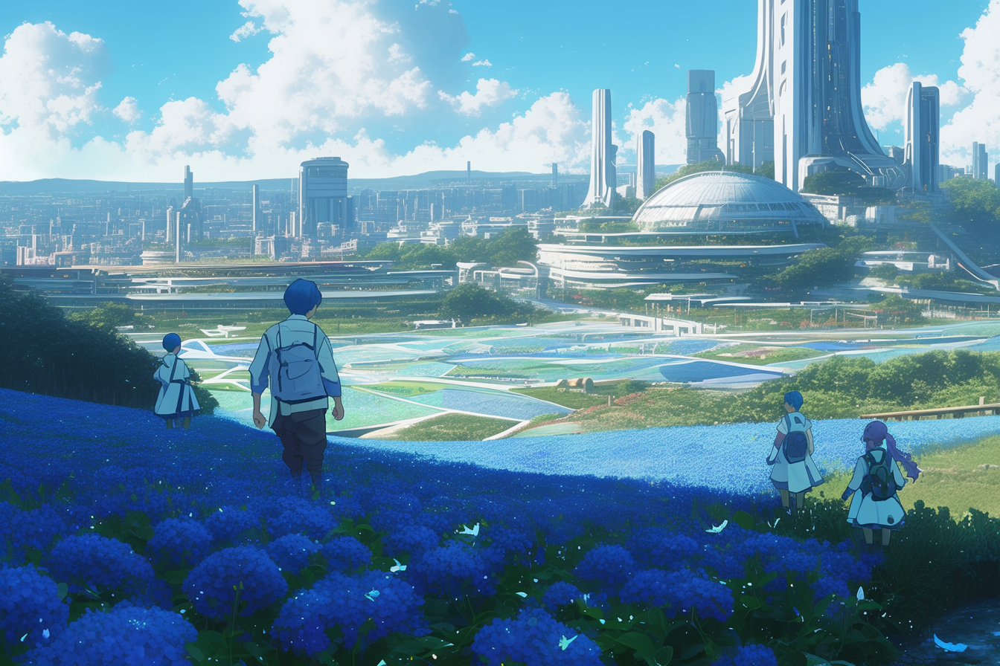
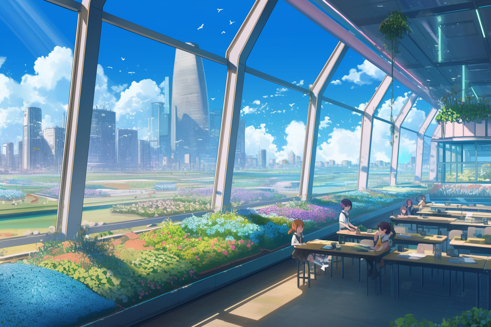

---
layout:
  title:
    visible: true
  description:
    visible: false
  tableOfContents:
    visible: true
  outline:
    visible: true
  pagination:
    visible: true
---

# Gardens

<figure><figcaption>
A district garden where Manna flowers are cultivated and orphaned children are housed.
</figcaption></figure>

## **Overview**

District Gardens are essential communal housing and agricultural facilities within the [Greater Atlantic Territorial Alliance (GATA)](../the-basics.md). Established primarily to care for orphans and child refugees known as the [Children of Atla](../people-and-culture/children-of-atla.md), these Gardens serve as safe havens where young wards of the state can grow and thrive under the supervision of [System](../politics/the-system.md)-employed caregivers and local volunteers.&#x20;

More than just residential spaces, the Gardens are also hubs of agricultural production and education, contributing significantly to their [district's](../politics/districts.md) broader welfare. Garden operations are overseen by a Headmaster.

***

## **Role of Gardens**

The Gardens are a crucial element of GATA's social fabric. They provide a structured environment where children who have lost their families can receive care, education, and stability.

This communal living arrangement not only ensures that the basic needs of these children are met but also integrates them into the broader societal framework of GATA. System-employed caregivers, along with local volunteers, are tasked with creating a nurturing atmosphere that fosters a sense of community and belonging among the children.

### **Manna Flower Cultivation**

The most characteristic feature of a district's Garden are the vast fields and facilities dedicated to the cultivation of [Manna flowers](../../science-and-tech/the-manna-flower.md), a genetically engineered plant essential to life in GATA.

With an abundance of labor at hand, Manna flowers are grown and harvested on the large campuses of the Gardens and provide the children and wider district with a variety of products, including basic materials, nutritious food, and vital medicines.

The cultivation process is overseen by gardeners employed by the System, ensuring a steady supply of these vital resources to the district.

### **Educational Institutions**

<figure><figcaption>
Children study in a Garden School.
</figcaption></figure>

Education is a major part of a Garden's function. Garden schools, where attendance is mandatory for children under 14, provide a strong educational foundation to young residents.

These schools are staffed by professional educators and supplemented with senior students from the local [Atlan Academy](the-atlan-academy-system.md), and administered by the Garden's Headmaster.

Garden schools serve as a pipeline for identifying talented and promising young students are recruited into the district's prestigious [Atlan Academy](the-atlan-academy-system.md), furthering their education and opening up many future opportunities.

Children who cannot be disciplined, or who demonstrate various destructive patterns of behavior are typically sent to an [Angelis](../military-and-defense/angelis.md)-sponsored school, where they are given a more structured, rigorous environment, with much more individual attention. Children who go this route sometimes return to their former Garden after some time, or they might continue on that path to working within GATA's martial institutions, from [Angelis](../military-and-defense/angelis.md), to [Collections](../law-and-order/collections.md), or [Gate Patrol](../borders-and-travel/gate-patrol.md).

***

## **Daily Life and Activities**

<figure><figcaption>
Children tend to the Manna flowers as part of their daily chores.
</figcaption></figure>

Life in the Gardens is structured around a daily routine that balances education, agricultural work, and community activities. The children engage in regular schooling, participate in the cultivation and harvesting of Manna flowers, and take part in various skill-building exercises.

This routine is meant to instill a strong work ethic and sense of responsibility. The blend of practical skills and academic learning prepares the children for various future roles within GATA.

Of course, children are adept at circumventing any rules or limitations they are placed under, and it is not uncommon for children to skip classes, roam the Manna fields, and defy curfew. Some children run away from the Gardens altogether, opting to fend for themselves on the district streets.

### **Impact on Youth Culture**

Growing up in the Gardens profoundly influences the beliefs, behaviors, and futures of GATA's children. The communal living environment can be challenging for some, and enriching for others. Children from a wide spectrum of backgrounds are required to work together, share space, and deal with conflict.

The emphasis placed on both education and practical skills is intended to equip them with the tools needed to navigate life in GATA, but with that said, every garden is different; some have reputations for more strict regimes, and none are without their own shortcomings and scandals, meaning that the Garden experience is not a universal one.

More often than not, children who grow up in the Gardens go on to be productive independent operators working hands-on contracts across the district. It's not uncommon for children from the Gardens go on to become influential members of society, especially those recruited into the Atlan Academy System, carrying with them the experiences of their youth.
