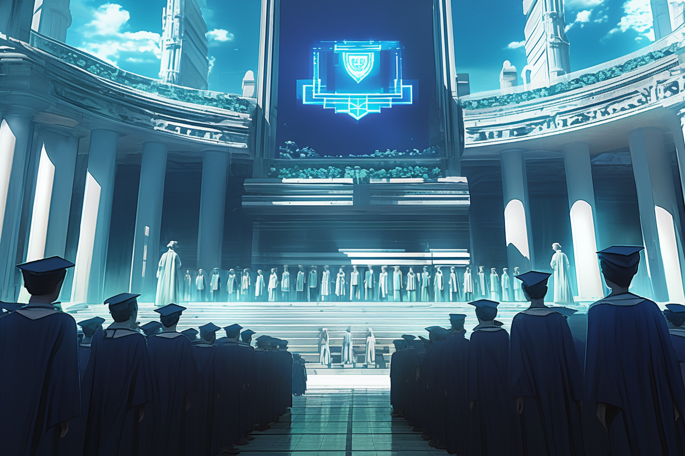

---
layout:
  title:
    visible: true
  description:
    visible: false
  tableOfContents:
    visible: true
  outline:
    visible: true
  pagination:
    visible: true
---

# Atlan Academies

## **Overview**

<figure><figcaption>
A bustling campus at one of GATA's Atlan Academies.
</figcaption></figure>

The Atlan Academy System is the premier educational institution within the [Greater Atlan Territorial Alliance (GATA)](../the-basics.md), renowned for its excellence and rigorous academic programs. It is designed to cultivate the brightest minds from every district in GATA, ensuring that students receive top-tier education and training to become future leaders, scientists, and innovators.

***

## **Background**

The Atlan Academy System was established during the early [Reconstruction era](../../history/the-reconstruction.md) following the [Dark Decade](../../history/the-dark-decade.md), a period of widespread civilizational collapse. As GATA consolidated power and [began to rebuild](../../history/the-reconstruction.md), the need for a centralized, high-quality education system became apparent.

Thus, the Atlan Academy was founded, initially to educate the youth of GATA's oceanic capitol, [Atla](../key-locations/atla.md), but later expanded to include students from all districts. It draws a direct inspiration from the university system of [the Old World](../../history/the-old-world.md) and serves much the same role in society.

### **Organizational Structure**

The Atlan Academy System is divided into several key components:

1. **Atlan Academies**: Located in every district, these academies serve as preliminary educational institutions where students are prepared for potential admission to the High Academy in the capitol. In some cases, certain subjects can only be pursued in particular districts due to [paradigm ](../politics/paradigms.md)restrictions, meaning that in certain domains even a feeder academy can offer a better education than in the capitol.
2. **The High Academy**: The central institution situated in Atla, the capital district of GATA. The Atlan High Academy collects the brightest minds from across [Greater Atla](../politics/greater-atla.md) and provides the most advanced education and training in the world.
3. **Universal Curriculum**: A standardized curriculum implemented across all feeder academies, ensuring uniformity and high standards of education throughout GATA. This curriculum includes a mix of theoretical and practical subjects designed to equip students with necessary skills and knowledge.
4. **Administration**: The Atlan Academy System is overseen by a council of educators and administrators appointed by the [Second Quorum](../politics/governance.md#the-second-quorum). This council ensures that the curriculum is up-to-date, facilities are well-maintained, and educational standards are met.

### **Reputation**

<figure><figcaption>
A graduation ceremony at the Atlan High Academy.
</figcaption></figure>

* **Elite Education**: Known for its rigorous selection process, the Atlan Academy admits only the most talented and promising students, beginning from a very young age.
* **Social Impact:** The Atlan Academy System is intimately involved in each district's Garden, a public campus where [Manna flowers](../../science-and-tech/the-manna-flower.md) are cultivated, and orphaned children are fed, housed, and schooled by senior academy students. Many of GATA's most promising young minds are plucked from Garden schools and admitted into their district's academy.
* **Advanced Facilities**: The academy boasts state-of-the-art facilities, including research labs, libraries, and technological resources, enabling students to engage in cutting-edge research and learning.
* **Holistic Development**: The curriculum emphasizes not only academic excellence but also physical, emotional, and social development. Students participate in various extracurricular activities, [sports](../people-and-culture/sports.md), and community service.
* **Integration with The System**: The academy is closely integrated with The System, GATA's automated logistical infrastructure, allowing their academic performance to seamlessly unlock prestigious keys and opportunities.

***

## Ongoing Developments

Currently, a new draft of the universal curriculum incorporating link use is being debated in the Second Quorum in response to increasing demand for links technology to finally be paradigmed across all of [Greater Atla](../politics/greater-atla.md).
