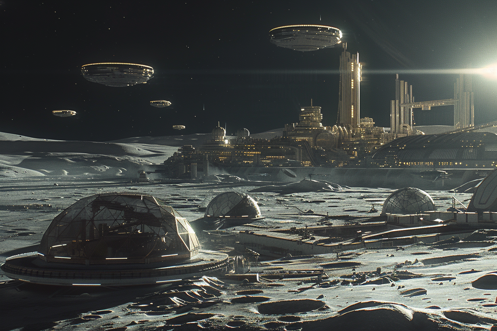

---
layout:
  title:
    visible: true
  description:
    visible: false
  tableOfContents:
    visible: true
  outline:
    visible: true
  pagination:
    visible: true
---

# Luna

<figure><figcaption>
A vista looking out over one of Luna's spaceports.
</figcaption></figure>

## Overview

Luna is a sprawling lunar city on the face of the moon near its southern pole. In addition to being the key hub for inter-district travel, it is a popular travel destination for people from all districts as it is the easiest travel key for an Atlan citizen to acquire.

While getting to Luna is relatively accessible, staying for any period of time is another matter; the cost of living on Luna is among the highest in GATA.

Known for its immense eco-domes and unique low-gravity architecture and urban design, life on Luna is transforming thanks to advances in static-field, mitigating the deleterious effects of low-gravity on the human body.

Luna was founded on the research outpost that housed the lunar survivors of the Dark Decade. Luna is the location of Systema’s headquarters.
