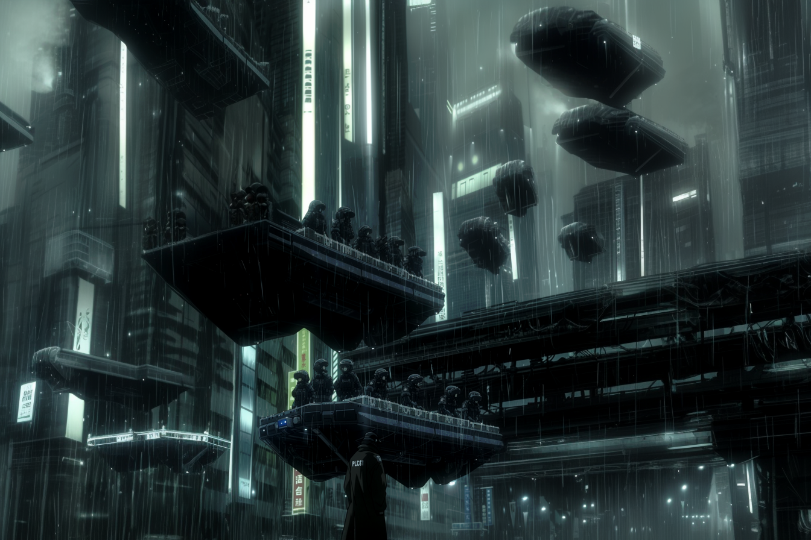

---
layout:
  title:
    visible: true
  description:
    visible: false
  tableOfContents:
    visible: true
  outline:
    visible: false
  pagination:
    visible: true
---

# New York City

<figure><figcaption>
Collections and NYC's local authority launching an extensive tech-recovery operation.
</figcaption></figure>

## Overview

One of the largest cities in [GATA](../the-basics.md). Despite the fact that New York City's local government applied for districthood in 2098, and was subsequently approved by the [Second Quorum](../politics/governance.md#the-second-quorum), the city does not yet meet the [System Requirements](../politics/the-system.md) for [districthood](../politics/districts.md#the-path-to-districthood) outlined in the [New Dawn Accords](../politics/new-dawn-accords.md).

Residents call it "The Second City" on account of the city's resurrection, emerging once more from within its own lifeless husk. In the wake of [the Crash](../../history/the-crash.md), and as a result of a series of hurricanes and rising sea levels, much of the city has remained flooded, transforming the metropolis into the canal city we see today.
