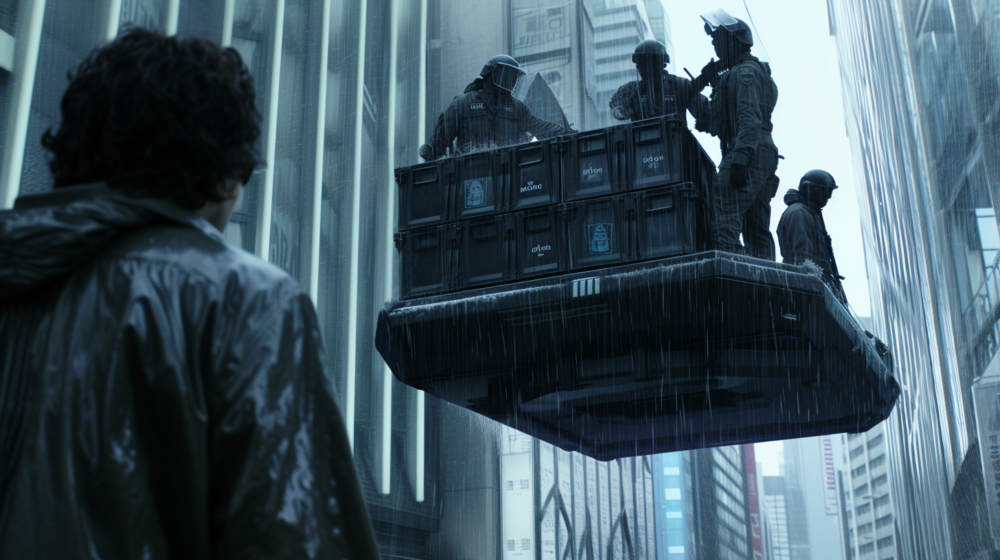

---
layout:
  title:
    visible: true
  description:
    visible: false
  tableOfContents:
    visible: true
  outline:
    visible: true
  pagination:
    visible: true
---

# Collections

<figure><figcaption>
Collections agents on a static raft confiscating illegal contraband.
</figcaption></figure>

### **Overview**

One of the enforcement branches of the [AIC](../institutions/atlan-information-control-aic.md), along with [Border Patrol](../borders-and-travel/gate-patrol.md). Collections is a bureau dedicated to the tracking and recovery of illegal technology, and the apprehension of those who exploit it.

***

### Collectors

Collections field agents are called Collectors, specially trained investigators and operators who typically work undercover, and are deployed all around the world, from [Greater Atla](../politics/greater-atla.md) and its partner states, to [Gray Zones](../politics/gray-zones.md) and the [Free Territories](../../free-territories/).

### Collections at District Gates

Every [Gate](../borders-and-travel/gates.md) in GATA has a Collections Desk, an office available to Collectors who need access to resources and support, and to members of the public who wish to report or surrender [illegal technology](tech-regulation.md) or other [Old World](../../history/the-old-world.md) contraband.
