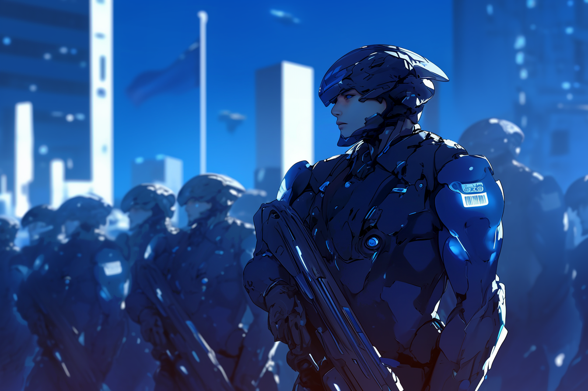

---
layout:
  title:
    visible: true
  description:
    visible: false
  tableOfContents:
    visible: true
  outline:
    visible: true
  pagination:
    visible: true
---

# Angelis

<figure><figcaption>
A battalion of Angelis infantry forces.
</figcaption></figure>

## Overview

A special public-private enterprise sanctioned by [GATA](../the-basics.md), headquartered in [Atla](../key-locations/atla.md), and staffed by more than 10 million personnel stationed around the world and in orbit.

Angelis' military might is formidable, with their ranks consisting of regular and special forces units, supported by a vast intelligence apparatus. Angelis is GATA’s largest [enterprise](../enterprise/), and provides military and intelligence services for GATA and [its partner states](../politics/new-dawn-accords.md#signatories).

Angelis was founded at the close of [The Reconstruction](../../history/the-reconstruction.md), as GATA fractured its national military into various dedicated branches, formalizing organizational structures that had developed naturally over its history.

***

## **Watchers**

<figure><figcaption>
Angelis Watcher overseeing the safety of Greater Atla.
</figcaption></figure>

Angelis strategy and intelligence. Watchers provide expert information gathering, border protection, personal protection, asset tracking, private communications, targeted downtime, and comprehensive strategic foresight. Having a Watcher on the line is an invaluable resource in a crisis.

### **Watchtowers**

<figure><figcaption>
An Angelis Watchtower in Low Earth Orbit.
</figcaption></figure>

Orbital stations and surveillance platforms where orbital Angelis personnel work. Watchtower staff includes Watchers and [Guardians](guardians.md) who work closely with their ground-based counterparts to ensure the security of [Greater Atla](../politics/greater-atla.md).&#x20;

Watchtower staff provide direct monitoring of battlefields and Red Zones using a network of secure line-of-sight relays to tap into sensor arrays distributed around the Earth in geo-synchronous orbit. Watchtowers also provide intelligence support for [districts](../politics/districts.md) with interior [Gray Zones](../politics/gray-zones.md).

Watchtowers are also where Mavericks and Angelis [Rapid Response](rapid-response.md) are garrisoned between deployments to an Overlook.

### **Overlooks**&#x20;

<figure><figcaption>
Angelis infantry awaiting deployment next to a Guardian's Heavy Combat Gear.
</figcaption></figure>

Small orbital habitats where [Rapid Response](rapid-response.md) and [Mavericks](mavs.md) are dispatched from. Overlooks are positioned across the Earth’s orbit, and are strategically distributed to reduce time to target. When Rapid Response or Maverick units are deployed on an operation, they typically drop from Overlooks in Aegis drop pods.

***

## **Aegis Drop Pods**

<figure><figcaption>
An Aegis pod after a controlled impact in an abandoned facility.
</figcaption></figure>

Armored drop pods that use [Static Field technology](../../science-and-tech/statics.md) to allow for accelerated descent and a decelerated hard-landing. The Aegis pod contains mission-relevant equipment, portable external compute, a break-away shield door, and various communication and jamming capabilities.

To open an Aegis pod, the shield door must be pushed out from the inside, causing the Aegis’ panels to fan open, allowing the occupant(s) to slowly increase their exposure to hostile targets while preserving some of the protection of the armored pod.

Aegis drop pods are used by Angelis infantry, support, Rapid Response, and MAVs. Notably, Guardians in their Heavy Gear do not require drop pods as their gear is equipped with their own statics and life support, permitting independent orbital re-entry.

***

## **Angelis Combat Gear**

<figure><figcaption>
Advanced Combat Gear designed for GATA's most elite operatives.
</figcaption></figure>

Angelis has the most advanced combat gear in the world. Angelis infantry uses more standard loadouts, but Guardians, Rapid Response, and MAVs are trained to use highly advanced gear that can be tailored to their talents and each mission’s requirements.

* [**Guardians**](guardians.md)**:** Blue Combat Gear / Large-to-mid size / Heavy loadout
* [**Rapid Response**](rapid-response.md)**:** Red Combat Gear / Mid-to-small size / Less-lethal loadout
* [**MAVs**](mavs.md)**:** White Combat Gear / Small, form-fitting / Minimal loadout
