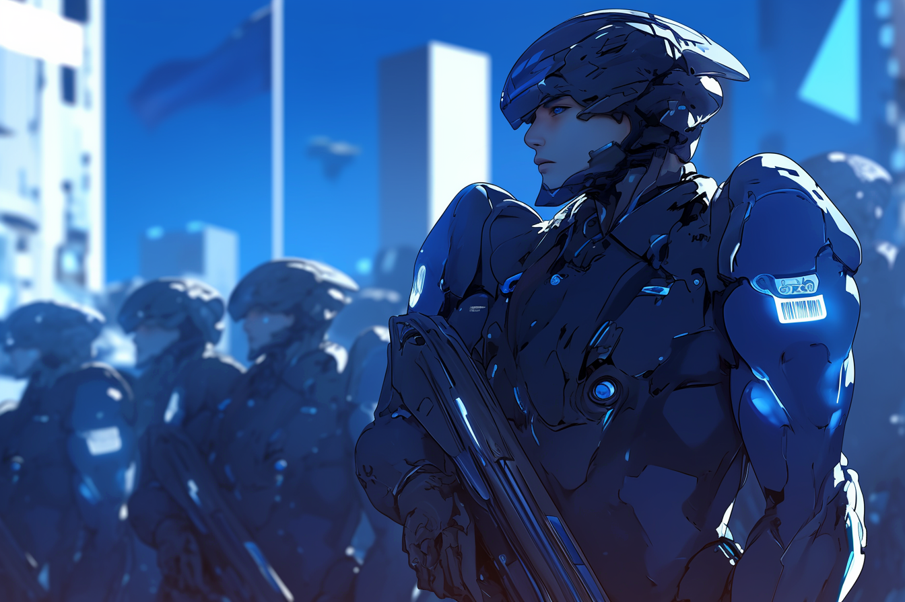

---
layout:
  title:
    visible: true
  description:
    visible: false
  tableOfContents:
    visible: true
  outline:
    visible: true
  pagination:
    visible: true
---

# Guardians

<figure><figcaption>
A battalion of Guardian forces.
</figcaption></figure>

## **Overview**

[Angelis](angelis.md)’ special forces units. Guardians undergo rigorous training and conditioning, and demonstrate mastery of a wide range of skills including hand-to-hand combat, use of multiple firearms and weapon platforms, [link proficiency](../../science-and-tech/links.md), and advanced ability with [Combat Gear](../../science-and-tech/gear.md#combat-gear).&#x20;

Guardian units are typically deployed in squads of 5-20, often supported by a company or battalion of regular infantry as support, as well as aerial support. Guardians are the blunt force weapon of Angelis, contrasted by the versatility of [Rapid Response](rapid-response.md), and the precision of the [MAVs](mavs.md).

Guardians are identifiable by their blue Gear, which are often in the mid-size to large size range, and are outfitted with [statics](../../science-and-tech/statics.md) for trans-medium operations that span land, air, sea and space.

***

## The Role of Guardians

<figure><figcaption>
A Guardian operative and her Combat Gear.
</figcaption></figure>

