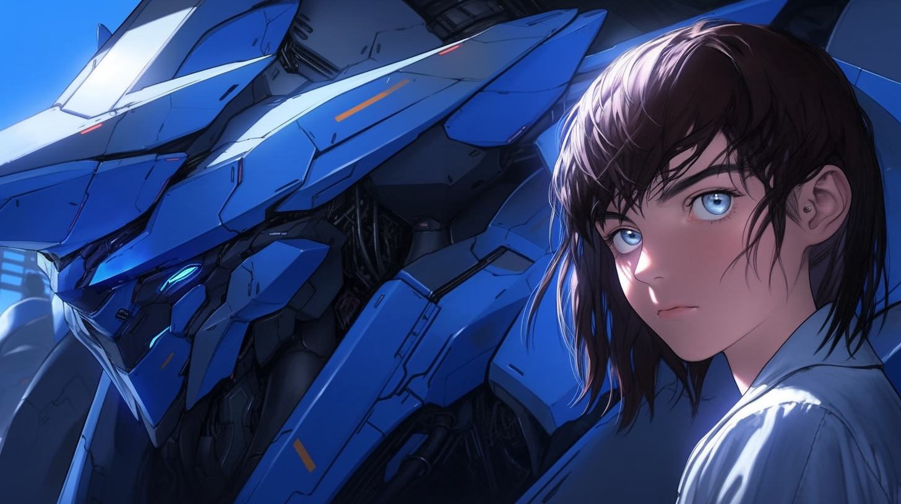

---
layout:
  title:
    visible: true
  description:
    visible: false
  tableOfContents:
    visible: true
  outline:
    visible: true
  pagination:
    visible: true
---

# Guardians

<figure><figcaption>
A Guardian operative and her Combat Gear.
</figcaption></figure>

## **Overview**

[Angelis](angelis.md)’ mechanized special forces units, Guardians are the blunt force weapon of Angelis, contrasted by the versatility of [Rapid Response](rapid-response.md), and the precision of the [MAVs](mavs.md). Guardians undergo rigorous training and conditioning, and demonstrate mastery of a wide range of skills including hand-to-hand combat, use of multiple firearms and weapon platforms, [link proficiency](../../science-and-tech/links.md), and advanced ability with Heavy [Combat Gear](../../science-and-tech/gear.md#combat-gear).&#x20;

Guardian units are typically deployed in fireteams of four, often complemented by a company or battalion of regular infantry, as well as aerial support, however it is not uncommon for Guardians to be deployed solo to support active engagements on the ground, such as Gate Patrol operations, or partner-state conflicts.

Guardians are identifiable by their blue Heavy Gear, which are often in the mid-size to large-size range, and are outfitted with [statics](../../science-and-tech/statics.md) for trans-medium operations that span land, air, sea and space. They can be deployed directly from Angelis [Watchtowers](angelis.md#watchtowers) and [Overlooks](angelis.md#overlooks) located in Low Earth Orbit.

***

## The Role of Guardians

<figure><figcaption>
Two Guardian units deployed with Angelis infantry.
</figcaption></figure>

Guardians are&#x20;
