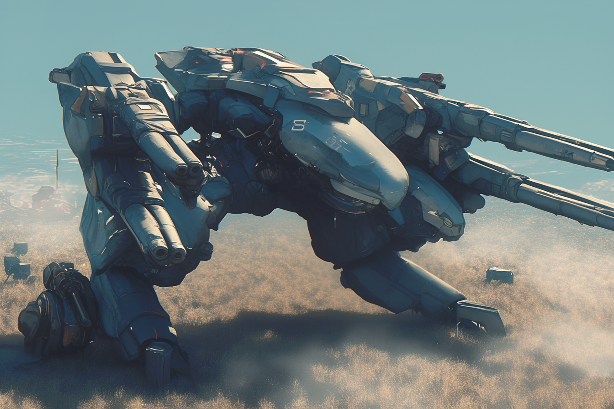

---
layout:
  title:
    visible: true
  description:
    visible: false
  tableOfContents:
    visible: true
  outline:
    visible: false
  pagination:
    visible: true
---

# Guardians

<figure><figcaption>
A Guardian pilot and her war frame.
</figcaption></figure>

## **Overview**

[Angelis](angelis.md)’ mechanized special forces units, Guardians are GATA's most devastating blunt-force weapon, contrasted by the versatility of [Rapid Response](rapid-response.md), and the precision tactics of the [MAVs](mav.md). Guardians undergo rigorous training and conditioning, and demonstrate mastery of a wide range of skills including hand-to-hand combat, use of multiple firearms and weapon platforms, [link proficiency](../../science-and-tech/links.md), and unparalleled talent operating [war frames](../../science-and-tech/frames.md).&#x20;

Guardian units are typically deployed in fireteams of four, often complemented by a company or battalion of regular infantry, as well as aerial support, however it is not uncommon for Guardians to be deployed solo to support active engagements on the ground, such as Gate Patrol operations, or partner-state conflicts.

Guardians are identifiable by their blue war frames, which are often in the mid-size to large-size range, and are outfitted with [statics](../../science-and-tech/statics.md) for trans-medium operations that span land, air, sea and space. They can be deployed directly from Angelis' [Watchtowers](angelis.md#watchtowers) and [Overlooks](angelis.md#overlooks) located in Low Earth Orbit.

***

## History

<figure><figcaption>
The Warden squadron that preceded the Guardians.
</figcaption></figure>

The Guardians can trace their lineage back to the [Joint-Atlantic Command's](../history/the-joint-atlantic-command-jac.md) Wardens, a squadron of fighters that were tasked with patrolling operation zones and preventing incursions.

After the JAC established industrial operations in Northern Africa, new purpose-built armaments could be produced. Soon after, when Atla was founded, the Wardens squadron was reassigned to the defense of the fledging capitol, and a new compartment was formed under the Existence Doctrine to replicate their function using a new kind of heavy mechanized unit tailored for long-term patrol, and designed for mixed ground-and-air engagements called "war frames", or simply "frames" for short.

<figure><figcaption>
An early war frame developed in the final years of the Dark Decade.
</figcaption></figure>

During the Reconstruction era, while GATA still maintained a national military (technically, an extra-territorial extension of Atla's local authority), it became standard to deploy these heavy, mechanized units to protect each of their refugee camps and nascent districts. The primary purpose of the war frame's imposing presence was as a deterrence to local Sovereign militias and bandits.

It was during this time that GATA's growing citizenry would begin to refer to these stoic masses of metal as "guardian angels". For two decades, these frames were a common sight across Greater Atla, and the name "Guardians" stuck. They proved instrumental in establishing the stability that allowed GATA and its people to flourish and rebuild. And likewise as GATA advanced, so too did the sophistication of these heavy mechanized units.

### After the Formation of Angelis

<figure><figcaption>
A modern Guardian war frame.
</figcaption></figure>

Later, following the end of the Existence Doctrine and the subsequent formation of Angelis, the Guardians branch was formally established by Angelis as a direct continuation of the compartment operating GATA's most iconic, stalwart protectors. These "guardians angels" are even the inspiration for Angelis' very name.

Since its establishment under Angelis, the Guardians have had access to an ever-progressing array of advanced technologies. Over the years they have been among the first in the world to use numerous new technologies in the field, including miniaturized static engines, links, syncing, and parallel energy.

Equipped with cutting edge frames, advanced technology and heavy weaponry, Guardians have since become known to dominate high-intensity combat scenarios. Their heavy loadouts and tactical versatility have seen them deployed in response to a wide range of threats and missions. To this day, the deployment of Guardians is often seen as a signal of GATA's firm commitment to a conflict or operation.

***

## Deployment and Operations

<figure><figcaption>
Two Guardian frames deploying with Angelis infantry.
</figcaption></figure>

Guardians typically operate in fireteams of four, though their numbers can vary depending on the mission requirements. Their operators are among the most highly trained and capable individuals in all of Angelis' armed forces. They are famously known for two things; waiting patiently, and striking ferociously.

They are sometimes complemented by a company or battalion of regular infantry and supported by aerial units for comprehensive battlefield dominance. Their ability to operate independently or as part of a larger force makes them versatile assets in GATA's military strategy, and their ability to be rapidly deployed from orbit allows for swift responses to emerging threats.

In addition to their role in Angelis' direct engagements across land, air, sea and space, Guardians are sometimes deployed to support other operations, such as Gate Patrol emergencies, partner-state conflicts, crisis zones, or to hold sensitive locations for long durations.

One of the longest standing assignments for Guardians is using them as a deterrent, intended to defend a given target and discourage unwanted incursions. The consequences for hostile targets crossing into their operational domain are swift and consequential. Once engaged, Guardians unleash their overwhelming force on targets, causing rapid and unrelenting devastation.

#### Impact on the Battlefield

Guardians work alone or in concert, to decisively extinguish their target's means and will to fight. Even after neutralizing their target, Guardian's are trained to disable and dismantle as much of their enemy's hardware and equipment as possible, with the aim to reduce the "latent threat" to zero.

Their presence can quickly stabilize volatile situations and provide immediate support to ground forces. However, due to their blunt tactics and cumbersome size, there are many situations for which Guardians are not an appropriate solution.

***

## Equipment and Technology

Guardians are equipped with the most advanced technology available in GATA, thanks to Angelis' special paradigm, availing to them a wider range of technologies produced by GATA's many district's private enterprises:

### Guardian Frames

The Guardians' iconic blue war frames range from mid-to-large size, offering enhanced protection and heavier loadouts. Their frames are integrated with statics for trans-medium operations, allowing Guardians to seamlessly transition between land, air, sea, and space environments.

At the heart of each Guardians war frame is a purpose-built COG built using custom raw hard code. These narrow cognitive systems manage the Guardian's subsystems in concert with the actions of the pilot.

Each Guardian's frame is tailored to their specialization, and modified to meet specific mission requirements, featuring cutting-edge technology such as enhanced sensory interfaces, augmented reality displays, and adaptive camouflage. They're designed to provide maximum operational efficiency and survivability in diverse combat scenarios.

### **Weaponry**

Guardians have access to a wide array of firearms and weapon platforms, including energy weapons, kinetic firearms, and specialized ordinance for various combat situations. Their proficiency with multiple weapon systems allows them to adapt to changing battlefield conditions and effectively neutralize threats.

### Enhancements

#### Quantum Communication

With the development of Quantum Seeds, Guardians now have access to instantaneous communication across vast distances, enhancing coordination and strategic planning.

***

## Training and Skills

The training regimen for the Guardians is one of the most demanding and comprehensive in the world. It includes:

#### Hand-to-Hand Combat

As with all Angelis infantry and special forces, Guardian operatives are trained in multiple martial arts and close-quarters combat techniques, ensuring they can engage effectively in melee situations.

#### Firearms and Weapon Platforms

Proficiency with a broad range of firearms and heavy weapon platforms is essential. Guardians are trained to use everything from personal sidearms to large-scale ordinance with precision.

#### Heavy Weapons and Equipment

Proficiency with an arsenal of heavy ordinance, canons, and equipment that can be outfitted on Guardian war frames.

#### Link & Syncing Proficiency

Advanced training in Link use allows Guardians to drive their frame's operation with their thoughts, enhances their extended proprioception, their situational awareness, and their communication with the rest of their fireteam. They can interface with various systems, control drones, and access real-time battlefield data. Sync training allows Guardians working in fireteams to communicate non-verbally with their teammates and coordinate their actions.

#### War Frame Mastery

Guardians are experts in using and maneuvering their advanced war frames, leveraging its full capabilities to gain a decisive tactical edge. This includes the use of static-powered mobility, augmented reality displays, adaptive camouflage, defensive counter-measures, and enhanced sensory interfaces.
