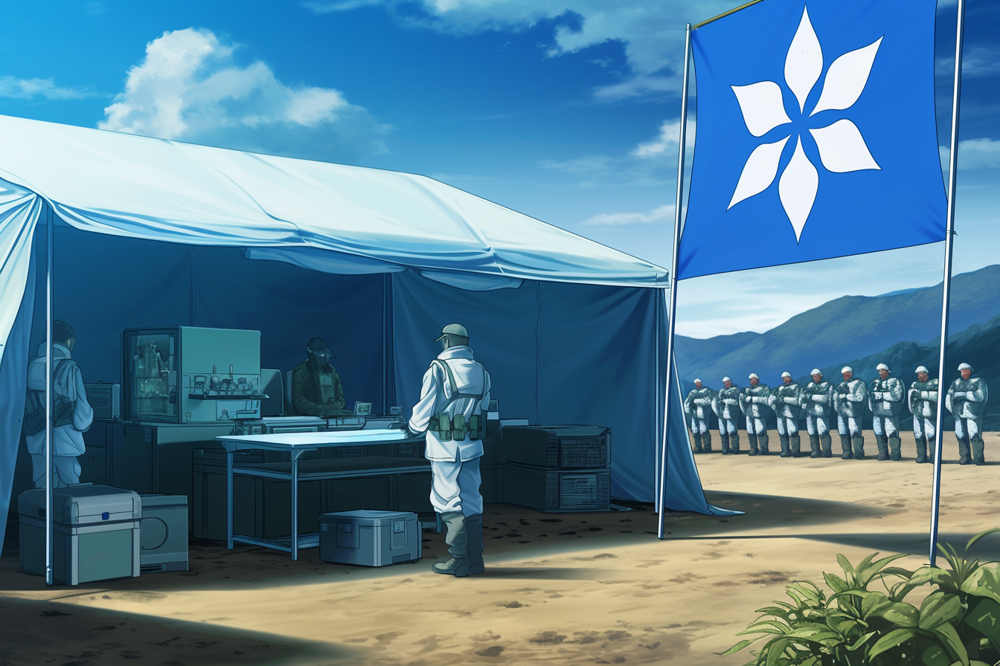
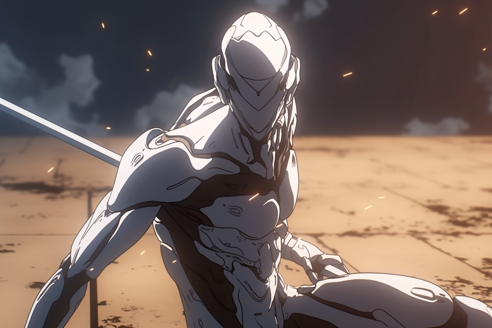
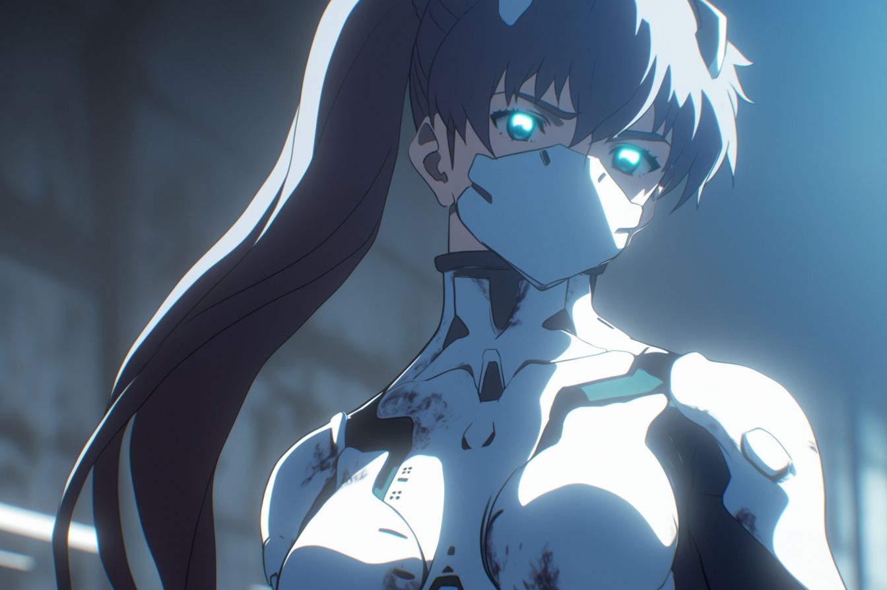
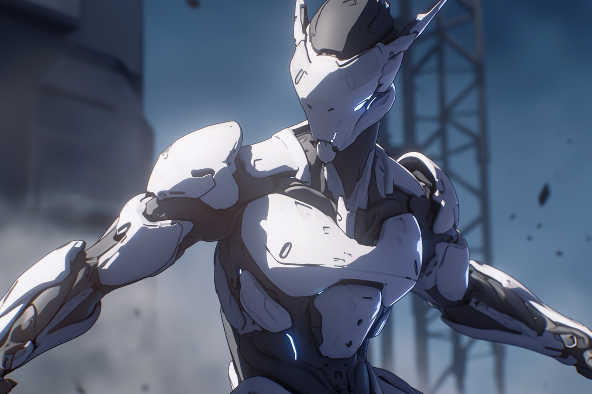

---
layout:
  title:
    visible: true
  description:
    visible: false
  tableOfContents:
    visible: true
  outline:
    visible: false
  pagination:
    visible: true
---

# MAV

<figure><figcaption>
Modern MAV Combat Gear.
</figcaption></figure>

## Overview

MAVERICKS (MAVs) are the pinnacle of [Angelis](angelis.md) and [GATA](../the-basics.md) combat effectiveness. The best of the best, recruited from the ranks of the [Guardians](guardians.md) and [Rapid Response](rapid-response.md).

The defining attribute of a successful MAV is their ability to operate independently, which was the basis for the [Unassisted Decisive Asset](mav.md#origins) (UDA) program that preceded.

However, simply being recruited into the MAV program is not enough; recruits must be able to physically and mentally tolerate the battery of therapies and enhancements that separate MAVs from other Angelis assets.

Among other augmentations, modern MAV operatives have miniaturized cog implants installed directly in their brainstem, enhancing their reflexes, pain tolerance, and tactical and strategic thinking. These cog implants can be paired with portable external compute that the MAV can position strategically or carry with them throughout an engagement, even further magnifying their combat performance and situational awareness.

***

## **Origins**

In the crucible of the late [Dark Decade](../../history/the-dark-decade.md), the desperate need to tame a chaotic world precipitated [Atla](../key-locations/atla.md)'s institution of the ["Existence Doctrine"](existence-doctrine.md), an operational philosophy which permitted numerous secret programs to temporarily explore experimental technologies and methods with minimal oversight.

### The Clear Serum Program

<figure><figcaption>
A field lab where the Clear Serum was administered to volunteers.
</figcaption></figure>

One Existence Doctrine program sought to discover the limit of individual human ability in order to produce the ultimate tactical operative. At its heart was an experimental gene therapy called ["Clear"](mav.md#clear-serum).&#x20;

Designed to enhance the physical and mental capabilities of GATA forces, the therapy drastically improved reflexes, speed of thought and learning, immunity, and healing capabilities.&#x20;

However, it came at a cost; those who could endure the therapy experienced various side effects that required regular attending. One notable side effect was an extreme increase in metabolic rate, with subjects needing constant calories and hydration, and leaving them prone to overheating when sedentary.

The Clear Serum project was helmed by the very team that had created the Manna flower, led by Dr. Valter Koenig. While Clear was originally conceived by Dr. Koenig with the intention that it could lift up all of humanity, its side effects narrowed its viability to military and intelligence applications.

It is estimated that more than fifty thousand Dark Decade and Reconstruction veterans had received some variant of the Clear Serum, most without their knowledge. Early formulations of the Clear serum were primarily derived from Silver [Manna](../../science-and-tech/the-manna-flower.md) and therapies to produce various genetic modifications based on classified research, however the exact formulation of Clear was always in flux, tweaked based on data from a world-wide DNA catalog being collected from Atlan refugee camps.

These early test subjects and their remarkable performance in the field inspired the creation of another Existence Doctrine Program; the Unassisted Decisive Asset program.

### Unassisted Decisive Assets

<figure><figcaption>
Legendary UDA operative [Redacted], calmly assessing the field.
</figcaption></figure>

Those who survived the transformation were officially termed "Unassisted Decisive Assets" (UDAs). Singularly potent, and armed with GATA’s superior weaponry and equipment, a Maverick could replace an entire battalion, undertaking critical assignments, from asset retrieval or protection, to sabotage and assassinations. Over time, these much-mythologized one-person armies acquired a more colloquial title — the "Mavericks."

While incredibly performant, the UDAs had one fatal flaw in the eyes of GATA's military leadership. They were human; unpredictable, diverse in their methods, and capable of disobeying commands.

It is believed that this very flaw was the reason that the original UDA development program was later redesigned from the ground up by Angelis when they assumed control of the program post-Existence Doctrine.

### End of the Existence Doctrine

When the Clear program and original UDA program were dissolved, all related records were scrubbed from the [General Record](../politics/the-general-record.md) by the [AIC](../institutions/atlan-information-control-aic.md). Whispers persist that the UDA program was responsible for numerous infamous scandals during the [Reconstruction Era](../../history/the-reconstruction.md), however these claims remain unsubstantiated.

And even darker rumors abound – some assert that ALTAR keeps retired UDAs in cryostasis, while others trade tales of renegade UDAs operating in the shadows, working for criminal syndicates or Sovereign factions.

For others, the UDA program does not appear so mysterious; several former UDA operatives are known to still hold positions within Angelis' armed forces and administration, despite there being no official record of their operational activities.

***

## **The New MAVERICKS**

<figure><figcaption></figcaption></figure>

 

<figure><figcaption></figcaption></figure>

Following the [Bright Mesa attack](../history/bright-mesa.md#the-bright-mesa-attack), the [First Quorum](../politics/governance.md#the-first-quorum) approved the formation of an official MAVERICK division under the banner of Angelis. This modern MAVERICK division is an attempt to recover the operational dominance afforded by the original UDA program.

Over this official division's 10 year history, these new Mavericks, commonly referred to as MAVs, have proven themselves to be the ace up Angelis' sleeve. Dropping from orbital [“Watchtowers”](angelis.md#watchtowers) in static-powered Aegis pods, MAVs can be deployed anywhere around the world in a matter of minutes, and can quickly turn the tide of any conflict or crisis.

Scouting and securing targets, reinforcing [Gate Patrol](../borders-and-travel/gate-patrol.md) and district [local authorities](../law-and-order/local-authority.md), overseeing shipping routes, and dropping into conflict zones in [GATA-allied territories](../politics/new-dawn-accords.md) or [homesteads](../politics/homesteads.md), the MAVs are arguably GATA's most pointed symbol and weapon. Their reputation for precision, discipline, and commitment to mission success makes them a threat few adversaries dare risk.

<figure><figcaption>
A MAV tapping their "vault" to destabilize the terrain.
</figcaption></figure>

Lethal and unflinching, MAVs are trained for solo operations and are well suited to covert and decisive interventions. MAVs can be identified at a glance by their highly advanced white [Combat Gear](../../science-and-tech/gear.md#combat-gear), the color a nod to the white body armor of the original UDAs, and offering a strong visual distinction from blue combat gear of Angelis' standard infantry.

MAV combat gear is widely regarded to be the most advanced in the world, conferring MAV operatives with a wide array of powerful resources and tactical options, in addition to astounding strength, speed and resilience.

### The New MAV Development Program

Angelis refined the “asset development” process using a more modest therapeutic regime that had much higher tolerance rates. Among other techniques, they induce natural epigenetic changes with sound baths, and administer an enhanced variant of [AKICEL](../enterprise/akicel.md)'s  rejuvenation therapy that hardens bone and induces changes in muscle fiber and connective tissues, significantly increasing the operative's strength and speed.

<figure><figcaption>
A MAV standing at attention.
</figcaption></figure>

MAV operatives receive a miniaturized [cog](../../science-and-tech/cogs.md) implant in their brain stem that enhances their senses, reflexes and fine motor control. While small, these clever little devices dramatically increase the signal and bandwidth of its owner's central nervous system. While their cog implant’s [LMNL](../../science-and-tech/hard-code.md#lmnl) architecture prevents remote manipulation, if the implant is damaged or somehow disabled, the asset’s battlefield performance would drop precipitously.

In addition to their cog implant, many modern MAV loadouts include a "vault"; an unwieldy metal case housing a parallel energy cell and a powerful compute platform. Parallel energy is still an experimental and unparadigmed technology being trialed in the field, and the vault's built-in compute is made with Angelis' highly compact raw-code architecture. This external unit provides MAVs with a massive reservoir of power and compute that can be tapped to allow them to rapidly formulate complex plans, or perform incredible feats of reactivity and coordination.

It is generally acknowledged that, while still extremely effective, modern MAVs are not as singularly potent as the original UDAs, partially due to their more conservative genetic augmentations, and partially due to their reliance on cogs, some would argue making them not truly "unassisted" assets.

### Operational Profile

MAVs aren't just reactive forces, knocking down challenges as they appear. Instead, they meticulously set up situations, dictating the flow of battles, creating and adjusting complex strategies on the fly. Their training and integration with their cogs, has finely honed their predictive abilities, allowing them to seize control of any battlefield.

However, MAVs aren't without their limitations. They thrive in solitary operations. Friendlies on the battlefield heavily constrain their ability to assume “decisive supremacy” in the engagement. This applies even to other MAVs.

***

## **Mavericks of Note**

Known only among program administrators, personnel, and the elite soldiers themselves, some names rise above the rest as highly notable Mavericks.

* \[Redacted] stands as a testament to the prowess of the original UDAs. With countless deployments to their name, they are best remembered by those in-the-know for facing an entire [Free Territory](../../free-territories/) militia in North Texas to complete their critical mission successfully at the cost of their own life.
* Finneas "Finn" Hughes was part of the original UDA program whose operatives first carried the unofficial moniker of "Mavericks". After the repartitioning of Atla's military, Finn joined the nascent Angelis' [Rapid Response](rapid-response.md) division where he went on to become one of its most decorated operatives. He was later killed in the process of bringing the ["Butcher of Bright Mesa"](../history/bright-mesa.md#the-bright-mesa-attack) to justice, and this incident is one of the events that precipitated the formation of Angelis' MAV division.
