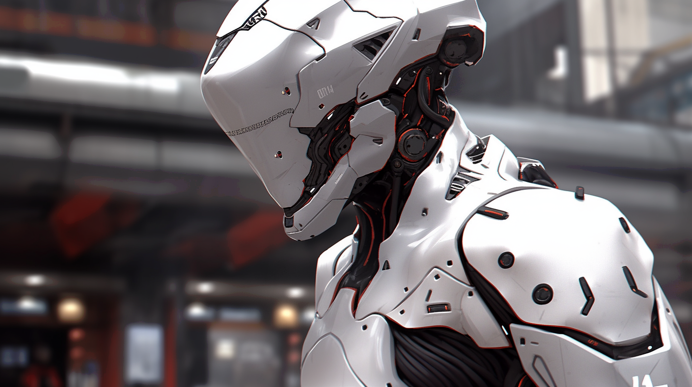
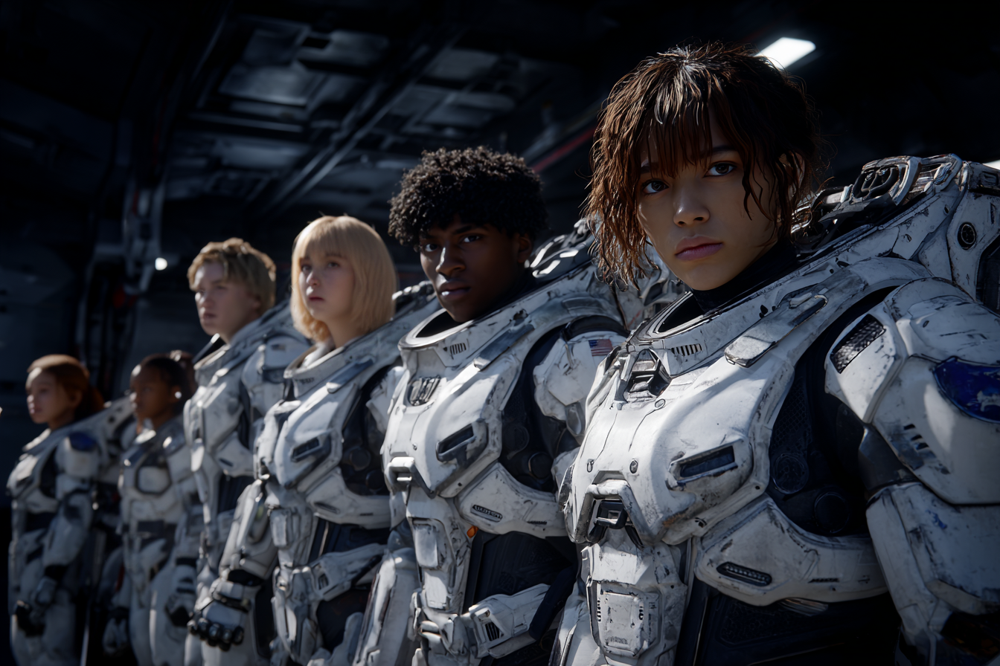
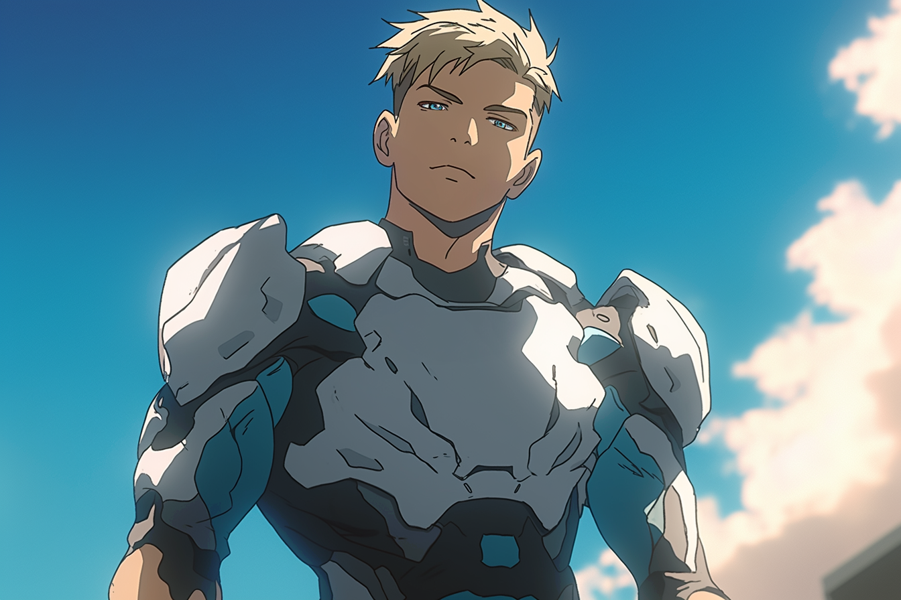
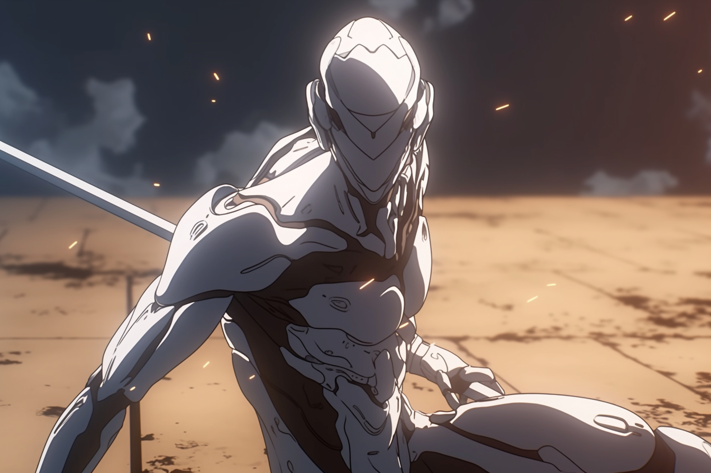
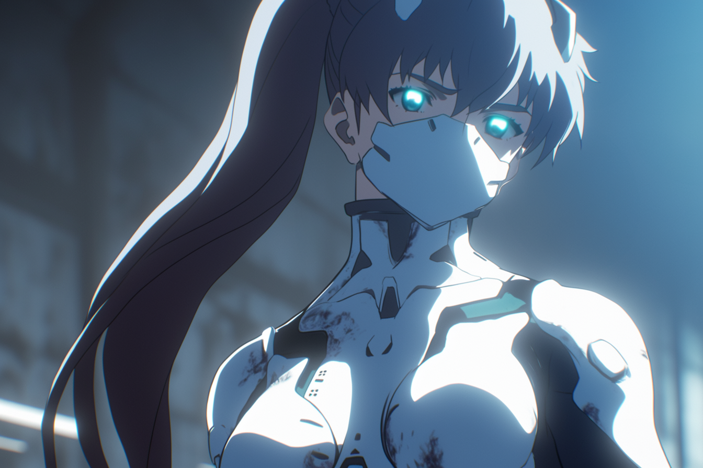
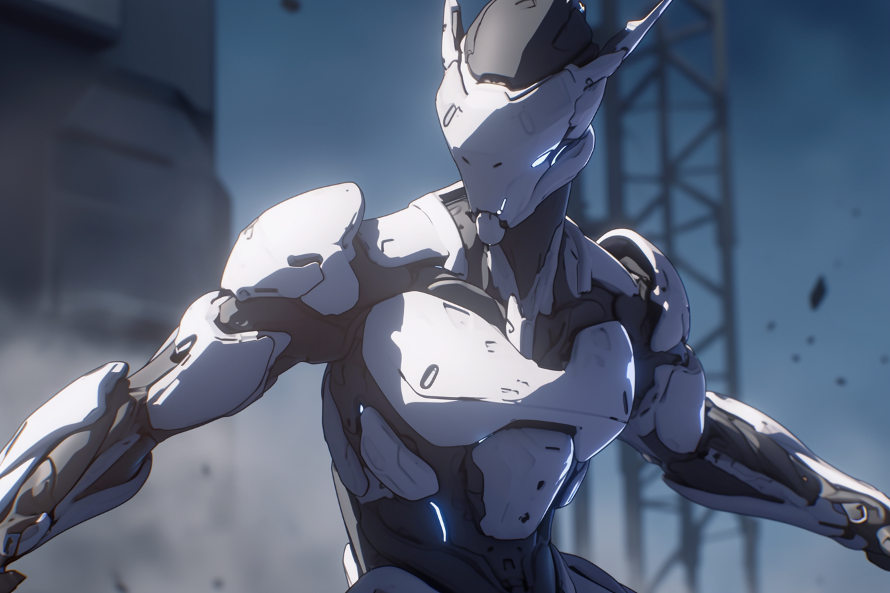
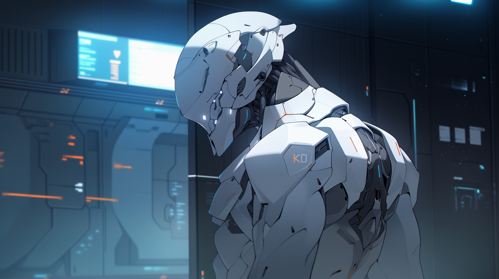

# Mavericks

<figure><figcaption>
Modern MAV Combat Gear.
</figcaption></figure>

## Overview

Mavericks, also known as MAVs (which is short for Mission-Adaptive Variable) are the pinnacle of [Angelis](angelis.md) and [GATA](../the-basics.md) combat effectiveness. The best of the best, recruited from the ranks of the [Guardians](guardians.md) and [Rapid Response](rapid-response.md).

The defining attribute of a successful MAV is their ability to operate independently and in a wide range of conditions and contexts, the culmination the [Unassisted Decisive Asset](mavs.md#origins) (UDA) program that preceded the modern MAV division.

However, simply being recruited into the MAV division is not enough; recruits must be able to physically and mentally tolerate the battery of training, therapies, and enhancements that separate MAVs from Angelis' other assets.

Among other augmentations, modern MAVs have miniaturized cog implants installed directly in their brainstem, enhancing their reflexes, pain tolerance, and tactical decision-making. These cog implants can be paired with portable external compute that the MAV can strategically conceal, or carry with them throughout an engagement, even further magnifying their combat performance and situational awareness.

***

## **Origins**

In the crucible of the late [Dark Decade](../../history/the-dark-decade.md), the desperate drive to recover human civilization from the brink birthed [Atla's](../key-locations/atla.md) ["Existence Doctrine"](existence-doctrine.md), an operational philosophy which permitted numerous compartmentalized programs to explore radical technologies and methods with minimal restriction. The Mavericks trace their origins to several of these programs.

### The Clear Program and Alpha-01

The Clear Program, a compartmentalized Existence Doctrine program, sought to discover the limit of individual human ability in order to produce the ultimate tactical operative. At its heart was an experimental therapy called ["Clear"](mavs.md#clear-serum).

Meticulously selected recruits and students across Atla were injected with a test dose of the Clear serum under the guise of medical screenings and other exams.

Those who proved to tolerate the formula were transferred to a secure base in Greenland where they were administered the complete Clear therapy over 8-12 weeks, and were inducted into an intensive training program where their aptitudes and performance were pushed to superhuman limits, culminating in the formation of an elite collaborative unit known as ["Alpha-01"](../../../narrative/cast/alpha-01.md).&#x20;

<figure><figcaption></figcaption></figure>

This unit served as a field test for these exceptional soldiers, with the aim of determining the optimal operational style for operatives gifted with their heightened capabilities. Their remarkable performance in the field would, in turn, culminate in the creation of the [Unassisted Decisive Assets](mavs.md#the-unassisted-decisive-assets).

### The Unassisted Decisive Assets

<figure><figcaption>
Legendary UDA operative [Redacted], calmly assessing the field.
</figcaption></figure>

The [Alpha-01](../../../narrative/cast/alpha-01.md) trial culminated in the splitting up of its team into individual warfighters officially termed "Unassisted Decisive Assets" (UDAs). Singularly potent, and armed with GATA’s superior weaponry and equipment, a well-placed UDA could replace an entire battalion, undertaking critical assignments, from asset retrieval or protection, to sabotage and assassinations. Over time, these much-mythologized one-person armies acquired a more colloquial title — the "Mavericks."

While incredibly performant, the UDAs had one fatal flaw in the eyes of GATA's military leadership. They were human; unpredictable, diverse in their convictions and methods, and ultimately, capable of disobeying commands.

### End of the Existence Doctrine

When the Clear program and original UDA program were dissolved, all related records were scrubbed from the [General Record](../politics/the-general-record.md) by the [AIC](../institutions/atlan-information-control-aic.md). Whispers persist that the UDA program was responsible for numerous infamous scandals during the [Reconstruction Era](../../history/the-reconstruction.md), however these claims remain unsubstantiated.

And even darker rumors abound – some assert that [ALTAR](../institutions/altar.md) keeps retired UDAs in cryostasis, while others trade tales of renegade former UDAs operating in the shadows, working for criminal syndicates or Sovereign factions in [the Free Territories](../../free-territories/the-basics.md).

For those within leadership and intelligence circles within GATA, the UDA program is not so mysterious; several former UDA operatives are known to still hold positions within Angelis' armed forces and administration, despite there being no official record of their operational activities.

***

## **The MAVERICK Division**

<figure><figcaption></figcaption></figure> <figure><figcaption></figcaption></figure>

For over a decade, the Unassisted Decisive Asset (UDA) program had been sealed and remained officially unacknowledged. However, to the surprise of many, at the close of the Existence Doctrine, the [First Quorum](../politics/governance.md#the-first-quorum) acknowledged the program's existence and approved the formation of an acknowledged MAVERICK division under the banner of Angelis following the [Bright Mesa attack](../history/bright-mesa.md#the-bright-mesa-attack).

This modern MAVERICK division is an attempt to recover the operational dominance displayed by the original UDA program, however with less emphasis on operator independence and more emphasis on single-mindedness and adaptability. This shift is exemplified in the new program's internal designation: "Mission-Adaptive Variables".

Over this official division's now-ten-year history, these new Mavericks, referred to as "MAVs", have likewise proven themselves to be an invaluable tool in GATA's asymmetrical conflict with [Sovereign forces](../../free-territories/people-and-culture/sovereigns.md). Dropping from orbital [“Watchtowers”](angelis.md#watchtowers) in static-powered [Aegis pods](angelis.md#aegis-drop-pods), MAVs can be deployed anywhere around the world in a matter of minutes, and can quickly turn the tide of any conflict or crisis.

Scouting and securing targets, reinforcing [Gate Patrol](../borders-and-travel/gate-patrol.md) and district [local authorities](../law-and-order/local-authority.md), overseeing shipping routes, and dropping into conflict zones in [GATA-allied territories](../law-and-order/new-dawn-accords.md) or [homesteads](../politics/homesteads.md), the MAVs are arguably GATA's most pointed symbol and weapon. Their reputation for precision, discipline, and commitment to mission success makes them a threat few adversaries dare risk.

<figure><figcaption>
A MAV tapping their "vault" to destabilize the terrain.
</figcaption></figure>

Lethal and unflinching, MAVs are trained for solo operations and are well suited to covert and decisive interventions. MAVs can be identified at a glance by their highly advanced white [Combat Gear](../../science-and-tech/gear.md#combat-gear), the color a nod to the white body armor of the original UDAs, and offering a strong visual distinction from blue combat gear of Angelis' standard infantry.

MAV combat gear is widely regarded to be the most advanced in the world, conferring MAV operatives with a wide array of powerful resources and tactical options, in addition to astounding strength, speed and resilience.

### MAV Development Program

Angelis refined the UDA “asset development” process, implementing a more modest therapeutic regime that has much higher tolerance rates. Among other techniques, they induce natural epigenetic changes with sound baths, and administer an enhanced variant of [AKICEL's](../enterprise/akicel.md) [rejuvenation therapy](../health-and-medicine/akicel-therapy.md#rejuvenation) that hardens bone and induces changes in muscle fiber and connective tissues, significantly increasing the operative's strength and speed.

<figure><figcaption>
A MAV standing at attention.
</figcaption></figure>

MAV operatives receive a miniaturized [cog](../../science-and-tech/cogs.md) implant in their brain stem that enhances their senses, reflexes and fine motor control. While small, these clever little devices dramatically increase the signal and bandwidth of its owner's central nervous system. While their cog implant’s [LMNL](../../science-and-tech/hard-code.md#lmnl) architecture prevents remote manipulation, if the implant is damaged or somehow disabled, the asset’s battlefield performance would drop precipitously.

In addition to their cog implant, many modern MAV loadouts include a "vault"; an unwieldy metal case housing a parallel energy cell and a powerful compute platform. Parallel energy is still an experimental and unparadigmed technology being trialed in the field, and the vault's built-in compute is made with Angelis' highly compact raw-code architecture. This external unit provides MAVs with a massive reservoir of power and compute that can be tapped to allow them to rapidly formulate complex plans, or perform incredible feats of reactivity and coordination.

It is generally acknowledged that, while still extremely effective, modern MAVs are not as singularly potent as the original UDAs, partially due to their more conservative genetic augmentations, and partially due to their reliance on cogs, some would argue making them not truly "unassisted" assets.

### Operational Profile

MAVs aren't just reactive forces, knocking down challenges as they appear. Instead, they meticulously set up situations, dictating the flow of battles, creating and adjusting complex strategies on the fly. Their training and integration with their cogs, has finely honed their predictive abilities, allowing them to seize control of any battlefield.

However, MAVs aren't without their limitations. They thrive in solitary operations. Friendlies on the battlefield heavily constrain their ability to assume “decisive supremacy” in the engagement. This applies even to other MAVs.

***

## **Mavericks of Note**

Known only among program administrators, personnel, and the elite soldiers themselves, some names rise above the rest as highly notable Mavericks.

* \[Redacted] stands as a testament to the prowess of the original UDAs. With countless deployments to their name, they are best remembered by those in-the-know for facing an entire [Free Territory](../../free-territories/) militia in North Texas to complete their critical mission successfully at the cost of their own life.
* Finneas "Finn" Hughes was part of the original UDA program whose operatives first carried the unofficial moniker of "Mavericks". After the repartitioning of Atla's military, Finn joined the nascent Angelis' [Rapid Response](rapid-response.md) division where he went on to become one of its most decorated operatives. He was later killed in the process of bringing the ["Butcher of Bright Mesa"](../history/bright-mesa.md#the-bright-mesa-attack) to justice, and this incident is one of the events that precipitated the formation of Angelis' MAV division.
