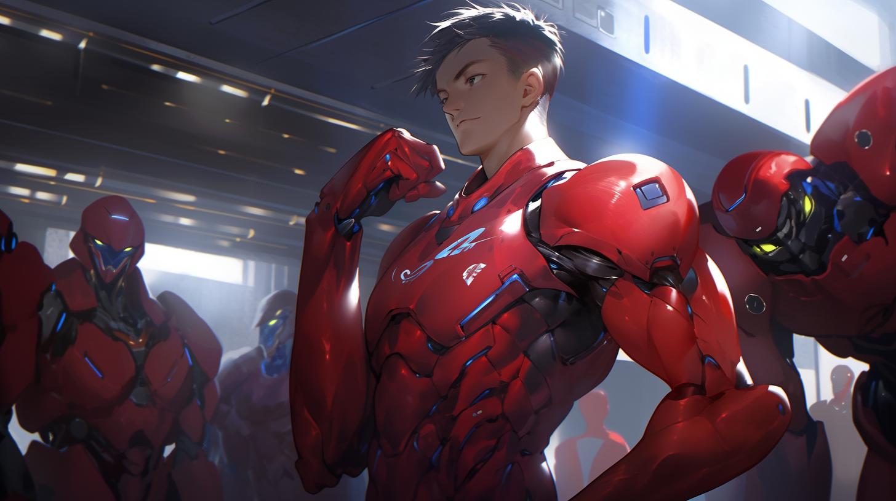
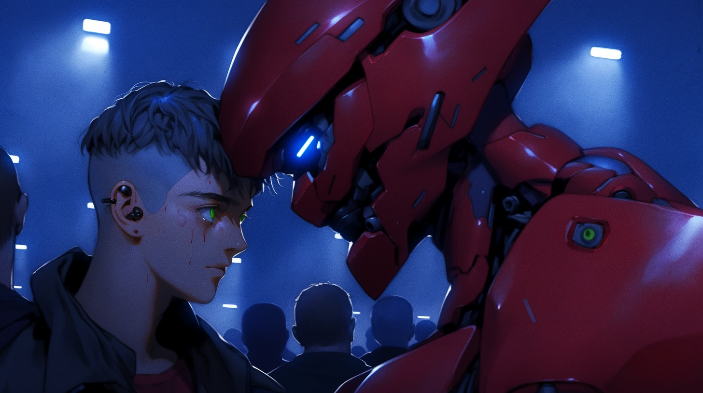

---
layout:
  title:
    visible: true
  description:
    visible: false
  tableOfContents:
    visible: true
  outline:
    visible: true
  pagination:
    visible: true
---

# Rapid Response

<figure><figcaption>
A Rapid Response unit prepares to disembark.
</figcaption></figure>

## Overview

A specialized division of [Angelis](angelis.md), Rapid Response are elite first responder units that are rapidly deployed to hotspots, battlefields, and disaster zones across [Greater Atla](../politics/greater-atla.md) and [GATA's](../the-basics.md) [partner states](../politics/new-dawn-accords.md#signatories). They typically operate in teams of 3-5 with complementary skills and are deployed from orbit in hard-landing pods called an Aegis, the same deployment method as [Mavericks](mavs.md). Due to many similarities between their training and operating procedures, new Mavericks are often recruited from the ranks of Rapid Response.

Rapid Response is identifiable by their red [combat gear](../../science-and-tech/gear.md#combat-gear), often in the small to mid-size range. Their gear emphasizes adaptability and maneuverability, designed to withstand the most extreme conditions, and are generally light on weapons and heavy on utility.

***

## The Role of Rapid Response

<figure><figcaption>
A Rapid Response operative in the heat of a crisis. 
</figcaption></figure>

Rapid Response units are deployed to conflict zones, natural disasters, and humanitarian emergencies around the world. They are often dispatched in a peacekeeping and humanitarian capacity to active warzones, and they are widely held in high regard around the world, even where GATA is unpopular.

However, Rapid Response is by its very nature an extremely dangerous job. The situations that Rapid Response are deployed to address can be very dynamic and unstable; unexpected variables can magnify a disaster in a split second.

<figure><figcaption>
An emotional moment between two members of Rapid Response.
</figcaption></figure>

As a result, mortality rate for Rapid Response is higher than standard infantry or [Guardians](guardians.md), particularly for operatives in their first few years on the job.

Rapid Response are sometimes deployed with [Research Corps](../../sol/institutions/the-research-corps.md) field researchers whose expertise will be required in their mission. Field researchers are typically very capable tactical operators themselves, with extensive field training emphasizing information supremacy, deception, and disruption tactics that leverage their comprehensive scientific and technical knowledge and quick thinking.

***

## **Rapid Response of Note**

* [Finneas Hughes](../../../narrative/cast/finn-hughes.md), one of the last of the UDA's, but opted out of the new MAVERICK program. Died eliminating the infamous Butcher of Bright Mesa. His genetic blueprint forms the basis of Angelis' next-gen peacekeeper program.
