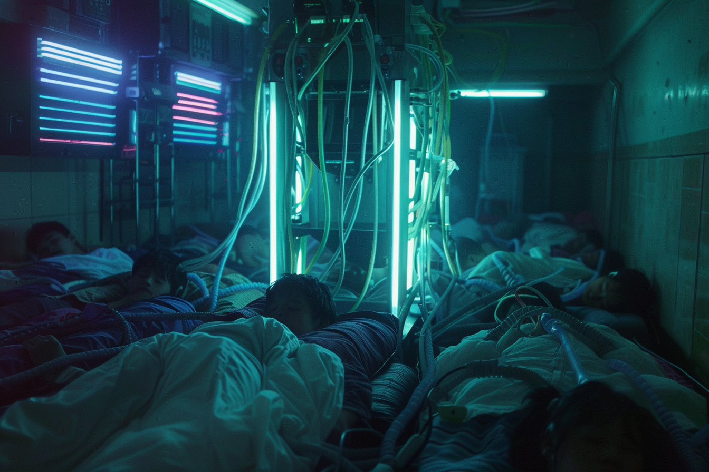

---
layout:
  title:
    visible: true
  description:
    visible: false
  tableOfContents:
    visible: true
  outline:
    visible: true
  pagination:
    visible: true
---

# Sleepers

<figure><figcaption>
A sleeper wearing a custom link interface.
</figcaption></figure>

## **Overview**

Sleepers are individuals who, for various reasons, spend the majority or entirety of their life within [constructs](../../science-and-tech/constructs.md). While some are bedridden with various conditions, there are those who prefer life in the constructs, and others who work on, or within, the constructs.

Sleepers are rarely seen but their presence is nonetheless felt in subtle ways across [GATA](../the-basics.md), from their influence in [politics](../politics/governance.md#the-third-quorum) and [enterprise](../enterprise/), to the ubiquitous [dormitories](sleepers.md#dormitories) that house many sleepers.

In recent years, some sleepers and dormitories have fallen under scrutiny from the AIC as the illegal [Astral seeds](../../science-and-tech/the-astral.md#astral-seeds) continue to spread on the black market. [Astral](../../science-and-tech/the-astral.md) use, while still not common among the wider population, is particularly prevalent among the sleeper community. It is believed that onboarding into private Astral networks is being facilitated in offline constructs and dormitories are increasingly being monitored by [the AIC](../institutions/atlan-information-control-aic.md) for hosting unregulated constructs.

***

## Dormitories

<figure><figcaption>
Sleepers crammed together in an illegal dormitory.
</figcaption></figure>

[Dormitories](sleepers.md#dormitories) serve as purpose-built residences for individuals who spend most of their lives in [virtual constructs](../../science-and-tech/constructs.md#virtual-constructs), either due to medical conditions, personal preference, or occupational requirements.

They can range widely by purpose, from rows of short-term "dive pods" found at inns, resorts, [arcades](../underground-scene/arcades.md), and pleasure houses, to long-term facilities with full-time care staff and [automata](../../science-and-tech/automata.md). There are also illegal dormitories which can more often be found in [Gray Zones](../politics/gray-zones.md) or in [the Free Territories](../../free-territories/the-basics.md).

Legitimate dormitories often include common areas where sleepers can move about and interact in real-life when necessary. These spaces are designed to be quiet and soothing, with amenities that promote mental health and well-being.
