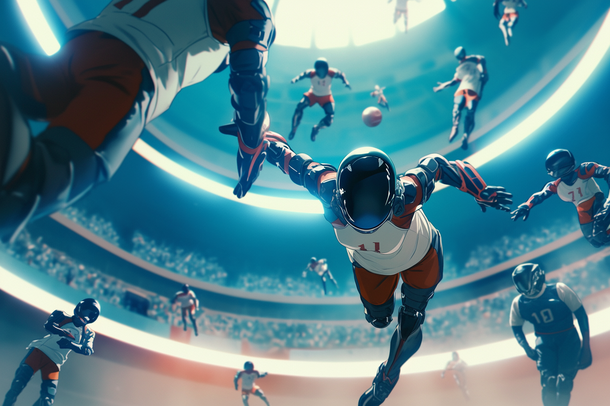

---
layout:
  title:
    visible: true
  description:
    visible: false
  tableOfContents:
    visible: true
  outline:
    visible: false
  pagination:
    visible: true
---

# Sports & Games

<figure><figcaption>
Children playing soccer in a field in the outskirts of a recovering city.
</figcaption></figure>

## Overview

Many traditional sports and games remain popular around the world, from team sports like football and basketball, to track and field, as well as chess and card games. However, a number of newer games have enjoyed massive growth across [GATA](../../the-basics.md) and beyond, many of which exploit new technologies to expand the scope of the possible and create new terrain for human competition.

From high-intensity contact sports to gravity-defying races, sports play a significant role in the cultural identities of GATA's various [districts](../../politics/districts.md) and other peoples, offering both entertainment and a means of fostering collaboration and friendly competition with other states.

***

## **Gravita**

<figure><figcaption>
A team prepares a play.
</figcaption></figure>

 

<figure><figcaption>
A guard leads an offensive play.
</figcaption></figure>

The most popular spectator sport in GATA. A contact sport played inside of an artificial gravity field.

The Defenders defend from the core; a sphere housing the [static field](../../../science-and-tech/statics.md) generator that maintains the modified gravitational envelope. The Offense attempts to score points by placing, throwing, or kicking the ball into one of the receptacles on the opposing team's core.

Gravita is known for its complex spatial strategy and hard-hitting action. The Gravita field is dotted with small static fixtures that players can use to steady or redirect themselves, obscure the enemy team's line-of-sight, or to bank the ball to teammates.

***

## **Static GP**

Static GP involves high-speed races through complex tracks using static vehicles of varying size classes. The races take place on courses filled with tight turns, vertical drops, and aerial sections.

Pilots must master the art of static drifting—decoupling one or more of their [static nodes](../../../science-and-tech/statics.md#static-nodes) and sliding through turns with precision—to maintain speed and control. Vehicles are equipped with advanced [static engines](../../../science-and-tech/statics.md#static-engines-and-motion) for enhanced responsiveness and maneuverability.

Static GP is a high-stakes, prestigious sport with a significant following, known for its breathtaking displays of skill and daring, as well as its high-value prize pools which include [credits](../../politics/money.md#credits-currency) and [keys](../../politics/keys.md).

***

## **Darts**

<figure><figcaption>
A thrill-seeking youth tricking on a high-end dart board.
</figcaption></figure>

 

<figure><figcaption>
Dart racers speeding through a district.
</figcaption></figure>

A “dart” is a high-performance variant of the [static boards](../../../science-and-tech/statics.md#static-boards) that are popular with the youth, capable of awesome displays of speed and agility. Darts use the widely paradigmed [static field tech](../../../science-and-tech/statics.md) to surf the Earth's gravitational field.

Riders use links to drive their dart's static engine, and hone their skills in various dart techniques, based on their style and preferences. One of the most fundamental dart skills that dart riding emphasizes over standard static boards is static drifting; de-coupling one or more of the board's static nodes to fluidly slide through turns and other maneuvers.

Every dart board is tailored to its rider, who must carefully calibrate the static manifold created by their board's [static engine](../../../science-and-tech/statics.md#static-engines-and-motion). These compromises determine a dart board's top speed, acceleration and deceleration, maneuverability, range, length, width, and weight.

This diversity of dart board form factors has made it suitable for a wide range of extreme sports, from professional tricking to racing, and rising popularity within street culture where the urban environment presents unique opportunities and challenges.

***

## Neurochess

<figure><figcaption>
A player explaining neurochess.
</figcaption></figure>

 

<figure><figcaption>
A player contemplates their move.
</figcaption></figure>

Neurochess is a cerebral sport that evolves traditional chess-like play with [link use](../../../science-and-tech/links.md). Players connect to the neurochess board, allowing them to visualize and manipulate the chessboard with their minds. The game can be played on a holographic game board or inside of a [virtual construct](../../../science-and-tech/constructs.md#virtual-constructs).&#x20;

The game adapts signature chess mechanics and expands the field of play into a three-dimensional cube grid, making it far more complex than traditional chess. Strategies are extremely nuanced, and require very strong visual-spatial intelligence. Naturally, [psychotech](../../../science-and-tech/psychotech.md) is not permitted during play.

Neurochess tournaments are major events within academic and upper-class circles, drawing large audiences who follow the games through immersive virtual constructs. Neurochess is easily the most competitive and prestigious game or sport across all of the [Atlan Academies](../../institutions/the-atlan-academy-system.md), and success in neurochess is a sure path to recognition within and without the academy's higher ranks.

***

## Guarda

<figure><figcaption>
A player considering their next move.
</figcaption></figure>

 

<figure><figcaption>
Guarda with its 6x6 grid.
</figcaption></figure>

A tactical card game originating during [the Dark Decade](../../../history/the-dark-decade.md) that grew in popularity during [GATA's](../../the-basics.md) expansion over the course of [the Reconstruction](../../../history/the-reconstruction.md). Today, one would be hard-pressed to find a citizen of GATA who doesn't know [how to play Guarda](guarda.md).

The cards used in Guarda predate the game by several years. The cards were originally called "léi" (雷, pronounced "lay", meaning "thunder"), and were created by a Chinese-American software engineer in [Bright Mesa](../../history/bright-mesa.md), two years after [the Crash](../../../history/the-crash.md). Inspired by the I Ching, the cards enjoyed some early popularity in the American South West as a divination system during the Dark Decade. Léi divination remains popular to this day, particularly in [the Free Territories](../../../free-territories/the-basics.md) of North America and China.

It is not known who first started using the lei cards as a game, but before long, the children of Bright Mesa were drawing grids in the dirt and using the cards to attack and defend. By the end of the Dark Decade the rules had been refined, and it had become wildly popular, even among the adults who had come to enjoy gambling on the game.

After [the Morning Light Summit](../../politics/new-dawn-accords.md#the-morning-light-summit) and the nearby LA camp's subsequent [districting](../../politics/districts.md#the-path-to-districthood) by the fledging GATA, people began to, slowly, and then suddenly, cross great distances and intermingle once again. The mass, voluntary relocation of a huge number of refugees under [Atla's](../../key-locations/atla.md) [Existence Doctrine](../../military-and-defense/existence-doctrine.md) spread the game far and wide at the very onset of the Reconstruction.

"Guarda" as it had then come to be called, (a Spanish-language reference to Atla's symbolic [Guardian](../../military-and-defense/guardians.md) [war frames](../../../science-and-tech/frames.md)), quickly became the most popular new table game since the rise of poker in the 20th century.&#x20;

Because of its fast-paced gameplay, short matches, and simple theory, Guarda appeals to a wide audience, however it is for these same reasons that it is not as valued by the academic elites.&#x20;

Nonetheless, even the world's top neurochess champs can't defeat the Guarda pros, highlighting the fundamental difference between strategy and tactics, or computers and human behavior.
