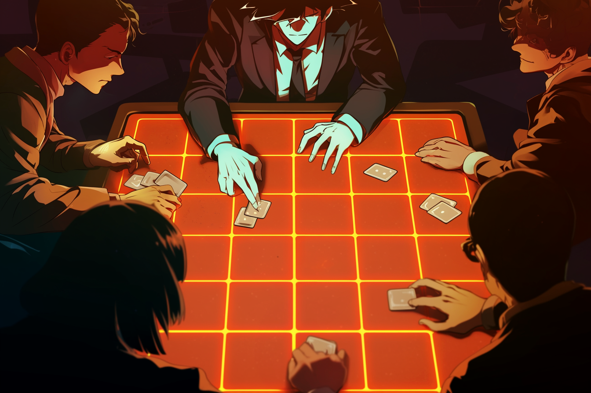

---
layout:
  title:
    visible: true
  description:
    visible: false
  tableOfContents:
    visible: true
  outline:
    visible: false
  pagination:
    visible: true
---

# Guarda

<figure><figcaption>
A player considering playing their next card.
</figcaption></figure>

## Overview

A tactical card game originating during [the Dark Decade](../../../history/the-dark-decade.md) that grew in popularity during [GATA's](../../the-basics.md) expansion over the course of [the Reconstruction](../../../history/the-reconstruction.md).

Known for its fast-paced gameplay, short matches, and its signature trap-like card called a "guard". Guarda is easy to learn, but difficult to master, as evidenced by the tactical complexity displayed at the peak of competitive play.

While originally played using a 6x6 grid, a number of variants have become popular in recent years, including the 4x4 variant called "Grda", as well as 5x5 and 10x10 variants.

***

## How to Play

<figure><figcaption>
Guarda with its 6x6 grid.
</figcaption></figure>

Guarda is a strategic card game that can be played with 2-8 players in free-for-all or teams.

In the center of the play area is a 6x6 grid called "the field". Players each sit facing one side of the field. Each player has a singular game piece which they will move around the field throughout the game.

On every Guarda card is the same 6x6 grid as on the the field, and a single arrow (or other directional indicator). The card's grid either displays a line filling up all consecutive horizontal cells in one of the grid's rows, or a line filling up all consecutive vertical cells in one of the grid's columns.

Players take turns clockwise, drawing cards, moving their piece on the field, and combating their opponents on the field with their cards until a winner is decided.

Uniquely, each player can set a secret card called a "guard" face-down in front of them, waiting to be activated. Well-managed hands, strategic movement, and the tactical use of the trap-like guard are the signatures of Guarda.

Anticipate your opponents movements, attack when their guard isn't set, and try not to get caught with your guard down.

***

## The Cards

Each player has their own Guarda deck. Though different decks may have different visual designs, the decks are identical in terms of their card composition.

Every Guarda deck contains 3x copies of each of the 12 different Guarda cards.

Each of the twelve different card types depict one of the different possible straight-line patterns that can be formed with the cells of the card's 6x6 grid:

* 6 cards depicting the 6 possible vertical lines.
* 6 cards depicting the 6 possible horizontal lines.

The direction that a card's arrow is pointing (towards the field or towards the player) when it is played determines whether the card is attacking or defending.

<figure><figcaption>
Example of Guarda cards in offensive and defensive orientations.
</figcaption></figure>

When a player plays a card with the arrow pointing towards the field, they are attacking.

When a player plays a card with the arrow pointing toward themselves, they are defending.

The grid cells that are highlighted on the card indicate which spaces on the field are being attacked or defended.

***

## Getting Started

Before the game begins, a player is selected to draw first.

Each player then takes clockwise turns drawing a single card from the top of their shuffled deck and placing it face up in front of themselves with the arrow pointing toward the field.

Once a player has drawn two cards with overlapping spaces, they then place their game piece on a space in the field where the horizontal and vertical lines on their cards' grid patterns intersect.

If that space is already occupied by another player, they draw until they draw an unoccupied intersecting space.

After placing their piece, the player places any cards drawn in this process face down in their discard pile.

Once every player's piece is placed, players each draw a hand of 5 cards.

## Turn Phases

Each turn has the following phases; (1) Draw, (2) Move, (3a) Act, (3b) React, and (4) Settle.

1. During the Draw phase, the player draws a card.\
   \
   If they have more than 5 cards in their hand they must discard until they have only 5 cards.\
   \
   If they have fewer than 5 cards, the player continues to draw until they hold 5 cards.\
   \
   If the player runs out of cards from their draw pile, they shuffle their discard pile and then draw until they hold 5 cards.
2. During the Move phase, the player may move their piece to an adjacent square on the field if they wish, but they may not move diagonally.\
   \
   The player can choose to discard as many cards as they wish from their hand in order to move an additional space for each discarded card, but they may only move in one direction.
3. During the Act phase the player may do one of the following: prepare their guard OR attack the field.\
   \
   The player prepares their guard by playing a card from their hand face down. It is turned sideways to indicate it is still preparing.\
   \
   At the beginning of the player's next Act phase, the player "sets" their guard, secretly orienting it offensively or defensively. The guard's orientation will determine if it will perform a block or a counter-attack when activated.\
   \
   When the player sets their guard, the guard remains face down, its orientation a secret to their opponents, ready to be activated at a later time when the player is under attack. (Note: Players are free to check their own guard's orientation at any time during their turn if they have forgotten which way it is oriented.)\
   \
   Players can only have one guard at any time and its orientation cannot be changed. If they set a new guard, their existing guard is discarded, and the new guard is in the preparation state until their next turn.\
   \
   The player attacks by playing one or more cards face up and pointing toward the field.\
   \
   The player can attack any one target space, and may play any cards that target that same space, so long as the grid pattern on all attacking cards overlap that same target space.\
   \
   The attacks will deal one damage to any and all opponents for each attack overlapping their position on the field.\
   \
   Players who are under attack [may then react](guarda.md#reacting-to-attacks), in clockwise order, by blocking with cards in their hand, or activating their guard (if it is set).
4. During the Settle phase, the player discards any cards that were played face up during their turn, and may discard as many additional cards from their hand as they wish (Note: discarded cards during the Settle phase do not grant movement).\
   \
   The player will draw replacement cards at the beginning of their next turn.

## Reacting to Attacks

If an attack is made, the React phase begins and any player(s) being attacked may choose to react by activating their guard, or defending with cards from their hand.

### Defending with your Hand

Players can defend against an attack with cards in their hand so long as the card's grid pattern overlaps with their own piece's position on the field (when oriented defensively with the arrow facing themselves).

Each card played defensively negates one point of damage.

Defending players cannot counter-attack with cards in their hand.

<figure><figcaption>
An attacker devastated by a guard's counter-attack.
</figcaption></figure>

### Activating your Guard

When reacting to an attack, a defending player may activate their concealed guard.

Guards can either block or counter. The guard's effect is determined by its orientation.

If a player is attacked with two or more cards while their guard is preparing (placed sideways), their guard is broken, the card is moved to the discard pile, and one point of damage is negated.

**Block:** If the guard is in the defensive orientation then it blocks; the defending player takes no damage regardless of the number of cards used in the attack. If the defending player is on a space overlapped by the guard card's grid pattern, this is a "critical block"; the guard is returned to the player's hand and the player may prepare another guard immediately, which can be set on their next turn.

**Counter:** If the guard is in the offensive orientation then it counter-attacks; the defending player takes one point of damage, and the attacking player takes two damage. If the attacking player is on a space overlapped by the guard card's grid pattern, this is a "critical counter"; the attacking player takes one additional point of damage.

When a defending player activates their guard, it is discarded immediately after taking effect (except in the case of a critical block).

If the player being attacked cannot or does not react, the attack is successful and the player loses one health point for each attacking card.

The attacking player cannot play their guard to defend against the defending player's counter-attack, but they can play cards from their hand to defend against a counter-attack.

If no more actions are to be taken, and the attacking player remains in the game, the React phase concludes, and the attacking player's turn continues to its Settle phase.

## Winning the Game

Guarda can be played with a variety of win conditions, and is sometimes played with stakes.

### Standard (No Stakes):

* **Elimination:** The most common style of play. Each player begins the game with 10 health points. Players take turns until there is only one player, or team, left standing.
* **Victory:** Each successful attack on an opponent earns the attacking player, or team, a point. First player or team to 10 points wins.
* **Exhaustion:** Players do not reshuffle their discard pile when they exhaust their draw pile. When a player runs out of cards in their draw pile, they are defeated.

<figure><figcaption>
A street kid hoping to finish the game with an attack.
</figcaption></figure>

### Gambling (Stakes):

* **Bounty:** The same as Elimination, except each player must ante up with the table stake (called their "bounty"). When a player defeats an opponent, they claim that player's bounty.
* **Spoils of War:** The same as Victory, except each player must ante up with the table stake (called their "spoils"). The winning player or team takes all.
* **Scavenger:** The same as Exhaustion, except each player must ante up with the table stake (called their "loot"). When a player is defeated, their piece remains on the grid, and the first player to move to the same space claims their loot.

<figure><figcaption>
A high-stakes Guarda table in a private club.
</figcaption></figure>

## Notes:

* Players usually provide their own Guarda decks. They fan out their cards at the beginning of the game to prove that their deck is regulation.
* In Guarda games with high-stakes or a large number of players, a player's guard card is played face-down directly on the grid, placed beneath their game piece, and is moved with the game piece. This prevents cheating, and makes it easier for players and spectators to see the state of the game at a glance.
* It is typical in street games of Guarda for players to use a 10-sided die as their game piece in order to track their health or victory points. Other common game pieces include stones with chalk numbers written on them, or hard-coded game pieces with digital counters. However, when playing in tournaments or on dedicated game boards, game stats are tracked in other ways, freeing players to use whatever game piece they'd like.
* It is common for the back side of standard Guarda cards to depict a 2x3 grid of square cells, so that six spare cards can be laid to produce a 6x6 grid for play area. This also allows players to easily build irregular grids for their games, if they choose. However, players can also simply draw a Guarda grid to their preference on a surface, or scratch it into the dirt.
* Paper slate cards are expensive, but are common in gaming establishments and in high-end decks of Guarda cards, allowing cards to change color based on their orientation, and feature animations when in play.
* In addition to the gambling variants of Guarda, there are a number of regional variants and meta-games that use Guarda cards and/or the Guarda Classic mechanics as their foundation.
* One of the most popular variants, "Grda", is a 4x4 variant played using a standard deck, but removing all copies of the 12 unused card types (the outermost horizontal and vertical lines), reducing the deck to 18 cards, reducing hands to 3 cards, and increasing the player's health points to 20. The guard's rules are unaffected.
