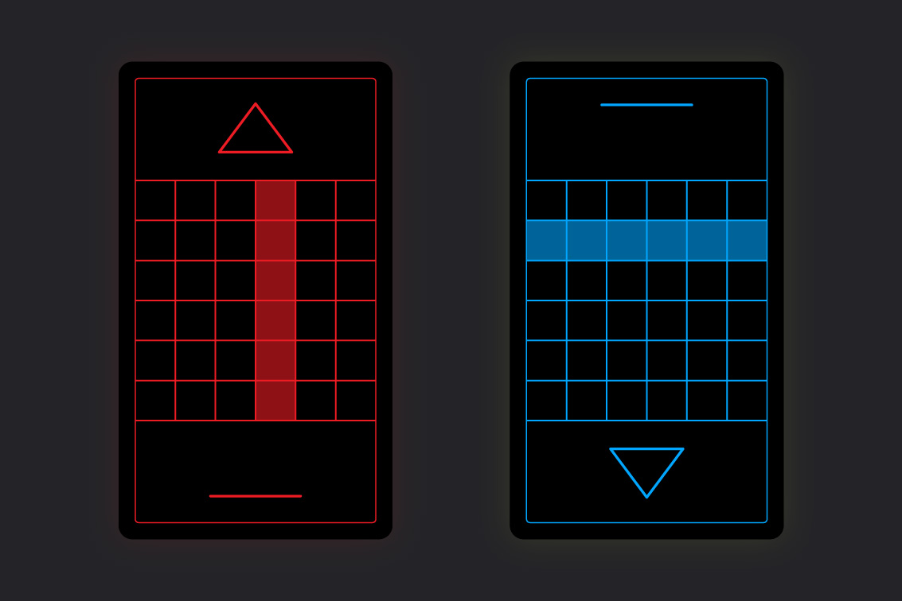

---
layout:
  title:
    visible: true
  description:
    visible: false
  tableOfContents:
    visible: true
  outline:
    visible: false
  pagination:
    visible: true
---

# Guarda

<figure><figcaption>
A player carefully considering their next move.
</figcaption></figure>

## Overview

A tactical card game originating during [the Dark Decade](../../../history/the-dark-decade.md) that grew in popularity during [GATA's](../../the-basics.md) expansion over the course of [the Reconstruction](../../../history/the-reconstruction.md).

Known for its direct, competitive gameplay, short matches, and its signature trap-like card called a "guard".

Guarda is easy to learn, but difficult to master, as evidenced by the tactical sophistication displayed at the peak of competitive play.

While it was traditionally played with a 6x6 grid and 6-card hand, a number of variants have become popular over the years, including the modern, fast-paced 5x5 variant.

***

## How to Play

<figure><figcaption>
Guarda being played with a 6x6 grid.
</figcaption></figure>

Guarda can be played with 2-8 players in free-for-all or teams.

In the center of the play area is a grid called "the field" (6x6 in standard play). Players each sit facing one side of the field, and control a singular game piece which they will move around the field throughout the game.

On every Guarda card is the same grid as on the field, and a single arrow (or other directional indicator). The grid displays a pattern corresponding to spaces on the field the card affects when it is played.

Players take turns drawing, moving, and fighting on the field until a winner is decided.

Uniquely, each player can set a secret card called a "guard" face-down, waiting to be activated.

Well-managed hands, strategic movement, and the tactical use of the trap-like guard are the signatures of Guarda.

***

## The Cards

Each player has their own Guarda deck. Though different decks may have different visual designs, every standard Guarda deck is identical in terms of card composition.

Standard Guarda decks contains 4x copies of each of the 12 different Guarda cards that can be played on the standard 6x6 field.

Each of the twelve different card types depict one of the different possible straight-line patterns that can be formed with the cells of the card's 6x6 grid:

* 6 cards depicting the 6 possible vertical lines.
* 6 cards depicting the 6 possible horizontal lines.

The direction that a card's arrow is pointing when it is played (towards the field or towards the player) determines whether the card is attacking or defending.

<figure><figcaption>
Example of Guarda cards in offensive and defensive orientations.
</figcaption></figure>

When a player plays a card with the arrow pointing towards the field, they are attacking.

When a player plays a card with the arrow pointing toward themselves, they are defending.

The grid cells that are highlighted on the card indicate which spaces on the field are being attacked or defended.

***

## Getting Started

Before the game begins, a player is selected to draw first.

Each player then takes clockwise turns drawing a single card from the top of their shuffled deck and placing it face up in front of themselves with the arrow pointing toward the field.

Once a player has drawn two cards with overlapping spaces, they then place their game piece on a space in the field where the patterns overlap.

If the space is already occupied by another player, they draw until they get an unoccupied starting space.

After placing their piece, the player places any cards drawn in this process face down in their discard pile.

Once every player's piece is placed, players each draw a hand of 6 cards.

## Turn Phases

Each turn has the following phases; (1) Draw, (2) Move, (3) Act, and (4) Settle.

1. **Draw Phase:** During the Draw phase, the player draws a card.\
   \
   If they still have fewer than 6 cards, the player continues to draw until they have 6 cards.\
   \
   If they have more than 6 cards, the player discards until they have only 6 cards.\
   \
   If the player has a guard, it does not counts toward their hand size.\
   \
   If the player runs out of cards from their draw pile, they shuffle their discard pile and then draw until they have 6 cards.\

2. **Move Phase:** During the Move phase, the player may choose to burn as many cards as they wish from their hand in order to move one space for each card burned.\
   \
   If the player is on a space adjacent to an opponent, they may burn cards from their hand to "push" their opponent, moving the opponent one space in the opposing direction for each card burned.\
   \
   They may only move/push in a straight line.\
   \
   Cards burned to move/push are placed in their discard pile.\

3. **Act Phase:** During the Act phase the player may either (a) prepare their guard OR (b) attack the field.\
   \
   a) **Preparing a Guard**\
   \
   The player prepares their guard by playing a card from their hand face down. It is laid sideways to indicate it is still preparing.\
   \
   At the beginning of the player's next Act phase, the player "sets" their guard, secretly orienting it offensively or defensively. The guard's orientation will determine if it will perform a block or a counter-attack when activated.\
   \
   When the player sets their guard, the guard remains face down, its orientation a secret to their opponents, ready to be activated at a later time when the player is under attack. (Note: Players are free to check their own guard's orientation at any time during their turn if they have forgotten which way it is oriented.)\
   \
   Players can only have one guard at any time and its set orientation cannot be changed. If they set a new guard, their existing guard is placed in their discard pile, and the new guard is in the preparation state until their next turn.\
   \
   b) **Attacking**\
   \
   The player attacks by playing one or more cards face up and pointing toward the field.\
   \
   The attack will deal one damage to any and all opponents for each attacking card overlapping that opponent's position on the field.\
   \
   Players who are under attack [may then react](guarda.md#reacting-to-attacks), in clockwise order, by blocking with cards in their hand, or activating their guard (if it is set).\

4. **Settle Phase:** During the Settle phase, the player discards any cards that were played face up during their turn, and may discard as many additional cards from their hand as they wish (Note: discarded cards during the Settle phase do not grant movement).\
   \
   The player will draw replacement cards at the beginning of their next turn.

<figure><figcaption>
An attacker devastated by a guard's counter-attack.
</figcaption></figure>

## Reacting to Attacks

If an attack is made, any players being attacked may choose to react by (1) defending with cards from their hand OR (2) activating their guard.

If a player being attacked cannot or does not react, then the attack is successful and the attacked player loses one health point for each attacking card.

If a player is attacked with two or more cards while their guard is still preparing (laid sideways), their guard is "broken" and moved to their discard pile. One point of damage is negated.

### 1. Defending with your Hand

Players can defend against an attack with cards in their hand so long as the card's grid pattern overlaps with their own piece's position on the field (when oriented defensively with the arrow facing themselves).

Each card played defensively negates one point of damage.

Defending players cannot counter-attack with cards in their hand.

### 2. Activating your Guard

When reacting to an attack, a defending player may activate their concealed guard.

Guards can either (a) block OR (b) counter. The guard's effect is determined by its set orientation.

a) **Block:** If the guard is set in the defensive orientation then it blocks; the defending player takes no damage regardless of the number of cards used in the attack. If the defending player is on a space overlapped by the guard card's grid pattern, this is a "critical block"; the defending player gains one health point and the guard is returned to the player's hand; the player may prepare another guard immediately, which can be set on their next turn.

b) **Counter:** If the guard is set in the offensive orientation then it counter-attacks; one point of damage is negated, and the attacking player takes two damage. If the attacking player is on a space overlapped by the guard card's grid pattern, this is a "critical counter"; the attacking player takes one additional point of damage.

When a defending player activates their guard, it is discarded immediately after taking effect (except in the case of a critical block).

The attacking player cannot play their guard to defend against a defending player's counter-attack, but they can play cards from their hand to defend against a counter-attack.

If no more actions are to be taken, and the attacking player remains in the game, the attacking player's turn continues to its Settle phase.

***

## Winning the Game

<figure><figcaption>
A street kid hoping to finish the game with an attack.
</figcaption></figure>

Guarda can be played with a variety of win conditions, and is sometimes played with stakes.

### Standard (No Stakes):

* **Elimination:** The most common style of play. Each player begins the game with 10 health points. Players take turns until there is only one player, or team, left standing.
* **Victory:** Each successful attack on an opponent earns the attacking player, or team, a point. First player or team to 10 points wins.
* **Exhaustion:** Players do not reshuffle their discard pile when they exhaust their draw pile. When a player runs out of cards in their draw pile, they are defeated.

### Gambling (Stakes):

* **Bounty:** The same as Elimination, except each player must ante up with the table stake (called their "bounty"). When a player defeats an opponent, they claim that player's bounty.
* **Spoils of War:** The same as Victory, except each player must ante up with the table stake (called their "spoils"). The winning player or team takes all.
* **Scavenger:** The same as Exhaustion, except each player must ante up with the table stake (called their "loot"). When a player is defeated, their loot remains on the field, and the first player to move to the same space claims their loot.

<figure><figcaption>
A high-stakes Guarda table in a private club.
</figcaption></figure>

***

## Strategy

These are some strategic concepts to consider when playing Guarda:


#### 🤲 Hand Management

When you draw your hand, orient all of the cards in your hand in the offensive orientation with the arrow pointing toward the field.

Determine if you have any cards that attack your opponent(s), and separate those to one side of your hand.

Then flip the remaining cards to the defensive orientation and determine if any of the remaining cards will successfully defend you. If so, separate those to the side as well.

The remaining cards can be burned for movement, or might be useful as a guard.



#### 🔮 Know When to Hold 'Em

If you plan to move on your next turn, consider where you'd like to move and if any of your remaining cards will become useful when you are on that space.



#### 🗑 Know When to Fold 'Em

If you still have undesirable cards at the end of your turn, remember to discard them so that you can draw more new cards on your next turn.



#### 🤜  Push and Shove

Pushing opponents is a key strategic move, allowing you to put then where you want them for a follow up attack, or to disrupt their defensive options.



#### 🌊 Be Water

Prepare yourself for other players to push you by considering which direction you are likely to be pushed based on your positioning. Favor defensive cards that follow that line, ensuring you can still react to their follow-up attack.



#### ⚡ Lightning Never Strikes Twice

If you were attacked by your opponent on your previous turn, it is not likely they still have cards that would attack your space, so it may be strategic to remain still.



#### ↔ It Cuts Both Ways

Consider where your opponent is on the board, and avoid resting on the inverse space as them, as they may be collecting cards to play defensively that they can then repurpose to launch a devastating attack.

Alternatively, you can use that same principle to bait them into wasting those cards by activating your guard.


***

## Notes:

* Players usually provide their own Guarda decks. They fan out their cards at the beginning of the game to prove that their deck is regulation.
* Guarda hand size is determined by the size of the field grid. For example, a 5x5 field means a 5-card hand size (not including the guard). A 9x9 grid means a 9-card hand.
* In Guarda games with high-stakes or a large number of players, a player's guard card is played face-down directly on the field, placed beneath their game piece, and is moved with the game piece. This prevents cheating, and makes it easier for players and spectators to see the state of the game at a glance.
* It is typical in street games of Guarda for players to use a 10-sided die as their game piece in order to track their health or victory points. Other common game pieces include stones with chalk numbers written on them, or hard-coded game pieces with digital counters. However, when playing in tournaments or on dedicated game boards, game stats are tracked in other ways, freeing players to use whatever game piece they'd like.
* It is common for the back side of standard Guarda cards to depict a 2x3 grid of square cells, so that six spare cards can be laid to produce a 6x6 field. This also allows players to easily build irregular fields for their games, if they choose. However, players can also simply draw a Guarda field to their preference on a surface, or scratch it into the dirt.
* Paper slate cards are expensive, but are common in gaming establishments and in high-end decks of Guarda cards, allowing cards to change color based on their orientation, and feature animations when in play.
* In addition to the gambling variants of Guarda, there are a number of regional variants and meta-games that use Guarda cards and/or the Guarda Classic mechanics as their foundation.
* One of the most popular variants, "Grda", is a 4x4 variant played using a standard deck, but removing all copies of the 12 unused card types (the outermost horizontal and vertical lines), reducing the deck to 18 cards, reducing hands to 4 cards (including the guard), and increasing the player's health points to 20. The guard's rules are unaffected.
