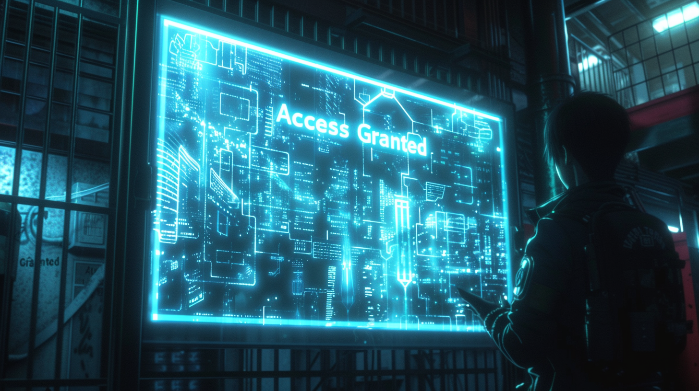

---
layout:
  title:
    visible: true
  description:
    visible: false
  tableOfContents:
    visible: true
  outline:
    visible: false
  pagination:
    visible: true
---

# Keys

<figure><figcaption>
A terminal requiring appropriate keys for access.
</figcaption></figure>

## Overview

Keys are digital signatures that bestow specific privileges on their holder. Every key has its own rules, and while many keys can be bought, or traded, others can only be earned, inherited, or assigned, and some can also be revoked.

Keys are an integral part of every-day life inside of [GATA's](../the-basics.md) [districts](districts.md). Keys are how citizens access the district, their homes, places of work, networks and devices, and exclusive goods and services. Keys also play an important role in [institutions](../institutions/) and [enterprise](../enterprise/), and are of great interest to [operators](../enterprise/operators.md), [criminal syndicates](../criminal-element/syndicates.md) and other motivated parties.

***

## Usage

A key's cryptographic signature can be encoded in many different form-factors, whether it's in digital storage on data sticks, steganographically encrypted into media like art or music, embedded in the structure of physical objects, or stored in the mind and usable only by [linking](../../science-and-tech/links.md) directly with systems.

### **Privileges**

When people seek to acquire keys, what they are really after are their associated privileges. The purpose of keys is to intelligently encapsulate specific privileges into discreet cryptographic objects that can be used by users of [The System](the-system.md). By tying all privileges within The System to keys, GATA's decentralized government can operate efficiently and at a distance without having to micro-manage districts and enforce [NDA-compliance](new-dawn-accords.md) and good governance directly.

Beyond GATA's keys, any enterprise, organization, or individual can instantiate their own keys in The System with whatever privileges they have to offer. Care is taken to ensure that keys and their associated privileges are thoughtfully composed to ensure that they don't lead to negative unforeseen consequences down the road, however mistakes are sometimes made.

### Inheritance

When someone dies, any transferable keys they have pass according to their inheritance arrangements. This can also occur automatically after a specified duration, typically 10 years. If no inheritance is set, the keys will pass to their next of kin, and if none, they will pass into the [AIC's](../institutions/atlan-information-control-aic.md) long-term cold storage and can be claimed via an appeal to the AIC if there is a legitimate claim.

***

## **Types of Keys**

### Citizenship Keys

Citizenship keys are bestowed to GATA citizens at birth. Citizenship cannot be revoked. All System activity is authenticated with Citizenship keys, meaning if you don’t have citizenship, you can’t use the System. These keys are biometrically validated once a year at [System Terminals](../../science-and-tech/terminals.md), but can be saved to digital storage in data sticks for every-day use. [The Local Authority](../law-and-order/local-authority.md) may request to authenticate citizenship keys, however citizens are not required by law to authenticate their citizenship keys to other citizens or enterprises.

Only citizenship keys that have been validated for the year can sign for other GATA privileges, like [gate](../borders-and-travel/gates.md) keys and System keys, or to collect their share of [Yield](yield.md).

### **Gate Keys**

Gate keys grant a citizen access to a particular district. Non-transferrable gate keys are assigned at birth to every GATA citizen born inside of a [district](districts.md). Transferrable gate keys can also be earned from or bestowed by private enterprises with an allocation of transferrable keys, or they can be traded on the market. However, in order to use a gate key, you must have the requisite citizenship keys.

### Testnet Keys

The most valuable (and illegal) keys are unrestricted System-level Testnet keys; illegal [hard-coded](../../science-and-tech/hard-code.md) keys that weren't destroyed during a district's transition from System Testnet. These keys can grant certain specific privileges, like access to sub-systems or granting exceptions to certain restrictions.

Every district is believed to have some, even [Atla](../key-locations/atla.md), however there have only been a handful of incidents of their use being discovered. In all cases, the transgressors were made examples, heightening the risk of trading in Testnet keys.

In the criminal underworld, myths persist of various unrecovered Testnet keys that can bestow extraordinary privileges, if only they can be found.
