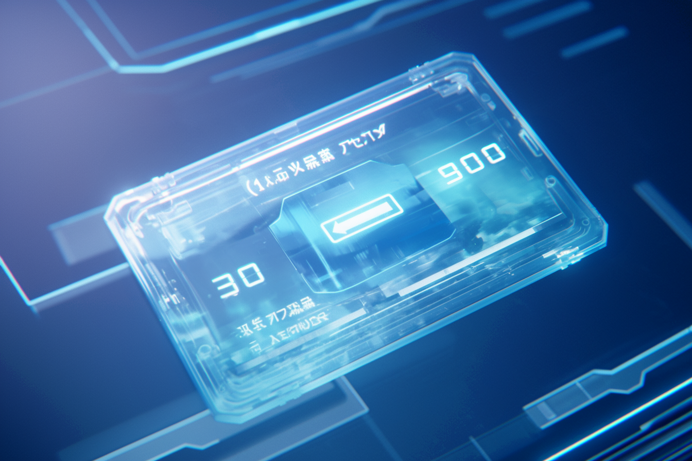
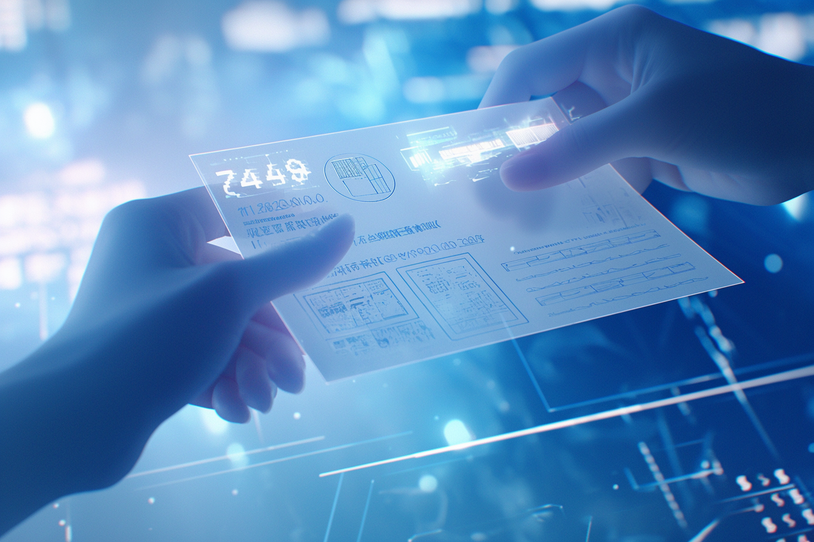

---
layout:
  title:
    visible: true
  description:
    visible: false
  tableOfContents:
    visible: true
  outline:
    visible: false
  pagination:
    visible: true
---

# Money

<figure><figcaption>
A credit transaction being set up on a slip.
</figcaption></figure>

## **Overview**

The [Greater Atlantic Territorial Alliance (GATA)](../the-basics.md) boasts a sophisticated and thriving economy operating on [the System's](the-system.md) decentralized infrastructure. At the heart of this economy is the System's native currency, [credits](money.md#credits-currency) (CRED), which facilitate cross-district and international commerce.&#x20;

While the System promises stability and efficiency, this comes at the cost of its automatic filtering of suspicious transactions. This [hard-coded](../../science-and-tech/hard-code.md) regulation sustains the existence of a thriving black market both within districts and across [Greater Atla](greater-atla.md).

Despite these challenges, GATA's prosperous and diverse financial ecosystem remains one of its greatest triumphs in the wake of [the Reconstruction](../../history/the-reconstruction.md).

***

## **Credits Currency**

Credits (CRED), commonly referred to simply as "creds", are the main medium of exchange within GATA and the native currency of the System.

Introduced with the creation of the System, credits facilitate legal transactions across all sectors, from everyday purchases to large-scale industrial operations. Credits are intrinsic to the operation of the System, which uses a hard-coded architecture that borrows from Old World decentralized networks.

Credits are regularly distributed via [the yield](yield.md) granted to GATA's citizens. The value of CRED is derived from the surplus generated by GATA's extensive operations, natural resources, and energy production, which are sold to domestic and international enterprise, as well as [state partners](new-dawn-accords.md#signatories).

As these tokens circulate through The System, they gradually accrue in various System-designed token sinks, taking them out of circulation forever. This mechanism ensures that the currency remains valuable and supports economic growth without the risk of devaluation.

### **Security and Privacy**

Transactions involving CREDS are untraceable, safeguarding the identities and personal information of users. This feature is particularly important in a world where data breaches are significant concerns. By ensuring that financial transactions cannot be easily tracked, GATA protects its citizens from potential misuse of their financial data.

With that said, this protection comes with a compromise; all CRED transactions are automatically filtered by the hard-coded System terminals, preventing illegal transactions, and alerting the local authority to suspicious network activity. Wallets involved in illegal transactions, or holding illegal assets, can be locked by the AIC, preventing the transfer of assets. Even in those cases, the assets can still be used for offline signing, giving them some potential value as slips or paper on the black market.

Of course, these restrictions and censures simply push the black market underground, driving the continued use of alternative currencies, slips, and other forms of physical money.

***

## **Alternative Currencies**

In addition to Credits, GATA's financial system includes alternative forms of currency to accommodate different types of transactions, investments, and user preferences. In addition to the many public currencies, every legal enterprise has its own private currency. Some goods and services can only be procured with a particular currency, resulting in constant fluctuations relative to the more stable CRED currency.

This market serves as a speculative sector for private capital to invest in growth and innovation, while many others see it as the world's biggest casino.

Some of the alternative currencies in the System economy have been ported over from legacy [Old World](../../history/the-old-world.md) ledgers.

### Bitcoin

Bitcoin is the most prominent legacy currency remaining from the [Old World](../../history/the-old-world.md). Primarily used as a store of value and a hedge against volatility similar to how gold was used historically. Due to the prevalence of [Sol-supervised](../../sol/the-basics.md) asteroid mining and techniques that allow the synthesis of many rare and exotic materials, precious metals like gold are no longer suitable for that purpose.

***

## **Slips**

<figure><figcaption>
A standard slip hardware wallet.
</figcaption></figure>

Small, portable hardware wallets that function as partial nodes for the CRED component of the System's vast network. Slips enable offline transactions, making them ideal for casual commerce and areas with limited connectivity. They can store various digital assets, keys, and other data, providing flexibility and security in everyday transactions.&#x20;

Slips can be configured in different ways to limit various permissions, such as biometric verification, adding a spending limit, or limiting particular assets to signing-only as a safeguard against theft.&#x20;

Slips are tied to an address on the System, and if lost, can be easily replaced so long as its owner has their recovery credentials. Slips without recovery credentials are sometimes used for off-the-books transactions, as the lack of recovery method ensures the exchange is secure.

## **Paper money**

<figure><figcaption>
Paper money used for secure offline transactions.
</figcaption></figure>

Paper money, also known as a paper wallet or simply "paper", is a common use of [paper slates](../../science-and-tech/slates.md#paper-slates), a resilient paper-like nanomaterial that is used to store encrypted information, including digital assets. Paper can be adorned with a wide variety of designs, which can serve to identify at a glance the currency or information that they contain.

While less physically secure than digital transactions, paper is valued in black market transactions for its untraceability. However, it carries other risks such as loss, theft, and destruction.

***

## **Legal and Regulatory Framework**

The financial system of GATA operates under a robust legal and regulatory framework to ensure its integrity and compliance with the [New Dawn Accords (NDA)](new-dawn-accords.md) as well as the Whole Privacy Protection Act (WPP).

Atlan Information Control (AIC) oversees the enforcement of financial regulations, ensuring that all transactions and economic activities align with GATA's stringent standards. The WPP further enhances the security of the financial system by regulating data collection, and preventing deceptive practices, surveillance, and systemic abuse.
