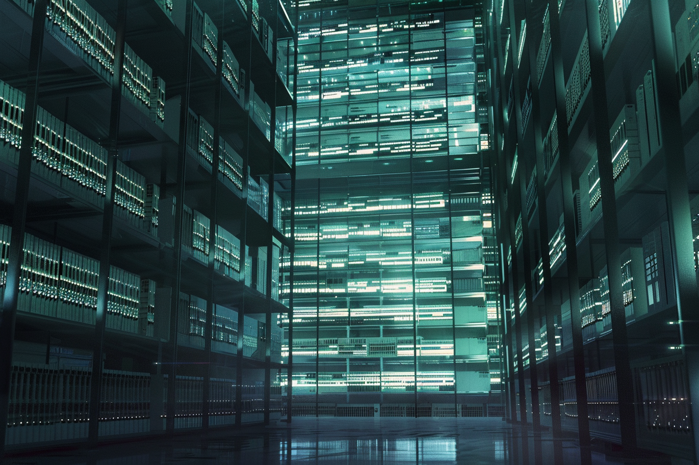

---
layout:
  title:
    visible: true
  description:
    visible: false
  tableOfContents:
    visible: true
  outline:
    visible: false
  pagination:
    visible: true
---

# The General Record

<figure><figcaption>
A secure facility housing a physical copy of GATA's General Record.
</figcaption></figure>

## **Overview**

The General Record is the official, public record of significant events across [Greater Atla](greater-atla.md). It is an ever-growing archive of historical events, and its management is overseen by the [First](governance.md#the-first-quorum) and [Second Quorum](governance.md#the-second-quorum). It also includes all public activity on [The System](the-system.md)’s decentralized network. Its contents include historical material from [the Old World](../../history/the-old-world.md) and documented first-person accounts from [the Dark Decade](../../history/the-dark-decade.md) and [Reconstruction](../../history/the-reconstruction.md).

In addition to being stored digitally in each [System Node](the-system.md#system-nodes) found in every one of [GATA's](../the-basics.md) districts, the General Record has multiple redundant physical copies stored in secure facilities in various secure locations across Greater Atla, in order to ensure its preservation.

The General Record is a critical source of truth for government and enterprise, as well as legal proceedings. It is often cited by [the AIC](../institutions/atlan-information-control-aic.md) in its deliberations, and in some cases may even be modified by the [AIC's](../institutions/atlan-information-control-aic.md) rulings.
