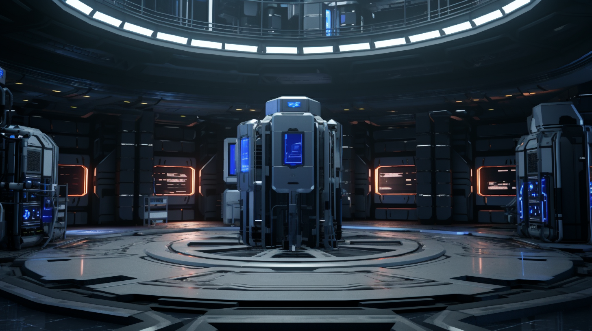

---
layout:
  title:
    visible: true
  description:
    visible: false
  tableOfContents:
    visible: true
  outline:
    visible: false
  pagination:
    visible: true
---

# The System

<figure><figcaption>
A control room inside of a System Node.
</figcaption></figure>

## Overview

The System is a decentralized, [hard-coded](../../science-and-tech/hard-code.md) infrastructure that handles power, economic transactions, communication, and coordination within and between [districts](districts.md).

After [GATA](../) began transitioning its districts to The System, there was a significant decrease in violence, political instability, mental and physical disease, and other social issues.

This transformation led to operational efficiencies that produced surpluses called [Yield](yield.md), which could be distributed to citizens, marking what is now called "The First Light of the New Dawn." The System is responsible for calculating and distributing Yield to GATA’s citizens.

The System’s concerns are sometimes referred to as the 3 R’s: Resources, Risk, and Rights.

***

## Technical Description

Under the hood, The System is an advanced, distributed state machine operating on a network of [hardcode](../../science-and-tech/hard-code.md) nodes and clients designed by [Systema](../enterprise/systema.md) using the [Asimov-complete](../../science-and-tech/asimovian-architecture.md) programming language, [LMNL](../../science-and-tech/hard-code.md#lmnl). [System Nodes](the-system.md#system-nodes) are large, facility-sized computers that house extremely secure, purpose-built [COGs](../../science-and-tech/cogs.md), capable of managing and enforcing the operation of GATA. Its architecture draws inspiration in part from Old World decentralized ledgers such as Bitcoin and Ethereum 8.0.

Most interaction with The System is done through the [System Terminals](the-system.md#system-terminals) that can be found throughout GATA's [districts](districts.md).

***

## System Terminals

<figure><figcaption>
System Terminals in one of GATA's districts.
</figcaption></figure>

System Terminals are public [terminals](../../science-and-tech/terminals.md) found ubiquitously across GATA’s districts. System Terminals are used by citizens to do things like send messages, search the [General Record](the-general-record.md), download information, withdraw and deposit funds, perform legal transactions, collect Yield, alert local authorities, and vote in the [Third Quorum](governance.md#the-third-quorum). Use of System Terminals requires valid [citizenship keys](keys.md#citizenship-keys).

System Terminals are not themselves computers; they are merely windows into The System’s distributed virtual computer. Personal interfaces like [slates](../../science-and-tech/slates.md) and [links](../../science-and-tech/links.md) can be synchronized with terminals allowing for remote access while within close range.

If users wish to make transactions that aren't recorded on the System, they'll need to use [private terminals](../../science-and-tech/terminals.md) and/or [endpoints](../../science-and-tech/endpoints.md), which can sometimes be risky or unreliable.

***

## **System Nodes**

<figure><figcaption>
A System Node facility in one of GATA's districts.
</figcaption></figure>

The System is secured by System Nodes, which are large, [Asimovian](../../science-and-tech/asimovian-architecture.md) compute facilities that maintain the state for GATA’s global operations.

System Nodes are heavily restricted COGs ([hard-coded](../../science-and-tech/hard-code.md) cognitive platforms) that handle power, economic transactions, communication, and coordination within and between districts.

Each district has at least two “full nodes”, which are owned and maintained by the district’s local government. The [System Terminals](the-system.md#system-terminals) found across GATA’s districts are all connected to public [endpoints](../../science-and-tech/endpoints.md) that connect to their local full nodes.

#### System Updates

When there are updates to System Core, the AIC drafts the module specification and Systema develops and installs these new modules in each district's System Nodes. Because The System is hard-coded, these updates must be done by hand. As a natural consequence, System Updates roll out slowly over time.&#x20;

A draft schedule for each new version is submitted to the [Second Quorum](governance.md#the-second-quorum) by the AIC, and the Second Quorum decide the final roll-out schedule. Customarily, the oldest districts are upgraded last. Newer districts are seen as ideal testing grounds for the latest updates.

### Enterprise Nodes

Additionally, large [enterprises](../enterprise/) with a significant share of traffic on the network are required to build and maintain their own full nodes.

All licensed enterprises have their own private System endpoints that allow them to coordinate their operations within and without the district, and report their activity in real-time, in accordance with the [NDA](new-dawn-accords.md).

***

## **System Sensors**

The System also utilizes an array of sensors installed by Systema's [Infrastructure & Maintenance department](../enterprise/systema.md#departments). These sensors are installed in districts, in the airspace above Greater Atla with [statics](../../science-and-tech/statics.md), as well as deployed in discrete remote locations around the world.&#x20;

These arrays provide real-time insight into things like climate, microbial health, biodiversity, migratory patterns, and other signals that can be factored into The System’s calculations.&#x20;

No raw audio or video is recorded, however extremely skilled data conduits can reconstruct partial images from sensor data. Useful for investigations into a past incident with no credible witnesses or conclusive evidence, however access to this data is difficult to have approved by the AIC.

It has been claimed by some that the [Angelis](../military-and-defense/angelis.md) [Intelligence Division](../military-and-defense/angelis.md#watchers) has direct access to this sensor information, however no evidence for this claim exists. This would be a direct contravention of [NDA](new-dawn-accords.md) and [WPP](../institutions/atlan-information-control-aic.md#whole-privacy-protection-act) law.
