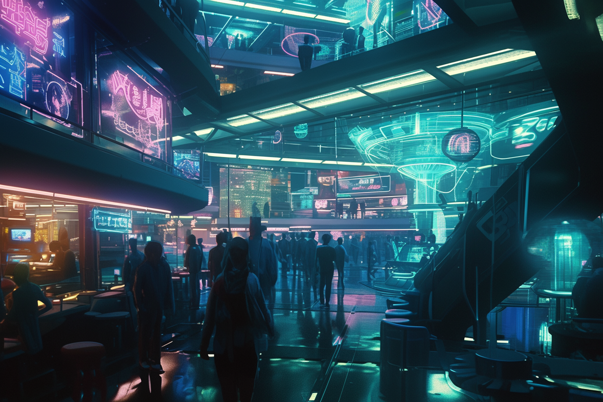
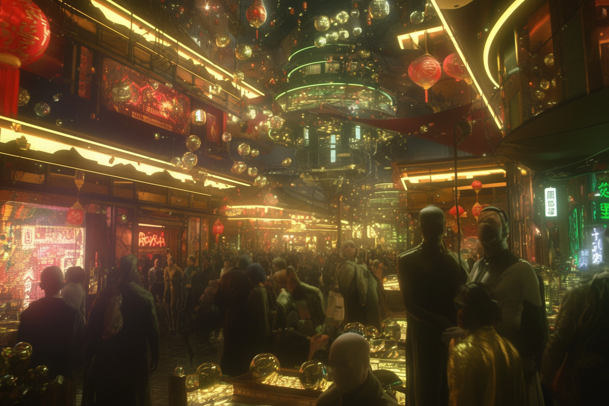
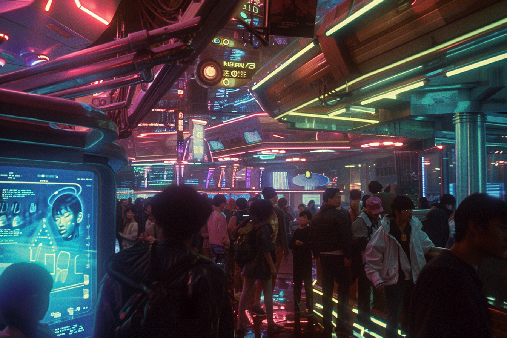
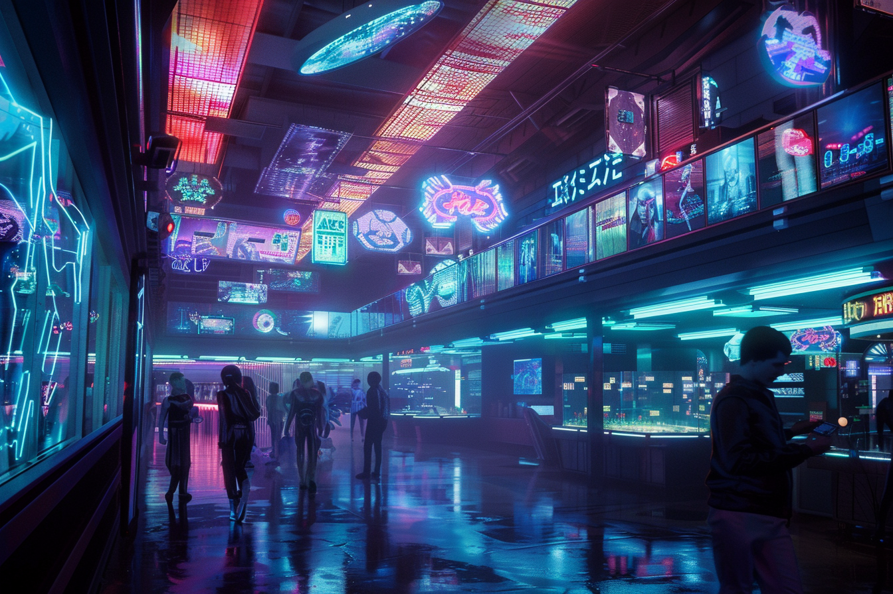
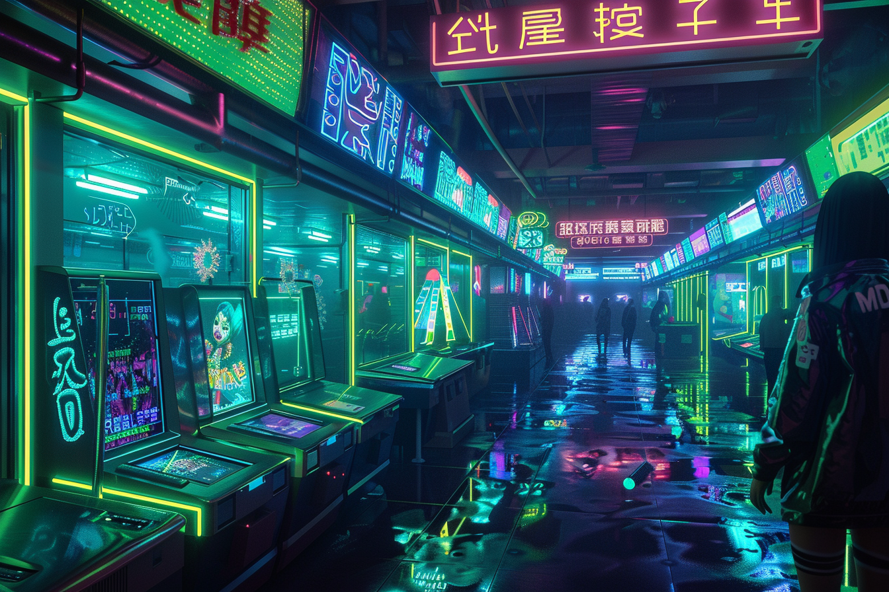
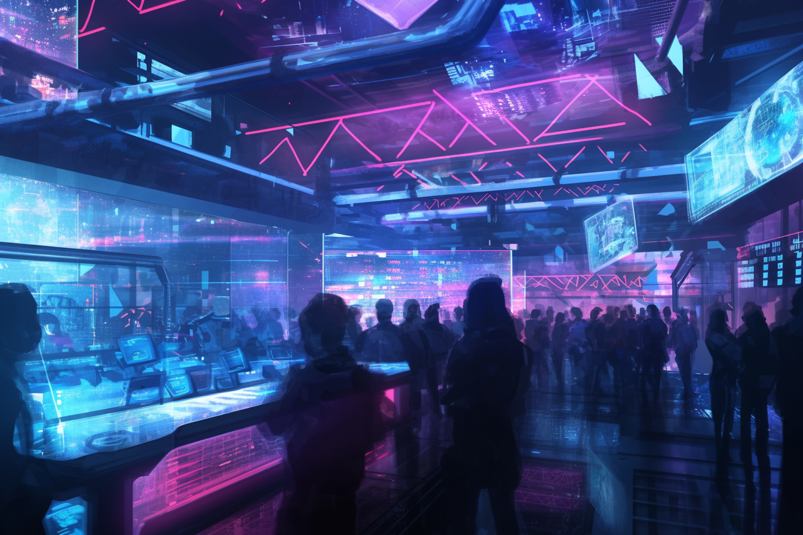

---
layout:
  title:
    visible: true
  description:
    visible: false
  tableOfContents:
    visible: true
  outline:
    visible: false
  pagination:
    visible: true
---

# Arcades

<figure><figcaption>
The central pavilion of a bustling arcade.
</figcaption></figure>

## Overview

Popular destinations for people of all ages to meet and socialize. In addition to games and interactive entertainment, arcades often serve food and beverages, including alcohol, and are popular venues for live entertainment.

Arcades across [GATA](../) are restricted to “blue” tech–[legacy technology](../law-and-order/tech-regulation.md) that is deemed safe–as well as any other technology that is in-[paradigm](../politics/paradigms.md).

In contrast, arcades located in [Gray Zones](../politics/gray-zones.md) and across the [Free Territories](../../free-territories/the-basics.md), offer a wider range of unfiltered entertainment, and are hubs for [sync raves](sync-raves.md), illegal drugs, sex trade, and illegal technology, from illicit [psychotech](../../science-and-tech/psychotech.md) to legacy weapons and other contraband.

***

## Arcade Culture

### Licensed Arcades

<figure><figcaption></figcaption></figure>

Increasingly popular for all ages, and particularly among the youth of [Greater Atla](../politics/greater-atla.md), arcades are thriving hubs where patrons can experience the latest and most sophisticated entertainment technologies and media. As with all [legal enterprise](../enterprise/), they are restricted to ["blue" tech](../law-and-order/tech-regulation.md#class-3-blue)—including legacy technology that has been deemed safe by [the AIC](../institutions/atlan-information-control-aic.md), as well as other technologies permitted within their jurisdiction's [paradigm](../politics/paradigms.md).

These arcades feature a mix of classic games, modern interactive media, immersive [virtual constructs](../../science-and-tech/constructs.md#virtual-constructs), and even popular gambling staples. They also host live entertainment such as music performances, comedy shows, and virtual sports tournaments.

<figure><figcaption></figcaption></figure>

 

<figure><figcaption></figcaption></figure>

While arcades are typically aimed at an all-ages audience, and certainly benefit from maintaining a family-friendly atmosphere during daytime hours, the late-night arcade scene is much more raucous and lively, particularly when a big performance is headlining on their main stage.

Over the table, arcades offer a wide selection of vendors and restaurants where patrons can purchase food, alcoholic and non-alcoholic beverages, as well as various legal [Manna](../../science-and-tech/the-manna-flower.md) extracts. However, with a little savvy, it's often possible to acquire a range of [substances](recreational-drugs.md) that aren't strictly legal.

### Underground Arcades

<figure><figcaption></figcaption></figure>

In contrast to regulated arcades, those in Gray Zones and across the Free Territories offer a much wider range of unfiltered entertainment, featuring both legal and illegal tech and media, and few restrictions on the use and sale of recreational substances.

These arcades tend to be operated by, or under the protection of, [local gangs](../criminal-element/gangs.md) or [criminal syndicates](../criminal-element/syndicates.md), who are incentivized to maintain a relatively safe environment for GATA citizens venturing into the zone, bringing [money](../politics/money.md), [keys](../politics/keys.md), and other opportunities into the community.

They are hubs for black market trade, often housing bazaars teeming with booths and kiosks selling everything from illicit [psychotech](../../science-and-tech/psychotech.md) and legacy weapons, to [Old World](../../history/the-old-world.md) media and other [scavenged contraband](../criminal-element/scavengers.md). These unregulated arcades are generally accommodating to the sex trade, and are commonly co-located with [pleasure houses](pleasure-houses.md) offering many discreet and exotic services.

<figure><figcaption></figcaption></figure>

 

<figure><figcaption></figcaption></figure>

The atmosphere in these arcades is often chaotic and vibrant, catering to those seeking freedom from GATA's strict regulations. They attract a diverse crowd, including rebels, thrill-seekers, and those simply looking to treat themselves to a night to forget.

Recently, Gray Zone arcades have become the go-to destination for [sync raves](sync-raves.md)—intense, immersive experiences guided by skilled [syncjockeys](sync-raves.md#sync-jockeys) where participants' minds are synchronized to create collective hallucinations.
