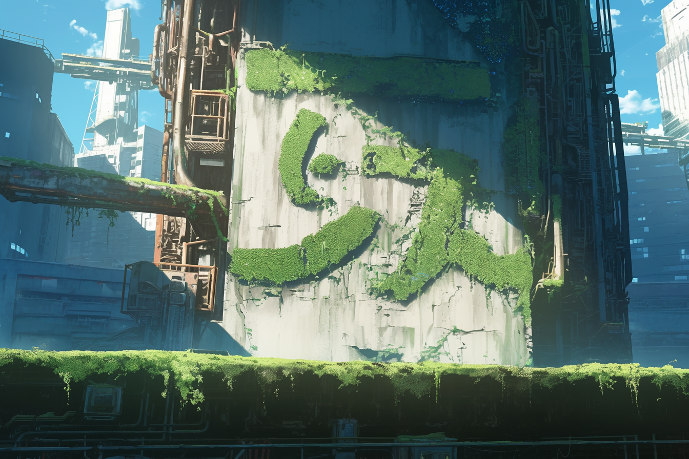

---
layout:
  title:
    visible: true
  description:
    visible: false
  tableOfContents:
    visible: true
  outline:
    visible: false
  pagination:
    visible: true
---

# Greenwork

<figure><figcaption>
Greenwork scrawled on the side of an abandoned facility.
</figcaption></figure>

## Overview

A growing street art medium that has spread around the world in recent years. Greenwork is made with a specially engineered fast-growing variant of the Manna flower that can be spread about like wild vines or grown in place like moss.

Greencans use a homebrew version of the much more expensive industrial plant growth-factor formulas in combination with Manna seeds. Greenwork is an especially common sight in URSA where environmental issues and activism are much more pronounced.
