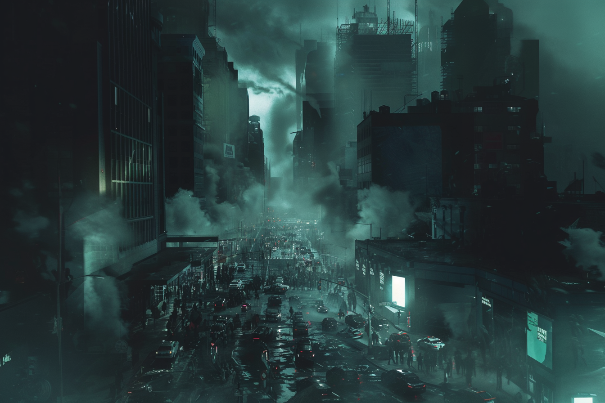

---
layout:
  title:
    visible: true
  description:
    visible: false
  tableOfContents:
    visible: true
  outline:
    visible: true
  pagination:
    visible: true
---

# The Crash

<figure><figcaption>
A chaotic scene in a city shortly after power and communications went out.
</figcaption></figure>

## Overview

The onset of the [Dark Decade](the-dark-decade.md) is called "The Crash", sometimes also referred to somberly as “Sunset” in [GATA](../gata/); the moment the light of the [Old World](the-old-world.md) slipped beneath the horizon.

When the lights went out, and communications failed, people in all corners of the world were plunged into darkness. From the chambers of power, to the corridors of hospitals, and the streets of every population center, the circumstances for all were immediately dire. Contingencies were activated, and some VIPs were even successfully extracted to secure locations despite the unprecedented event.

Large urban centers quickly devolved into chaos, resulting in mass flight into the surrounding areas, precipitating countless tragic encounters between desperate and frightened civilians. A terrifying state of nature soon took root. The following weeks and months would only see conditions continue to deteriorate.

Without food, medicine, and redundancies for key civilizational infrastructure like energy and supply chains, the masses were left to fight over a dwindling supply of essential resources. A frenzied scramble for food, shelter and safety slowly devolved into a hunt for guns, drones, bots, and batteries.

Most terrifyingly, multiple nuclear launches were automatically triggered; fortunately, NATO's autonomous space-based laser defenses were not affected by The Crash and successfully neutralized the vast majority of these warheads around the world. Unfortunately, automatic retaliations could not be aborted, and military targets across Russia, China, and North Korea were destroyed with nuclear and ballistic strikes, resulting in mass casualties and destruction.

The Crash was the most confusing and chaotic period of the Dark Decade, as no one understood the scale, severity, or cause of the crisis as it was unfolding.
