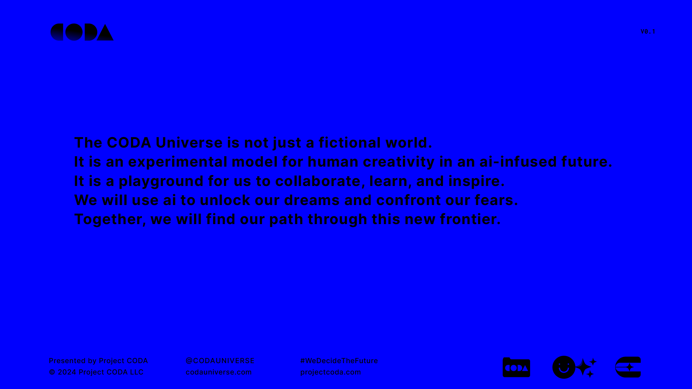
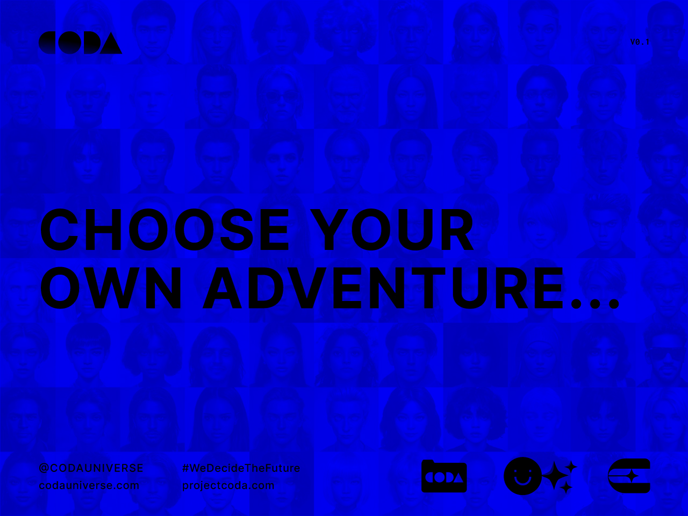
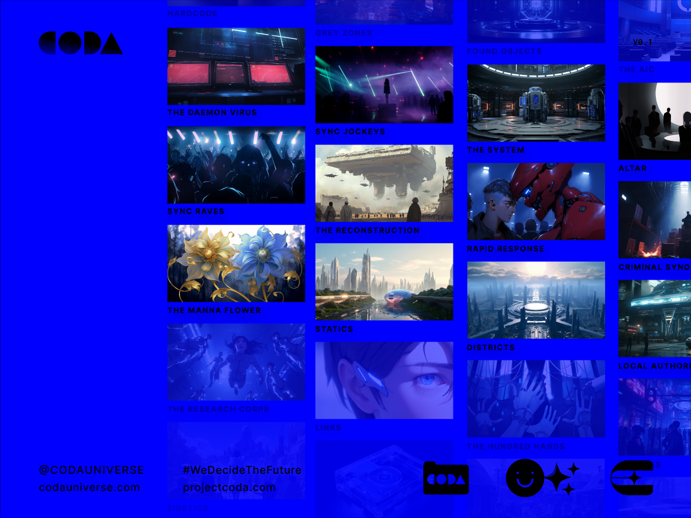
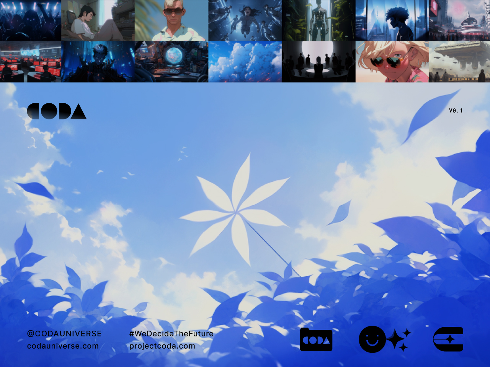
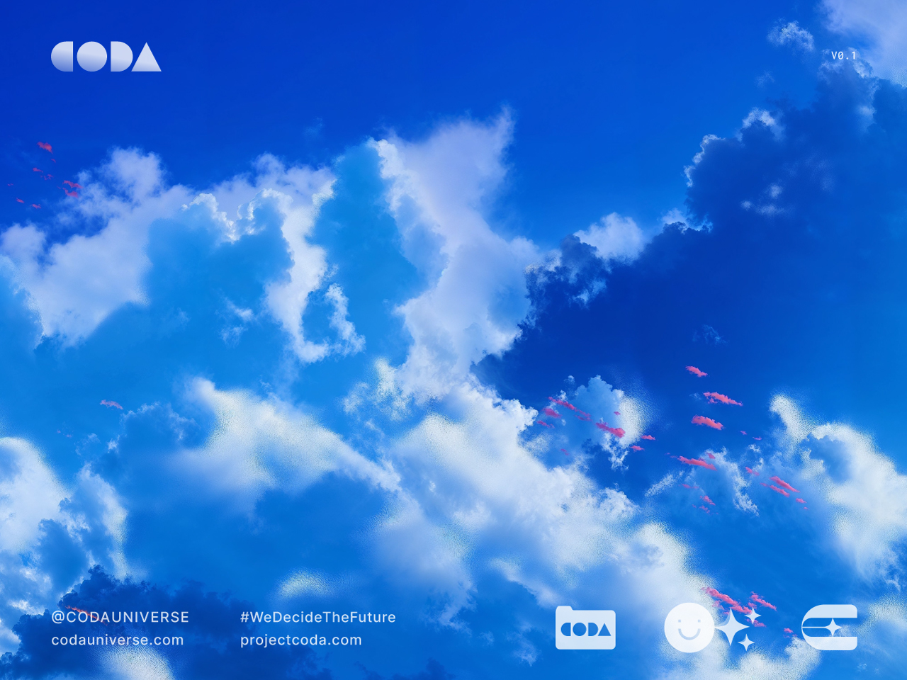
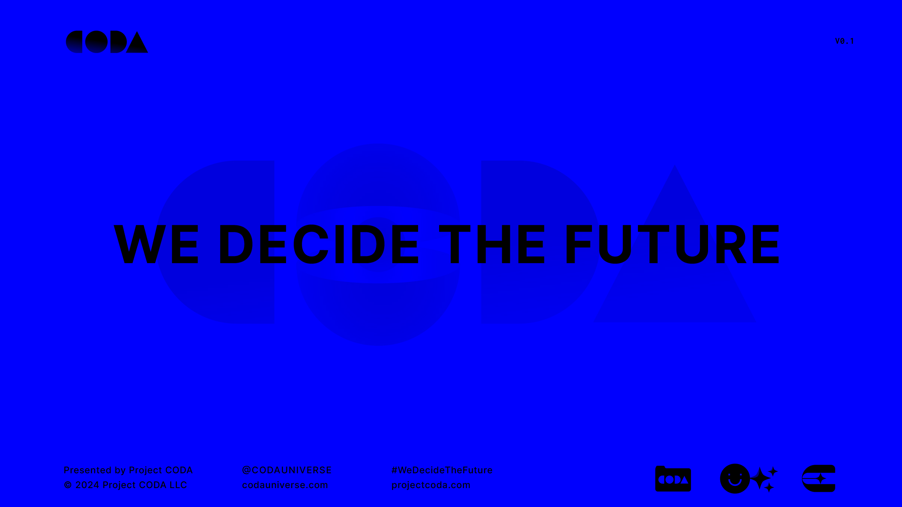

---
layout:
  title:
    visible: true
  description:
    visible: false
  tableOfContents:
    visible: true
  outline:
    visible: false
  pagination:
    visible: true
---

# 📄 About

<figure><figcaption></figcaption></figure>

## 🔵 The CODA Universe

The CODA Universe is an expansive story-world set 100 years in our future; a setting for new media and stories featuring an open-ended cast, an ever-deepening lore, and a timeline spanning hundreds of years.

In the process of its creation, the universe has been infused with themes exploring the risks and rewards of innovation, the eternal tension between order and chaos, the power of true connection, the unanswered question of the human destiny, and many more.

The foundational canon of the CODA Universe is stored forever on the Bitcoin blockchain, and is maintained by dxxmsdxy. The canon serves as the basis for media and experiences set in the CODA Universe.

***

## 🔵 The CODA Saga

**The CODA Saga** is an epic tale set in the CODA Universe.

It begins in the shadowy corners of a nascent underground sync rave scene, where skilled conduits called sync jockeys guide the crowd's minds in hallucinatory trances using illegally modified technologies.

There, submerged in the haze and pulsing bass frequencies, a mysterious piece of experimental hardware is debuted, setting in motion a chain of events that will change the world forever.

***

## 🔵 Project CODA

**Project CODA** is a community initiative dedicated to creating and funding original media set in the CODA Universe.

Members of Project CODA contribute to the CODA Universe's ever-growing library of lore, stories, characters, art, music, 3D assets, scripts, virtual sets, and more. All contributions are attributed and, if work is used in commercial products, their creators are compensated.

Project CODA members also govern the CODA Creation Fund, a community treasury for funding the media produced by Project CODA.

***

## Inception

<figure><figcaption></figcaption></figure>

 

<figure><figcaption></figcaption></figure>

The CODA Universe was conceived by dxxmsdxy in January, 2021.

First, the outline for the CODA Saga was written; a character-centered epic that charts the course of the world's central conflicts and themes, starting in the fictional year of 2125. This saga became the scaffolding for a rich and expansive world that was developed over the course of several years.

The fundamental building blocks of the CODA Universe are its 100+ characters and its hyper-linked fragments of lore, which are inscribed permanently on-chain, and which serve as training and context for generative applications.

***

## World & Themes

<figure><figcaption></figcaption></figure>

 

<figure><figcaption></figcaption></figure>

> _**100 years from now...**_
>
> _A fractured world recovers from the lingering wounds of the Dark Decade. An authoritarian world power offers refuge from chaos in exchange for strict control. Technology is tightly regulated, protecting civilization from the demons of its past. Institutions, rebel nations, and vast criminal syndicates fight for scraps of power and privilege._&#x20;
>
> _And at the edges, in the underground, something new is taking form..._

The CODA Universe is a super-collision of possible futures, both strange and familiar. Neither a utopia nor a dystopia. It is a continuation of humanity's tenacious walk along a precarious tightrope anchored to some unknown destination beyond our visible horizon.

The concepts encapsulated by the world are reflective of the challenges and dilemmas we face in our present and near-term future. It is meant to serve as an eschatological time capsule of projections about the human destiny.

***

<figure><figcaption></figcaption></figure>

## Creator

The CODA Universe was created by [dxxmsdxy](http://dxxm.xyz), a pseudonym of one of the earliest builders and artists in crypto and ordinals. The CODA Universe is part of their continuing exploration of 'interpretable art'.

