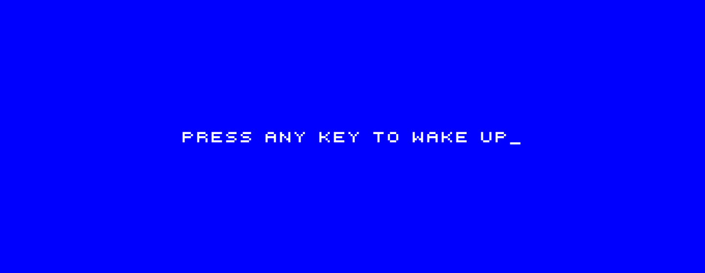
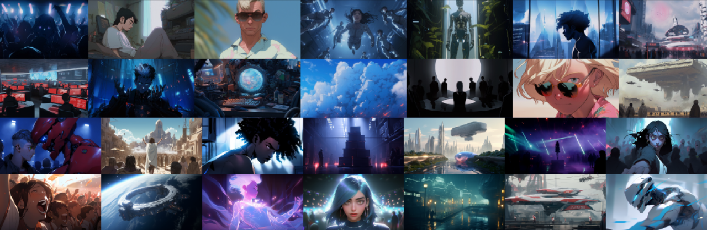

---
layout:
  title:
    visible: false
  description:
    visible: false
  tableOfContents:
    visible: true
  outline:
    visible: false
  pagination:
    visible: true
---

# 🔵 Opening Crawl

<figure><figcaption></figcaption></figure>

> ## 2125: The youth are restless\_
>
>
>
> More than 70 years have passed since the _THE CRASH_; the day everything stopped—and the long nightmare that followed.
>
> But even in those darkest days, some had already set to work rebuilding.
>
> Few became many. A movement became a creed. In time, the tattered shreds of a once-thriving global civilization were woven back together into the triumphant flag of _ATLA_.
>
> Today, the older generations that lived through the _DARK DECADE_ and _THE RECONSTRUCTION_ take great pride in the invincible order that they’ve made.
>
> The autonomous _SYSTEM_ provides for all of their needs.&#x20;
>
> But the youth despair.
>
> The human destiny will never be in their hands. They instinctively pine for the freedom of an uncertain world they have never known.
>
> In the shadows of Greater Atla's glistening towers an underground scene has taken root. Illegal raves where minds, music, and hallucinatory visions are synchronized by human _CONDUITS_, and the boundary between Self and Other is dissolved.
>
> In the haze, amidst the ecstatic rediscovery of revelry, drugs, and lawlessness, a crack has formed.
>
> A _NEW FUTURE_ is already leaking in.


[..](../../)


<figure><figcaption></figcaption></figure>

