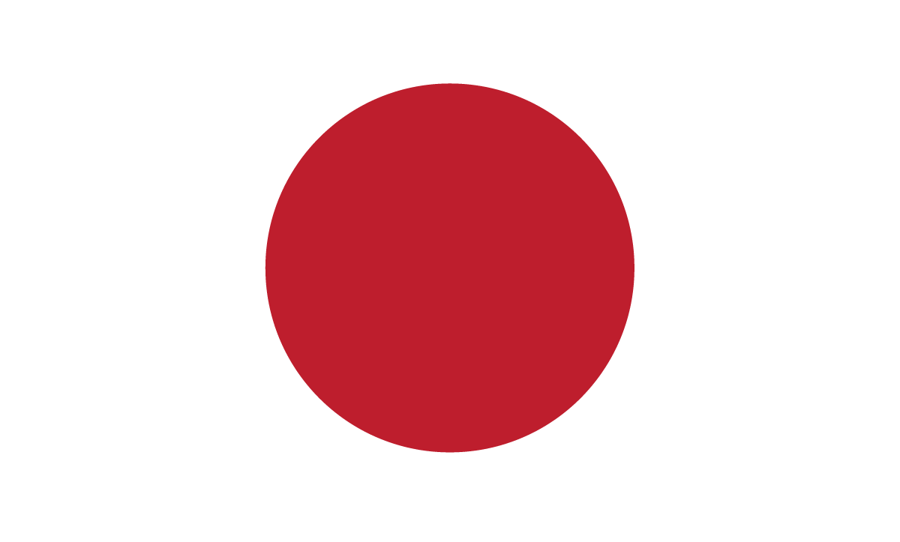

---
layout:
  title:
    visible: true
  description:
    visible: false
  tableOfContents:
    visible: true
  outline:
    visible: false
  pagination:
    visible: true
---

# 🔵 The Basics

<figure><figcaption>
A ground crew servicing an Imperial Stinger.
</figcaption></figure>

## Basic Info

* Government: Hereditary Monarchy
* Population: 287,000,000

***

## Overview

Retained a functioning power grid during [the Dark Decade](../history/the-dark-decade.md) due to advanced energy infrastructure. Its isolationist stance has been softened by technology exchanges with [GATA](../gata/).

Has extremely strict border control and encourages the population to self-police, surveil and report illegal transgressions. Social life is muted with many citizens preferring to remain in their private estates. Publicly, citizens appear exceptionally law abiding, but it is commonly understood that inside their estates many do as they please.

Recent population boom due to unauthorized use of anti-aging therapies like [AKICEL](../gata/enterprise/akicel.md) and novel genetic engineering technologies.

<figure><figcaption>
New Imperial Japan's flag.
</figcaption></figure>

***

## Comparative Stats

* **Freedom: 5** - Freedoms are limited in public, but enjoyed in the privacy of estates.
* **Luxury: 8** - Abundant wealth and resources are there for those who serve the Empire.
* **Military: 7** - While Japan has a small military, its defenses are formidable.
* **Education: 9** - School is mandatory and life-long in Japan.
* **Technology: 7** - Tech exchange with GATA has rapidly advanced Japan’s technology.
* **Health: 9** - Boasting the most advanced biotech, many citizens live long, healthy lives.

***

## Key Points

* Remained relatively stable during the Dark Decade.
* Balances its cultural pride with the realities of global diplomacy.
* New internal and external political dynamics resulting from advances in biological technologies.
* Often referred to by citizens simply as “the Empire”
* Its isolationist nature has earned the nation the moniker “The Walled Garden”, which is a euphemistic reference to the [Imperial Garden prison](law-and-order/the-walled-garden.md).
