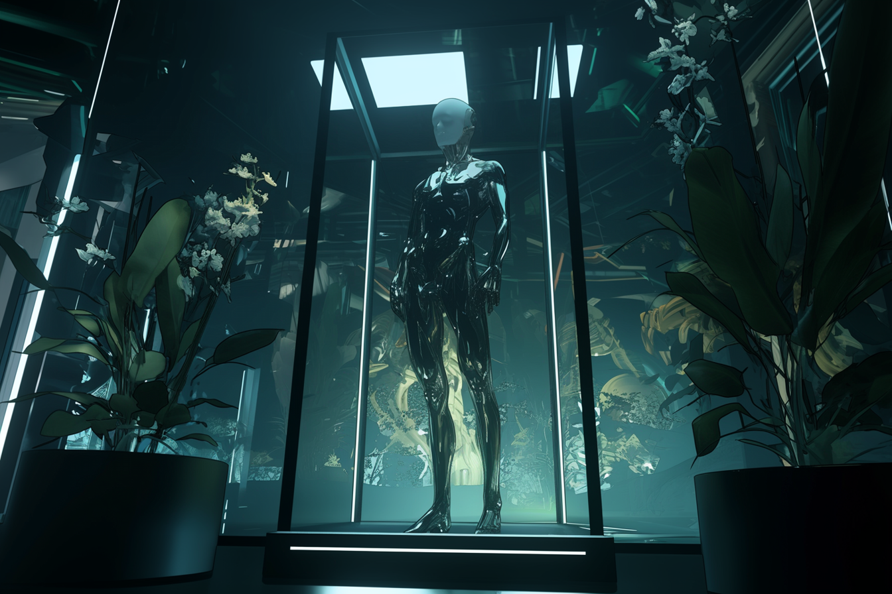
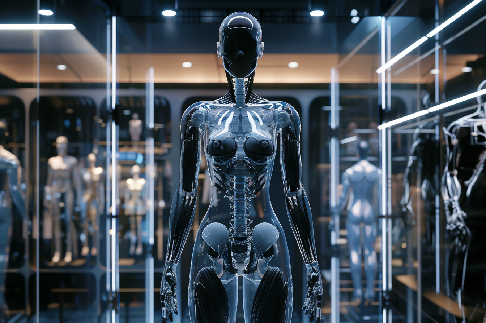
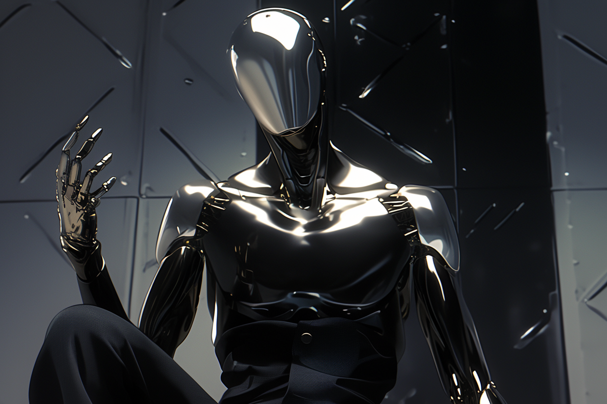
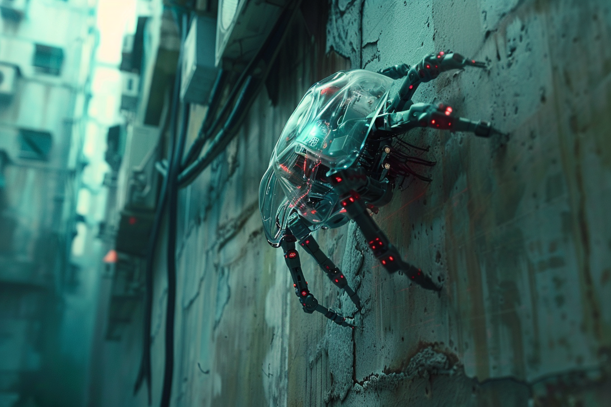
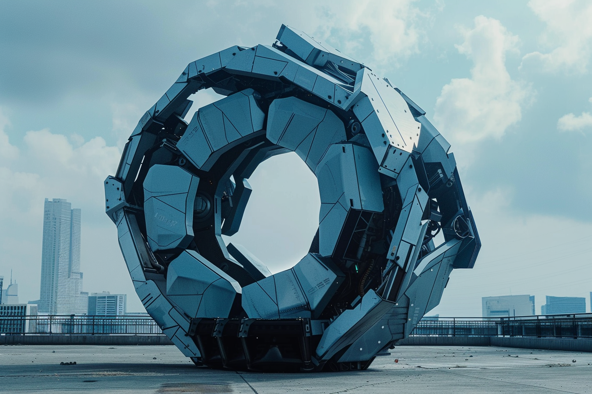

# Automata

<figure><figcaption>
An unskinned anthro designed to look, move and feel like a human.
</figcaption></figure>

## Overview

Automata are autonomous robots designed to perform simple tasks in the environment. They are essentially walking (or flying or rolling or burrowing) physical functions.

Sometimes, automata are connected to a nearby local compute platform, including [System](../gata/politics/the-system.md) [endpoints](endpoints.md). They can look like inanimate parts of the environment, or mechanical insects and animals, and many things in between. Common automata include the [static gondolas](statics.md#gondolas) and [other moving platforms](statics.md#static-engines-and-motion) found across [GATA](../gata/), and the ‘bugs’ that maintain natural and artificial ecosystems.

Automata are constructed using advanced materials and hard-coded components. While some automata are starkly artificial, living plastic and fiber optics are used to produce many complex bio-mimicking morphologies with features that resemble musculature, tendons, and nervous systems.

In a broad sense, automata can be simply understood as bodies without minds. Their “thinking” lives elsewhere:

* [COGs](cogs.md) are hard-coded cognitive systems that fill the role [Old World](../history/the-old-world.md) [artificial intelligence](artificial-intelligence.md) once did. A cog can drive many automata, but it is typically housed in a separate, immobile installation.
* [Constructs](constructs.md) are virtual or astral environments. Agents inside constructs may _control_ automata, but constructs themselves are not robots; they are **places**, not bodies.

In modern architecture, automata provide sensors, actuators, and mobility, while COGs and other [Asimovian systems](asimovian-architecture.md) provide cognition and decision-making. [Links](links.md), [endpoints](endpoints.md), [constructs](constructs.md), and other mechanisms provide interfaces between people, cogs, and automata.

***

## Types of Automata

### **Anthros**

<figure><figcaption>
An AU-built anthro in a showroom.
</figcaption></figure> <figure><figcaption>
An anthro being driven remotely by a human conduit.
</figcaption></figure>

Anthro is short for anthropomorphic automata. Like all other automata, they do almost no processing onboard due to the limitations imposed by [AIC regulation](../gata/institutions/atlan-information-control-aic.md), thus requiring a separate platform to drive them (or a human conduit to embody them as surrogates). Connecting an athro to local hardware can give them a wide range of capabilities, and they are particularly popular in luxury contexts, customer service, and as companions.

The use of anthros is fairly strictly regulated across GATA due to provisions in the NDA that limit the use of human resemblance in enterprise due to hard lessons learned during the mid-21st century in the Old World where fake [human identities were used to sow social and political discord](../history/the-old-world.md).

Rates of anthro use and manufacture are highest in the African Union where they have defined their own paradigms. AU anthros are considered to be the highest quality, and adhere closely to the technical word of the law laid out in the NDA, even though the AU's interpretation differs from that of the AIC in GATA.

### **Bugs**

<figure><figcaption>
A small bug automata performing maintenance tasks.
</figcaption></figure> <figure><figcaption>
A line of bug automata walking by.
</figcaption></figure>

Small robotic automata that perform basic status assessment and maintenance in public spaces. They can climb walls, slip between cracks and perform a variety of functions, but in order to be [NDA](../gata/law-and-order/new-dawn-accords.md)-compliant their onboard computation capacity is very limited.

### Trajectoids

<figure><figcaption>
A large trajectoid made of many articulating parts.
</figcaption></figure> <figure><figcaption>
A mid-sized trajectoid with few articulations.
</figcaption></figure>

Multi-purpose machines and computational platforms with and without articulating parts, that use their shape and topology to control how they move through and interact with their environment.

Most often take the form of large contextual automata that transform shape or orientation based on needs, and come in a wide variety of forms and functions. If a space’s use might change, or a variety of tasks must be performed in the space, trajectoids can simply be activated and moved into the needed orientation without requiring a skilled [conduit](links.md#conduits) (or [cogs](cogs.md)) thanks to their geometrically precise shapes, allowing them to easily roll, slide, or bend into the correct position.

***

### Terminology & Distinctions

Because automata sit at the intersection of machinery, [artificial intelligence](artificial-intelligence.md), and infrastructure, several related terms are often confused. In [NDA-compliant](../gata/law-and-order/new-dawn-accords.md) jurisdictions, these terms are used with specific meanings.

#### Automata

“Automata” is the formal term for autonomous machines built on [hard-code](hard-code.md) and [Asimovian architecture](asimovian-architecture.md), designed to perform bounded tasks in the physical environment.

* They typically have little or no onboard computation, relying on nearby [endpoints](endpoints.md), local platforms, or [COGs](cogs.md) for control.
* They are treated as complex physical functions rather than independent agents.
* Their design, scale, and permitted behaviors are constrained by [tech regulation](tech-regulation.md) and the [New Dawn Accords (NDA)](../gata/law-and-order/new-dawn-accords.md).

In most [districts](../gata/politics/districts.md), when authorities or engineers say _“automata”_, they are referring specifically to this regulated class of hard-coded robotic bodies.

#### Legacy “robots” and robotics

In historical and technical writing, “robots” and “robotics” usually refer to [Old World](../history/the-old-world.md) machines built using legacy processors and software.

* These systems often combined mechanical bodies with **software-driven autonomy** and adaptive learning, and were later found to be vulnerable to destructive algorithms like [the Daemon virus](the-daemon-virus.md).
* Under modern tech regulation, most such systems, their designs, and their enabling components fall under [Class 1 “red tech”](tech-regulation.md#class-1-red) and are illegal to possess or operate inside districts.

As a result, _“robot”_ has become a somewhat dated or cautionary term, often used when discussing the Old World or the early Dark Decade, or colloquially, as a loose synonym for “mechanical helper”, especially among those not concerned with NDA distinctions or regulations.

In technical and legal language within [GATA](../gata/the-basics.md), however, “automata” has replaced “robots” as the standard term for NDA-compliant robotic devices.

#### Everyday usage

In ordinary speech, people are not always precise:

* Individuals may casually call small automata “bots” or “robots”, especially bugs and other small maintenance units.
* Enterprises, [the AIC](../gata/institutions/atlan-information-control-aic.md), and technical curricula prefer “automata” for NDA-compliant systems, reserving “robots” and “robotics” for Old World technology, speculative discussion, or comparisons between systems.

From a historical perspective, automata can be seen as the safe, Asimovian subset of what the Old World would have called robotics. In contemporary practice, however, _“automata”_ is its own category—in a sense, a replacement and rebrand of classical robotics—defined by its substrate and regulatory constraints.
