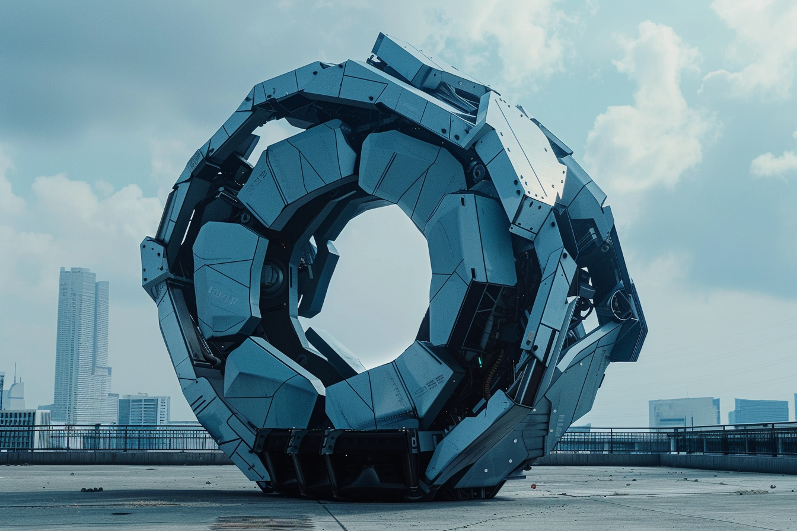

---
layout:
  title:
    visible: true
  description:
    visible: false
  tableOfContents:
    visible: true
  outline:
    visible: true
  pagination:
    visible: true
---

# Automata

<figure><figcaption>
An unskinned anthro designed to look, move and feel like a human.
</figcaption></figure>

## Overview

Automata are autonomous robots designed to perform simple tasks in the environment. They are essentially walking (or flying or rolling or burrowing) physical functions.

Sometimes, automata are connected to a nearby local compute platform, including [System](../gata/politics/the-system.md) [endpoints](endpoints.md). They can look like inanimate parts of the environment, or mechanical insects and animals, and many things in between. Common automata include the [static gondolas](statics.md#gondolas) and [other moving platforms](statics.md#static-engines-and-motion) found across [GATA](../gata/), and the ‘bugs’ that maintain natural and artificial ecosystems.

Automata are constructed using advanced materials and hard-coded components. While some automata are starkly artificial, living plastic and fiber optics are used to produce many complex bio-mimicking morphologies with features that resemble musculature, tendons, and nervous systems.

***

## Types of Automata

### **Anthros**

<figure><figcaption>
An AU-built anthro in a showroom.
</figcaption></figure>

 

<figure><figcaption>
An anthro being driven remotely by a human conduit.
</figcaption></figure>

Anthro is short for anthropomorphic automata. Like all other automata, they do almost no processing onboard due to the limitations imposed by [AIC regulation](../gata/institutions/atlan-information-control-aic.md), thus requiring a separate platform to drive them (or a human conduit to embody them as surrogates). Connecting an athro to local hardware can give them a wide range of capabilities, and they are particularly popular in luxury contexts, customer service, and as companions.

The use of anthros is fairly strictly regulated across GATA due to provisions in the NDA that limit the use of human resemblance in enterprise due to hard lessons learned during the mid-21st century in the Old World where fake [human identities were used to sow social and political discord](../history/the-old-world.md).

Rates of anthro use and manufacture are highest in the African Union where they have defined their own paradigms. AU anthros are considered to be the highest quality, and adhere closely to the technical word of the law laid out in the NDA, even though the AU's interpretation differs from that of the AIC in GATA.

### **Bugs**

<figure><figcaption>
A small bug automata performing maintenance tasks.
</figcaption></figure>

 

<figure><figcaption>
A line of bug automata walking by.
</figcaption></figure>

Small robotic automata that perform basic status assessment and maintenance in public spaces. They can climb walls, slip between cracks and perform a variety of functions, but in order to be [NDA](../gata/politics/new-dawn-accords.md)-compliant their onboard computation capacity is very limited.

### Trajectoids

<figure><figcaption>
A large trajectoid made of many articulating parts.
</figcaption></figure>

 

<figure><figcaption>
A mid-sized trajectoid with few articulations.
</figcaption></figure>

Multi-purpose machines and computational platforms with and without articulating parts, that use their shape and topology to control how they move through and interact with their environment.

Most often take the form of large contextual automata that transform shape or orientation based on needs, and come in a wide variety of forms and functions. If a space’s use might change, or a variety of tasks must be performed in the space, trajectoids can simply be activated and moved into the needed orientation without requiring a skilled [conduit](links.md#conduits) (or [cogs](cogs.md)) thanks to their geometrically precise shapes, allowing them to easily roll, slide, or bend into the correct position.
