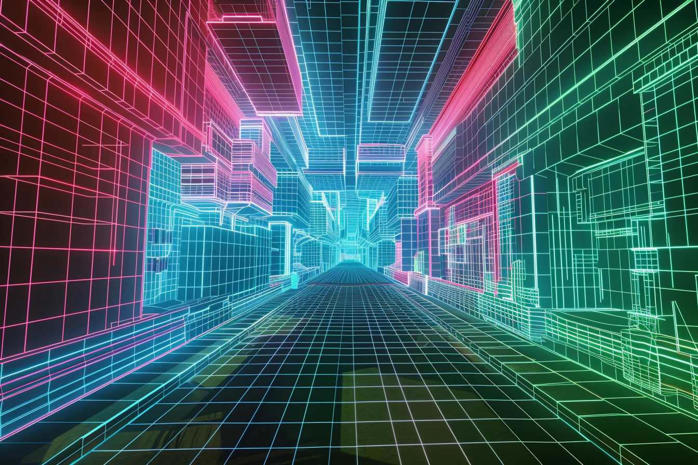
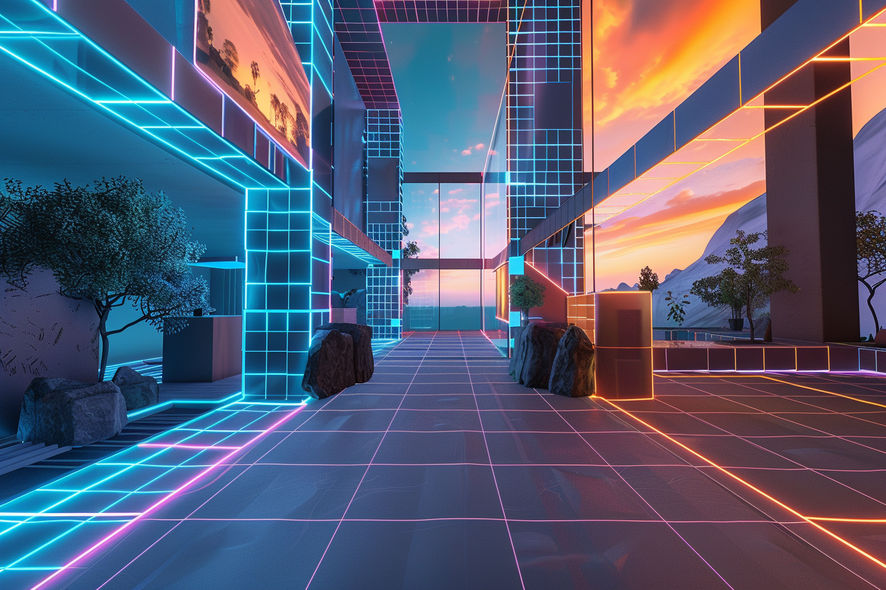

---
layout:
  title:
    visible: true
  description:
    visible: false
  tableOfContents:
    visible: true
  outline:
    visible: false
  pagination:
    visible: true
---

# Constructs

<figure><figcaption>
A virtual construct running on a hard-coded system.
</figcaption></figure>

## **Overview**

Constructs are sophisticated virtual environments that users can access via headsets or links. They play a pivotal role in the daily lives of many inhabitants, serving as spaces for social interaction, entertainment, and various professional activities.

***

## **Virtual Constructs**

<figure><figcaption></figcaption></figure>

Virtual constructs are virtual reality environments housed on hard-coded systems. These constructs are designed using Asimovian architecture, ensuring they are secure and predictable.

Users can share access to virtual constructs remotely within the same district, however sharing constructs across districts is uncommon due to the prohibitively high bandwidth costs for cross-district traffic. This economic barrier means that most virtual constructs are confined to local use, fostering tight-knit virtual communities within individual districts.

The design of virtual constructs is highly varied, ranging from simple meeting spaces to complex simulations of real-world environments or entirely fantastical realms. They are used for entertainment, remote meetings, law enforcement and intelligence, and education, among other uses.

The security provided by the hard-coded systems underpinning these constructs ensures that they are reliable and free from the exploitative features that plagued legacy VR technologies.

### Intelligence & Law Enforcement

One of the most powerful and controversial applications for virtual constructs is the real-time or retrospective recreation of real-life environments for surveillance and investigations by intelligence and law enforcement.&#x20;

Because of the strict regulations on sensor data and data aggregation stipulated in the WPP, in GATA and NDA-signatory states these kinds of constructs are primarily restricted to use by their highest level of intelligence.

In GATA, real-time constructs are used by Angelis Watchers who also can collaborate with local governments and local authorities to provide valuable support in their operations.

In the Free Territories, while there are no enshrined laws against the use of surveillance constructs, there is a strong distaste.

***

## **Astral Constructs**

<figure><figcaption></figcaption></figure>

Astral constructs differ significantly from their virtual counterparts. Instead of being housed on computational platforms, Astral constructs exist entirely within the minds of their users.&#x20;

These constructs are made possible through the use of astral seeds; rare, illegal, and highly valuable components that enable direct and instantaneous connections between remote systems. This instantaneous connection is essential for astral users to synchronize, however because instantaneous communication cannot be filtered, it is incompatible with the Whole Privacy Protection Act (WPP).

The manifestation of an astral construct is a continuous process, driven by the collective mental effort of its occupants. They offer an unparalleled level of full-sensory immersion and immediacy,  shaped directly by the thoughts and emotions of their users. This continuous and intentional manifestation produces an ethereal and ever-evolving environment, reflecting the collective psyche of its participants.

***

## Residual

Both virtual and astral constructs have been shown to cause lingering effects for link users after prolonged exposure, widely known as "residual". Residual typically manifests as flashbacks, delusions, or persistent sensations or hallucinations. Symptoms can range from negligible to debilitating, and in the most extreme cases, has driven some of those afflicted to take their own life.

Residual can typically be relieved by desisting from use, however it has been noted that astral residual is much more difficult than virtual residual to overcome, and may result in lifelong residual effects for those affected, however not enough studies have been conducted to date.

Virtual constructs, unlike astral constructs, can be accessed safely without the use of a link, preventing the neurological effects that lead to residual from occurring.
