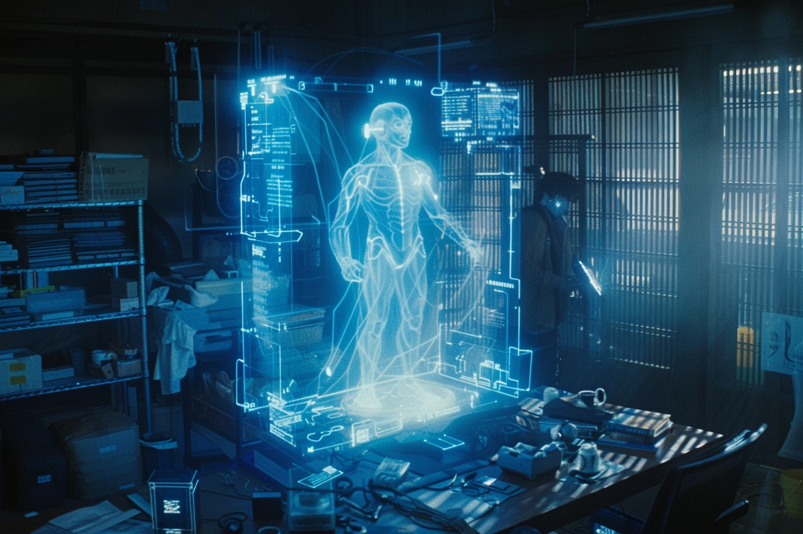

---
layout:
  title:
    visible: true
  description:
    visible: false
  tableOfContents:
    visible: true
  outline:
    visible: true
  pagination:
    visible: true
---

# Emitters

<figure><figcaption>
A spatial emitter on a desk being used for scientific visualization.
</figcaption></figure>

## Overview

Emitters are used to project holograms and holographic displays. There are two varieties; spatial emitters and direct emitters.

Spatial emitters project the hologram into the air, giving them a translucent ‘ghost-like’ quality. These are often used in public spaces, enterprise, and research. Spatial emitters can take the form of small projector-like emitters distributed around a space that work in concert to project visuals from multiple directions, or they can take the form of glass-like plates on walls or desktops that project the holograms just adjacent to the emitter surface.

Then there are direct emitters which project imagery directly into the retina of the target. Direct emissions are indistinguishable from solid objects in the space, and are prevalent in more private experiences and environments. Occasionally there are instances of malicious use of direct emitters intended to mislead or disorient targets.
