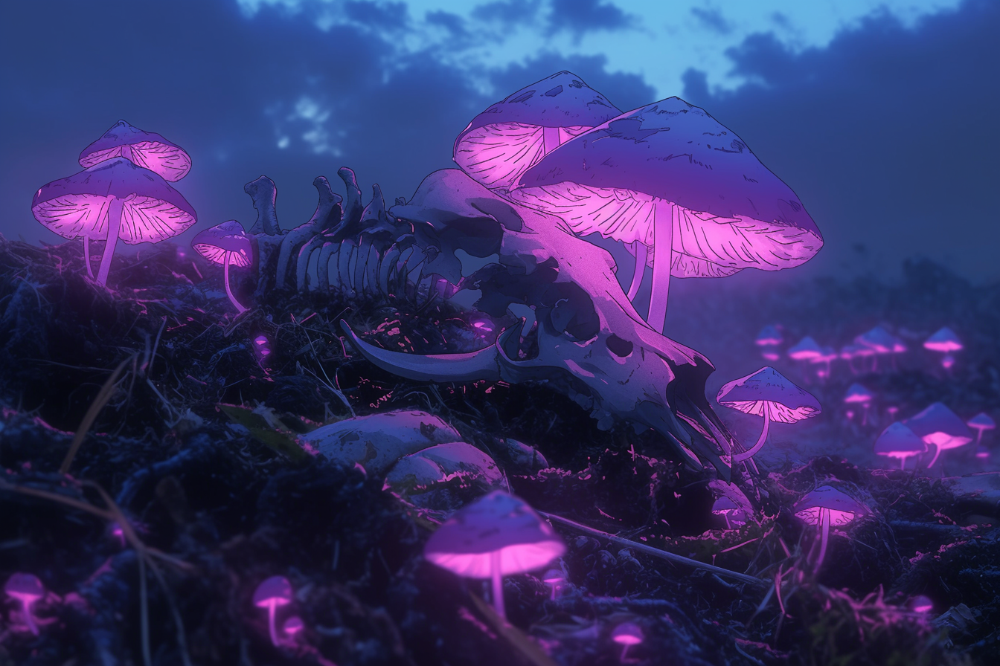
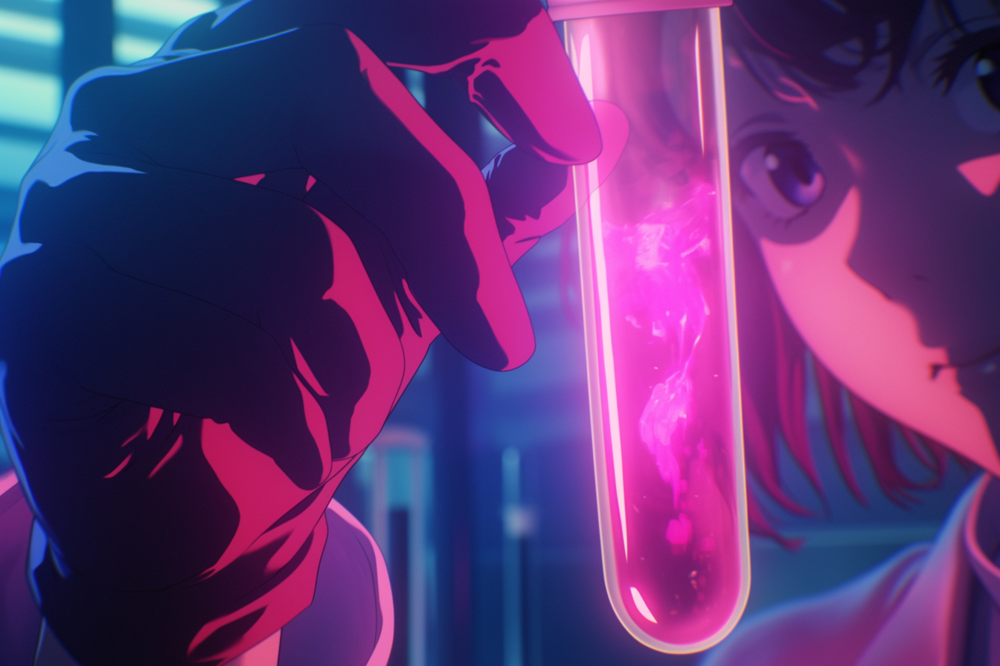

---
layout:
  title:
    visible: true
  description:
    visible: false
  tableOfContents:
    visible: true
  outline:
    visible: false
  pagination:
    visible: true
---

# Erebos Mushroom

<figure><figcaption>
Erebos Mushrooms growing near an animal's remains.
</figcaption></figure>

## Overview

The Erebos Mushroom is a recently discovered bioluminescent fungus found growing in various areas around the world, and its emergence has been connected to the [Manna flower](the-manna-flower.md). Named after Erebos, the primordial deity of darkness in Greek mythology, this fungus is noted for its deep purple caps that emit an eerie pink glow in darkness.

Recent reports from [URSA](../ursa/the-basics.md), [the Free Territories](../free-territories/the-basics.md), and remote regions around the Earth of living animals with visible [Erebos infestations](erebos-mushroom.md#erebos-infestation) growing from their bodies have raised concerns about potential emergent risks to humans and biomes, however this phenomenon is still being studied.

***

## Origins

The Erebos mushroom was first discovered during the later years of [the Reconstruction](../history/the-reconstruction.md) near the remains of animals and humans, leading researchers to determine that these fungi grow specifically from bodies that died with Manna extracts in their bloodstream.

In the early 2100s, researchers conducting experiments on Erebos samples confirmed early suspicions that the Manna flower and Erebos shroom share a curious, and intertwined relationship.

***

## Physical Characteristics

The mysterious mushroom's ghostly appearance is a stark contrast to the vibrant Manna flower, to which its origins have been attributed.

Erebos mushrooms sprout in clusters and typically range from 2 to 6 inches in height, while their caps range from 1 to 6 inches in diameter. The caps have a deep purple coloration with a bioluminescent pink glow, and their stalks have a translucent white appearance, often speckled with tiny, glowing spots.

The mushroom disperses spores which emit a faint pink glow in the air around the mature fungus, and web-like filaments spread through the fungi's substrate with a bioluminescent glow that can sometimes be seen through the soil.

***

## Chemical Composition

The Erebos Shroom contains a range of bioactive compounds, some of which are similar to those found in the Manna flower. However, it also produces unique alkaloids and terpenes that contribute to its distinct pharmacological effects.

### Pharmacological Applications

#### Psychoactive Effects

* **Low Doses:** Enhance senses, induce mild euphoria, and produce mild hallucinations.
* **Moderate Doses:** Cause vivid hallucinations, intense emotional experiences, and deep introspection.
* **High Doses:** Lead to severe hallucinations, a loss of sense of reality, and potential for permanent psychological damage.

#### Neurogenesis

The Erebos mushroom contains compounds that promote the growth of new neurons. This property has the potential to aid in the treatment of neurodegenerative diseases like Alzheimer's, Parkinson's, and [Rejection Syndrome](../gata/health-and-medicine/akicel-therapy.md#rejection-syndrome). Early research indicates that regular, controlled consumption could slow disease progression and enhance neural repair.

#### Cognitive Enhancement

* **Memory:** Improves recall and retention of information.
* **Focus:** Enhances concentration and attention span.
* **Cognitive Function:** Boosts overall cognitive performance, making it a potential therapeutic aid for cognitive impairments and a performance-enhancing substance for healthy individuals.

***

## Health Hazards&#x20;

Not much is known about the long-term risks associated with exposure to Erebos mushrooms or their extracts, but ongoing studies have identified some of the associated hazards.

Prolonged use or high doses can result in persistent hallucinations, paranoia, and detachment from reality. Users might experience severe anxiety and depression following intense hallucinations. Incorrect preparation can lead to symptoms such as nausea, vomiting, and in severe cases, organ failure and death.

### Erebos Infestation

<figure><figcaption>
A buck infested with the Erebos Mushroom.
</figcaption></figure>

Erebos Infestation is a recently observed phenomenon where living animals are found with Erebos shrooms growing out of their bodies, and causes physical and behavioral changes in the affected animals.

Infested animals exhibit erratic and aggressive behaviors, suggesting neurological or biochemical interference from the fungus. Additionally, it seems to cause infested organisms to grow larger than their non-infested counterparts, possibly due to metabolic changes induced by the Erebos Shroom. The animal's soft tissues such as their eyes, and other affected areas primarily around the fungal growths, emit a faint pink glow similar to the fungus itself.

It is believed that the Erebos mushroom has adapted to utilize living hosts as part of its lifecycle, possibly enhancing its spread and survival by exploiting the host’s nutrients and biological processes.&#x20;

#### Implications of Erebos Infestation

The appearance of Erebos Infestation raises several significant concerns. The infestation could disrupt local ecosystems by affecting predator-prey dynamics and altering the behavior and population of affected species. There is also a potential risk that the infestation could spread to humans, especially those frequently in contact with wildlife or Manna flower cultivations.

The spread of Erebos mushroom through living hosts presents a biosecurity challenge, necessitating monitoring and potentially the development of containment strategies. These concerns have forestalled the sanctioned application of Erebos shrooms for therapeutic use across GATA.

***

## Modern Context

The Erebos mushroom has quickly garnered attention both for its conceivable threat to public health, its therapeutic potential, and its emerging use as a recreational drug in GATA's underground scene. In controlled medical environments, it is being studied for its neurogenic and cognitive-enhancing properties. Meanwhile, in the [sync rave culture](../gata/underground-scene/sync-raves.md), its psychoactive effects are highly sought after for enhancing sensory experiences and inducing powerful, shared hallucinations.

***

## Research and Regulation

<figure><figcaption>
A researcher studying a sample of Erebos extracts.
</figcaption></figure>

The Erebos mushroom has become a subject of great interest for [Sol's](../sol/the-basics.md) [Research Corps](../sol/institutions/the-research-corps.md) and medical enterprises such as [AKICEL](../gata/enterprise/akicel.md) due to feared risks and potential pharmacological applications.

Ongoing research aims to fully understand the Erebos shroom's bioactive compounds and their effects on the human body. Due to its potent effects and potential risks—particularly the spectre of Erebos Infestation—strict regulations and guidelines are being developed to ensure safe handling.

Researchers are actively studying Erebos Infestation to better understand its mechanisms and effects. Efforts are focused on identifying species and regions affected by the infestation to map its spread, investigating how the fungus spreads and establishes itself in living hosts, and exploring potential treatments or preventive measures to protect both wildlife and humans from infestation.
