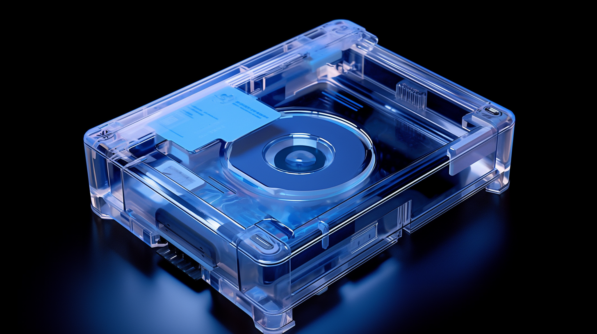
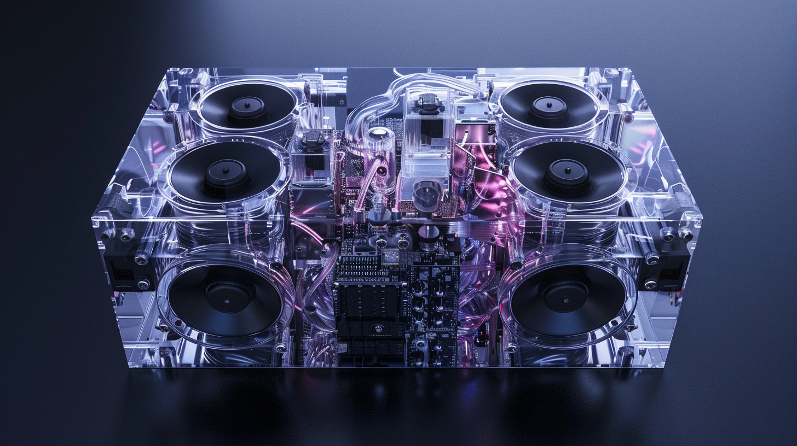
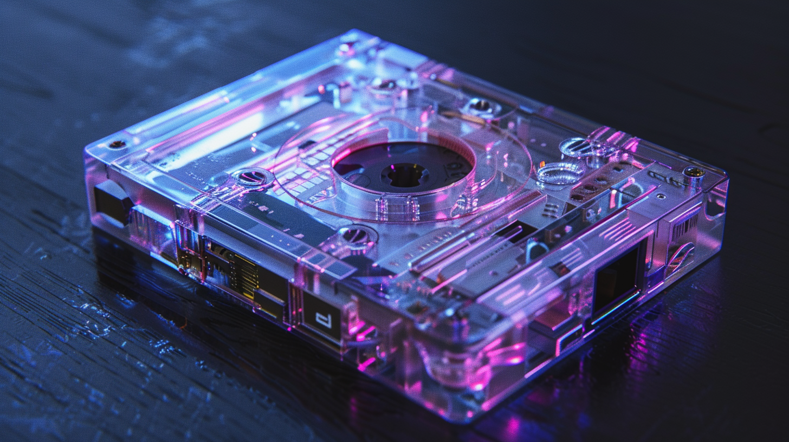

---
layout:
  title:
    visible: true
  description:
    visible: false
  tableOfContents:
    visible: true
  outline:
    visible: true
  pagination:
    visible: true
---

# Fabricated Tech

<figure><figcaption>
A small fabricated device purpose-built by its user.
</figcaption></figure>

## Overview

Fabricated tech refers to the recycling of existing [LMNL](hard-code.md#lmnl) modules, electronics, mechanical components, and other raw materials in the creation of new custom modules and devices. Fabricated tech is made by hand or using [fabricators](fabricated-tech.md#fabricators).

Fabricated tech is extremely convenient due to its size (legacy components are smaller than their LMNL counterparts), customizability, and reusability. Fabricated tech makes it easy break down and recompile the technology that you need as you need it, reusing the same electronic and LMNL components.

On the market, some components can get quite expensive, such as [legacy components](../gata/law-and-order/tech-regulation.md), [COGs](cogs.md), and components made with exotic materials, like [static nodes](statics.md#static-nodes).

<figure><figcaption></figcaption></figure>

 

<figure><figcaption></figcaption></figure>

 

<figure><figcaption></figcaption></figure>

 

<figure><figcaption></figcaption></figure>

***

## **Fabricators**

Fabricators are state-of-the-art 3D printers and LMNL compilers that integrate the electronic and mechanical components provided, along with new [hard coded](hard-code.md) modules, all printed inside of a hard shell made from a polymer nanocomposite. Components can be anything from screens, buttons, and information storage, to speakers, ports, transmitters and receivers.

### **Generative Fabrication**

If size, shape or aesthetics aren’t of particular concern, fabricated tech’s layout and form factor can be generated on demand by high-end modern fabricators with integrated COGs. However, COGs significantly increase the size and cost of generative fabricators, making them too large and expensive for most private citizens to own. Generative fabricators can be found commonly throughout [GATA](../gata/), and beyond.

### **Design Considerations**

By supplying a fabricator with various electronic components, including [legacy tech](../gata/law-and-order/tech-regulation.md) components, a user can generate a device that works as they require. The more functionality required by the device, the larger its form factor due to the number of components and the size of LMNL modules.

Fab size and shape can be controlled with skilled component selection, component layout, and custom form design. Fabs can have sealed unibody designs, can be fabricated in multiple pieces, and can include intricate mechanical structures like hinges, sockets, buttons, dials, and so on.

#### **Standard Dimensions**

Fabricated tech is often produced at standard LMNL module dimensions so that the device can be plugged or integrated into other larger systems.

***

## **Unregulated Fabricated Tech**

In [Free Territories](../free-territories/) and [Gray Zones](../gata/politics/gray-zones.md), fabricated tech doesn’t always comply with [NDA regulations](../gata/politics/new-dawn-accords.md) and might not use LMNL to integrate components. It isn’t uncommon to find fabs built instead using raw hardcode to integrate legacy components. This means unregulated fabricated tech can be much smaller, but it is left vulnerable to the [Daemon virus](the-daemon-virus.md) and other threats.

***

## **History**

Fabricated tech came into prominence during [the Reconstruction](../history/the-reconstruction.md) as an effective way to repurpose existing tech by breaking it down into components and recombining them to create safe, purpose-built tech. In the early Reconstruction, there were no fabricators, and in fact the first “fabricators” were skilled technicians who would serve their community as a tradesperson. This job is not very common anymore, however some professional hand fabricators do still exist.

***

## **NDA Compliance**

In GATA, fabricated personal tech is required by [AIC](../gata/institutions/atlan-information-control-aic.md) regulation to be “immediately scrutable”. Fabricated tech that isn’t easily cleared upon visual inspection is subject to confiscation or destructive inspection by the Local Authority or any lawful agents of GATA, such as [deputized operators](../gata/enterprise/operators.md#deputized-operators).

As a result of this “scrutibility” requirement, it has become commonplace in GATA for citizens to fabricate their tech’s body using a translucent polymer nanocomposite. This makes fabs easily inspected, their clear, plastic-like body revealing any internal components and LMNL modules.

### An Emergent Style Trend

The translucent body design trend has also made it fashionable to show off rare components, embed lights and displays, and explore creative form factor designs. This flashy trend of emphasizing and embellishing fabs is relatively new and is particularly popular among the youth.

Prior to translucent bodies, most fabricated tech was designed so that it could be easily opened, with removable components, and were often even handmade.

However, modern fabricators have made it possible to use more advanced materials and processes, allowing for the emergence of fully-sealed, translucent nanopolymer casings of any shape. The translucent body has in turn opened up more options for component layouts that would have been hard or impossible to inspect before.
