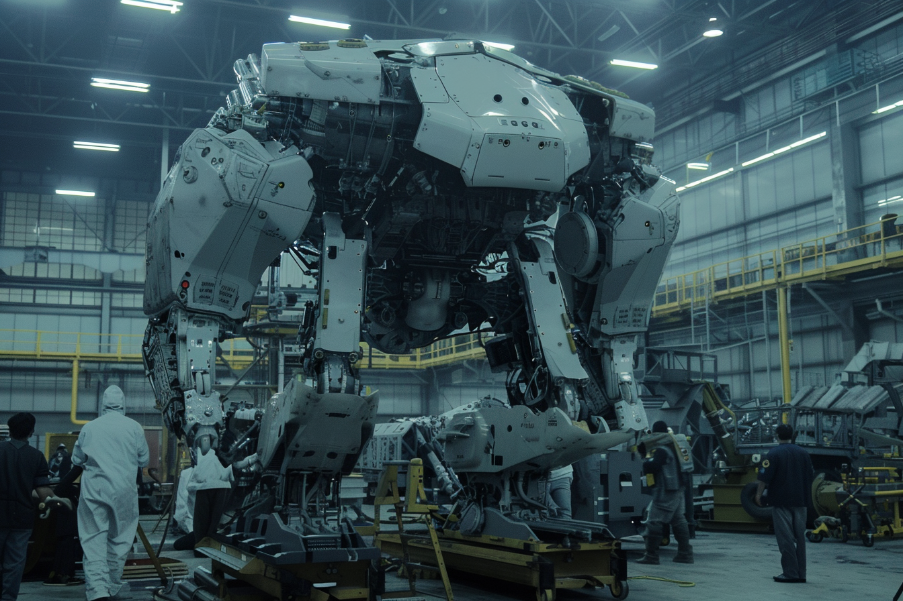

---
layout:
  title:
    visible: true
  description:
    visible: false
  tableOfContents:
    visible: true
  outline:
    visible: false
  pagination:
    visible: true
---

# Frames

<figure><figcaption>
A modern combat frame.
</figcaption></figure>

## Overview

Frames are anthropomorphic mechanized vehicles with humanoid chassis'. They're controlled by a [conduit](links.md#conduits) pilot and are designed for a multitude of applications, from military operations to construction, shipping, and resource extraction.

Originating as armored "war frames" developed by the [Joint Atlantic Command (JAC)](../gata/history/the-joint-atlantic-command-jac.md), they were later fielded by [Atla](../gata/key-locations/atla.md) and [GATA](../gata/the-basics.md) to secure important strategic locations in combat. Frames are named for their skeletal chassis, which provides a versatile and familiar, anthropomorphic form factor that enhances dexterity and pilot compatibility.

Due to the success of the frame design, many nations and enterprises around the world have dramatically accelerated their frame-based R\&D efforts, developing a wide range of frames, representing a challenge to GATA's monopoly on technology. As a result, frame-on-frame combat has seen a dramatic rise in recent years, as even [Free Territories](../free-territories/the-basics.md) and [Sovereign militias](../free-territories/military-defense/sovereign-militias.md) have acquired a formidable cohort of war frames and pilots.

***

## History

<figure><figcaption>
An early frame built in at the end of the Dark Decade.
</figcaption></figure>

The development of frames began during [the Dark Decade](../history/the-dark-decade.md), with the JAC seeking advanced armored units capable of bridging the operational gap between ground-based units like tanks and infantry, and aerial units like fighters jets and drones.

These early war frames proved invaluable both heavy combat and versatile field operations, and were particularly impactful in holding strategic locations. Their success led to the broader application of frame technology across various sectors.

Over time, frames evolved from purely military assets to essential tools in construction, resource extraction, and other fields requiring robust, adaptable machinery and great physical force. They are no longer solely built by GATA, with numerous different frame manufacturers around the world, and have become a staple of military and industrial operations.

***

## Design and Functionality

<figure><figcaption>
A modern frame being serviced in an enterprise factory.
</figcaption></figure>

Frames are characterized by their chassis' somewhat humanoid design, typically featuring arms and legs that allow them to ambulate and manipulate their environment with high precision. This design makes Frames highly intuitive for pilot , leveraging natural muscle memory and proprioception for seamless control.

Some frames' form factors are more familiar, with two arms and two legs, while others are constructed with multiple, unorthodox appendages and control surfaces, or atypical postures and ambulatory patterns. Transforming frames have the ability to significantly transform their shape in order to adapt to their context, for example taking on a more aerodynamic configuration, or switching from bipedal to quadrupedal stances.

Ultimately, the frame's chassis is tailored to its intended function, and elite frame pilots are often equipped with frames that are designed to their personal specifications.

<figure><figcaption></figcaption></figure>

 

<figure><figcaption></figcaption></figure>

 

<figure><figcaption></figcaption></figure>

Passive [statics](statics.md) built into their extremities are intended to prevent their massive, ambulatory bodies from significantly damaging or deforming the ground beneath them when they land and walk in the course of their normal operation.

Frames can be loaded out with a wide range of equipment and technologies, and require a tremendous amount of power to operate. Today, frames are powered miniaturized [fusion power cells](fusion-energy.md), with the best cells being produced by [GATA](../gata/the-basics.md) and [New Imperial Japan](../new-imperial-japan/the-basics.md).

### Operating a Frame

A frames outer shell opens to reveal its cockpit, called the Operator Cradle, a compact, heavily armored compartment typically concealed within the frame's torso. Modern cradles use a passive static field to provide additional protection and isolate the pilot from impacts and G-force effects, making the cradle a zero gravity environment while in operation.

<figure><figcaption>
A frame operator in the cradle of a larger frame.
</figcaption></figure>

Older frames have cradles outfitted with a more traditional set of manual controls and a dashboard replete with buttons and switches. However, ever since the development of [links](links.md), modern frames steadily been transitioning to conduit operators who drive their frames with a link, allowing for much smaller cradles and frames.

While link-driven frames are vastly superior in terms of performance, finding and training operators who are talented enough conduits to pilot them quickly became the limiting factor. But as a generation who grew up using a link are coming of age, a much deeper pool of talent is emerging.

### **Key Features:**

#### Dexterity

Frames can perform complex, nuanced tasks thanks to their articulated limbs and hands, making them suitable for a wide range of applications.

#### Versatility

Frames can be re-equipped with different tools and weapons, allowing for rapid adaptation to various tasks and missions.

#### Strength

The strong structural chassis of frames allows them to carry heavy loads and withstand significant stress, making them suitable for demanding environments.

***

## Applications

### Military

* **War Frames**: Equipped with advanced weaponry and armor, used in combat to hold strategic positions and engage enemy forces.
* **Recon Frames**: Outfitted with advanced sensors and stealth technology for surveillance and reconnaissance missions.

### Construction

* **Builder Frames**: Fitted with tools such as welding torches, cranes, and drills for large-scale construction projects.
* **Demolition Frames**: Equipped with heavy-duty hammers, cutting equipment, and explosives for safe and efficient demolition.

### Shipping and Logistics

* **Loader Frames**: Designed to handle heavy cargo, equipped with [grabbers](grabbers.md), gripping mechanisms and conveyor systems for loading and unloading shipments.
* **Transport Frames**: Capable of carrying large containers and supplies over rough terrain, reducing reliance on traditional vehicles.

### Resource Extraction

* **Miner Frames**: Outfitted with drills, saws, and excavation tools for mining operations.
* **Harvest Frames**: Used in forestry and agricultural sectors, equipped with cutting and processing tools for harvesting resources.

### Transmedium Capabilities

When equipped with statics and life support systems, frames become highly versatile transmedium vehicles. They can operate in air, land, sea, and space, providing unmatched flexibility in various environments.

**Key Technologies:**

* **Statics**: Enable controlled movement and stability in different mediums, including zero-gravity and underwater environments.
* **Life Support Systems**: Ensure operator safety and comfort, allowing for extended missions in hostile environments.
* **Adaptive Gear**: Frames can switch between different operational modes, such as flight, underwater propulsion, and ground mobility.

***

## Weaponry and Enhancements

Frames can be outfitted with a wide array of weaponry and enhancements, tailored to specific mission requirements.

**Weapon Systems:**

* **Energy Weapons**: Plasma rifles, laser cannons, and EMP launchers for combat scenarios.
* **Kinetic Firearms**: Gauss rifles, railguns, and automatic shotguns for diverse combat engagements.
* **Heavy Ordnance**: Miniature missile launchers, grenade launchers, and mortar systems for large-scale attacks.

**Enhancements:**

* **Defensive Systems**: Energy shields, reactive armor, and stealth cloaks for protection and evasion.
* **Support Systems**: Drones, medical units, and supply modules for extended operational capability.
* **Sensor and Communication**: Advanced targeting systems, quantum communication arrays, and holographic displays for enhanced situational awareness and coordination.
