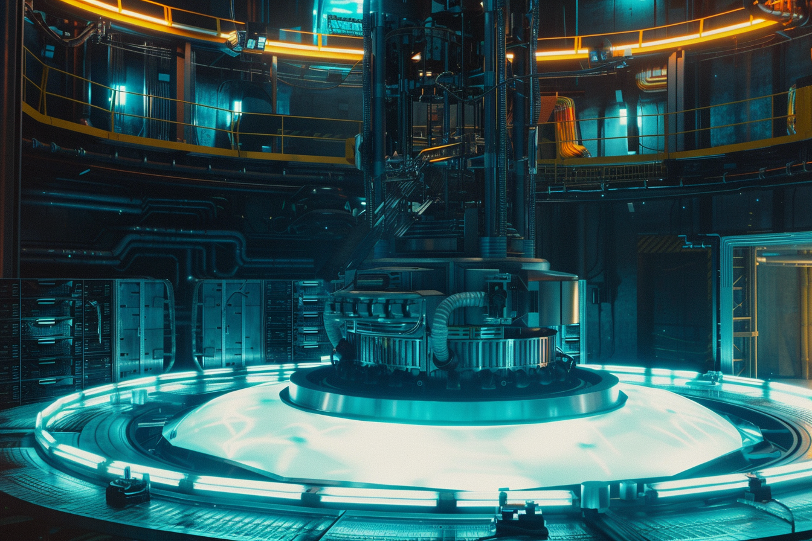
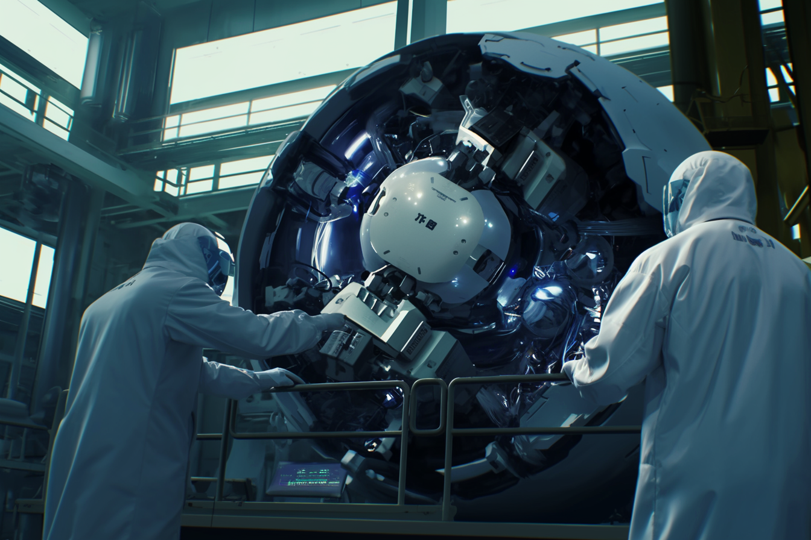

---
layout:
  title:
    visible: true
  description:
    visible: false
  tableOfContents:
    visible: true
  outline:
    visible: false
  pagination:
    visible: true
---

# Fusion Energy

<figure><figcaption>
An industrial fusion cell in operation.
</figcaption></figure>

## **Overview**

Fusion energy is the primary industrial power generation technology for most of [GATA](../gata/)’s [districts](../gata/politics/districts.md), as well as [New Imperial Japan](../new-imperial-japan/), [URSA](../ursa/), and [the Free Territories](../free-territories/). Fusion cells, developed and refined over decades, have become integral to the functioning of major powers like GATA and New Imperial Japan.&#x20;

These cells power everything from household devices to massive industrial operations, ensuring the smooth running of sprawling metropolises and remote homesteads alike.

***

## **Historical Context**

Fusion energy was first developed in the mid-21st century during the Old World. By this time, New Imperial Japan had already established a reliable fusion energy infrastructure. Their distributed energy grid proved crucial to their political continuity through the Dark Decade, allowing them to maintain relative stability and order while other nations fell into anarchy.&#x20;

Simultaneously, Western military forces had effective fusion capabilities, which played a pivotal role in the formation and early success of the Joint Atlantic Command.

### The Dark Decade and Reconstruction Era

During the Dark Decade, the Joint Atlantic Command (JAC), which later evolved into GATA, leveraged Western fusion technology to maintain their operations and secure resources. One of Atla's first major technological projects was to develop highly-efficient, scalable fusion reactors for their extensive global operations. This project was critical in their ambitious vision, providing a strategic advantage that GATA later used as an incentive when inviting new territories to join the alliance.

***

## GATA's Fusion Technology

<figure><figcaption>
One of GATA's large advanced fusion reactors.
</figcaption></figure>

GATA, known for its technological prowess and meticulous engineering, utilizes large-scale fusion reactors. These reactors are powered by robust fusion cell technology developed during the Reconstruction Era. These cells are noted for their longevity and reliability, with many still operational decades after their initial deployment.

GATA's fusion reactors are a testament to their engineering excellence, capable of providing steady power output to districts and industrial facilities across their territories. However, their approach to fusion creates a reliance on high-yield centralized fusion generators which has obvious limitations for smaller homesteads beyond district walls or personal use.

GATA does have its own miniaturized fusion power cells developed by Angelis which are competitive with New Imperial Japan's designs, however they are not paradigmed for civilian or enterprise use in any of GATA's districts, and are almost exclusively utilized in the context of Angelis' military and defense endeavors.

GATA's slow rollout of new fusion generation tech is due to the conservative approach of the [AIC](../gata/institutions/atlan-information-control-aic.md) when [paradigming](../gata/politics/paradigms.md) new technologies, combined with rising interest in the testing of [parallel energy](parallel-energy.md), a novel energy solution that promises greater efficiency, among other potential benefits.

***

## New Imperial Japan's Miniaturized Fusion Cells

<figure><figcaption>
Technicians installing one of New Imperial Japan's miniaturized fusion cells.
</figcaption></figure>

Contrasting with GATA's large-scale approach, New Imperial Japan has always focused on miniaturized fusion cells. These smaller cells are versatile and efficient for personal and smaller-scale applications, but they do not scale well for large industrial uses.

This technology has been widely adopted by URSA and various Free Territories, where the need for portable and adaptable power solutions is greater. Even GATA citizens living in remote homesteads across Greater Atla are known to rely on these unregulated energy cells, which they acquire from sovereign markets.
