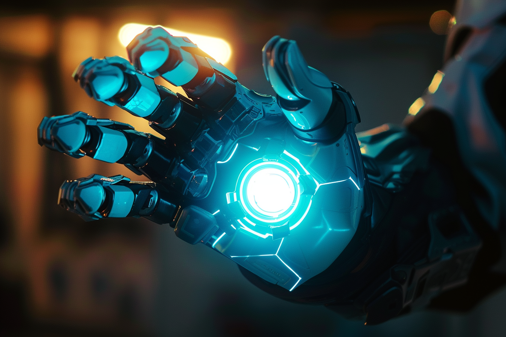
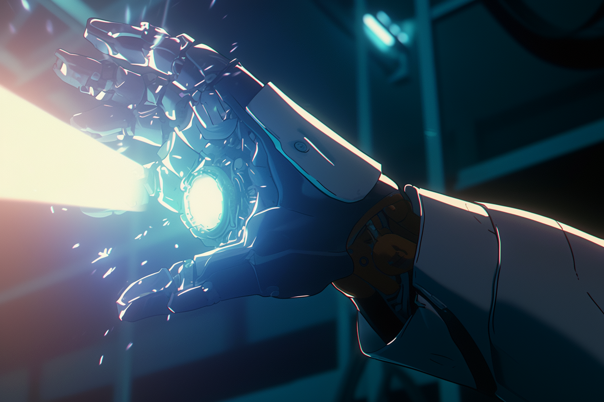

---
layout:
  title:
    visible: true
  description:
    visible: false
  tableOfContents:
    visible: true
  outline:
    visible: true
  pagination:
    visible: true
---

# Grabbers

<figure><figcaption>
A grabber gauntlet.
</figcaption></figure>

## Overview

Equipment and wearable gauntlets that allow the user to ‘grab’ onto a point in space or on an object's surface and either attract or repel it. Grabbers are the product of continued development in static and link technology.

While wearable grabbers are often used to enhance a user's grip on heavy objects and reduce the load that is transferred to their arms and back, they can also be used by more skilled [conduits](links.md#conduits) to climb sheer faces and smooth surfaces, or even grab and move objects at a distance, however the more mass you grab, the more power is required to manipulate it.

<figure><figcaption>
An industrial grabber being used to help load shipments.
</figcaption></figure>

Grabbers also come in the form of stationary equipment used in industrial applications. These high-powered grabber beams are not paradigmed for civilian use, however they are prevalent in enterprise and can be found in use across all of GATA's districts' shipping yards. They are particularly useful in space for personal mobility, precise maneuvering of objects, resource extraction, and debris management.

***

## Usage

<figure><figcaption>
A high-powered grabber gauntlet being used to grab a distant object.
</figcaption></figure>

The sensation of grabbing is unique. When attracting oneself toward a point, or an object towards oneself, the user will have the feeling that the object is pushing on them. An inexperienced conduit can even be pushed off balance if they’re unprepared. The further away a target, the more difficult it is to get a firm grip.

Grabbing doesn't just localize all of its effect on a small region of a target, but rather, the grab can encompass a wider area or entire object. This allows the user to grab a target object without putting all of the load on a small part of it, but grabbing larger objects requires more power and experience.

The grabbing effect on points and objects at a distance is subject to the inverse-square law, meaning that the further away a target is, the weaker the grabbing effect.

In order to attract an object, the user has to push into the resistance. This repulsive sensation is actually something an experienced conduit can use as a form of locomotion, fall-breaking and even an offensive attack.

The grabbing effect is also highly contingent on the power source being used, and can draw an extraordinary amount of power when under heavy loads. Wearable grabbers typically require some external power source in order to "grab" anything of significant mass.\
