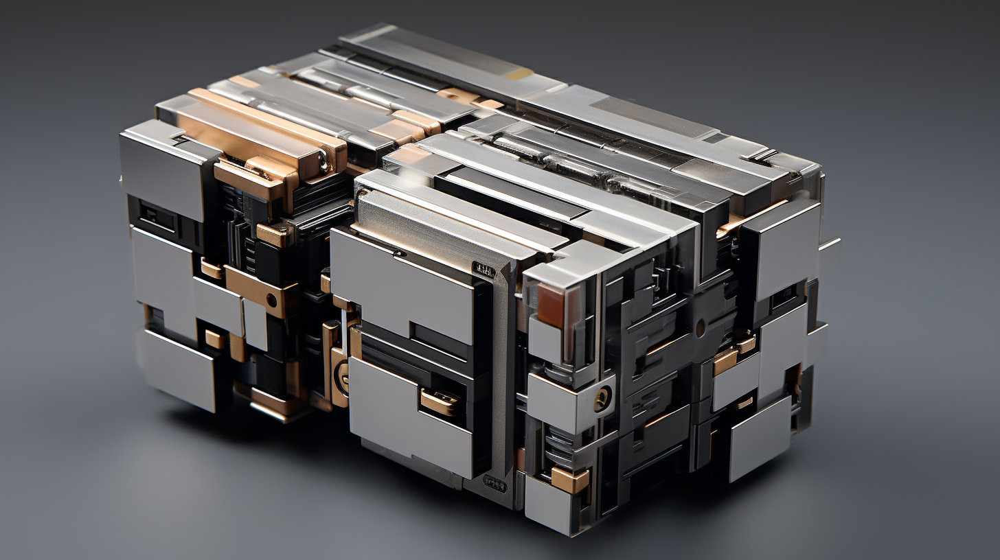
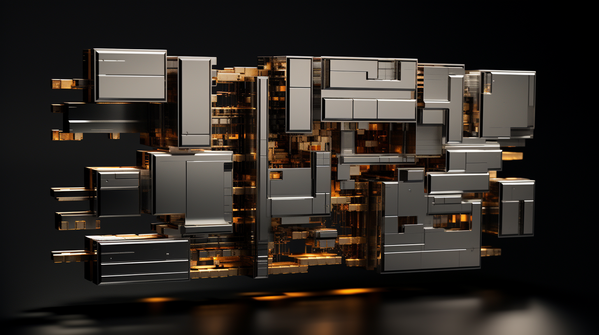

# Hard Code

<figure><figcaption>
A close-up of a LMNL program with interlocking hard code modules. 
</figcaption></figure>

## Overview

Hard code modules are made of "physical functions"; logical circuits defined by their physical structure, that can be composed and extended to form secure, application-specific physical programs. Hard code is the only legal form of computational system in [GATA](../gata/) and [NDA](../gata/law-and-order/new-dawn-accords.md)-compliant states.

Hard-coded systems are impervious to corruption because their functions are physically encoded in the shape and structure of its computational components, meaning they cannot be re-written remotely or compelled to perform functions that they were not designed with the capacity to perform.

By their nature, hard-coded systems are much larger than their general-purpose precursors. This is because each logical function must be physically represented by a computational structure that performs only that function, and all information moving through the system must pass through relatively many redundant filter modules that are themselves written in hard code.

Over long-term use, or when under heavy load for extended periods, the hard-code circuit lattice will accumulate wear, which can diminish a system or module's efficiency and effectiveness, and can even result in failure.

Today, the most common programming language for writing hard code is [LMNL](hard-code.md#lmnl), an open-source framework widely adopted around the world.

***

## The Regulation of Hard Code

In order to comply with GATA's regulations, all novel hard code that is sold, exploited commercially, or otherwise used outside of licensed research, must be registered with the AIC for a provisional prototyping key. This key is a temporary license provided to both identify the unique code, as well as to provide it with sandboxed System access for compatibility testing). After a variable grace period, all provisional hard code that isn't designed to be compiled by an NDA-certified compiler must pass a "Blue" (and, if applicable, "Green") paradigm review by an AIC-appointed auditor.

Enterprise often pays to expedite their paradigm review process, which can at times result in backlogs for coders and enterprise without as much capital, and this backlog can swell due to market dynamics driving competitive flashpoints, or an increased volume of novel code submissions following significant changes to large paradigms.

Because LMNL is Asimov-complete out of the box, LMNL-based components and modules do not require can be safely reviewed autonomously upon connection to the System mainnet, and single-filter specs can be approved nearly instantly.

***

## Raw Hard Code

<figure><figcaption>
An extremely compact system built with raw hard code.
</figcaption></figure>

Less commonly utilized today, raw hard code refers to physical functions that are not written or compiled using frameworks or automation. Raw hard code is instead meticulously hand-constructed by master coders, allowing them to build more sophisticated and compact physical functions.

Prior to the popularization of LMNL, all hard-coded systems were built in this way. Hand-building physical functions allows much more flexibility in the shape of logical structures, and more efficient connections between its modules.

Most significantly, raw hard code allows the coder to funnel all data through a single filter module, rather than having many redundant filter modules distributed throughout the system, resulting in a dramatically more compact module or program.

However, using raw hard code comes at a cost; it is not Asimov-complete by default, unlike Asimovian frameworks like LMNL, making raw code much riskier from a security and compliance standpoint, and more expensive to build and maintain. Due to these challenges, raw hard code is only legally allowed to be produced and serviced in GATA by licensed enterprises and operators.

***

## LMNL

<figure><figcaption>
A compiled LMNL module.
</figcaption></figure>

LMNL (pronounced "liminal") is an [Asimov-complete](asimovian-architecture.md) hard-code programming language used to write physical functions. LMNL being Asimov-complete means that by simply writing hard-code in LMNL, systems will be safe and secure in accordance with [New Dawn Accord](../gata/law-and-order/new-dawn-accords.md) standards and regulations that prohibit general purpose processors.

Hard-coded systems are similar in principal to the Application-Specific Integrated Circuits (ASICs) found in legacy technology; hardware components that are designed and optimized for a single purpose. Code written in LMNL compiles to corresponding hard code modules; physical computational structures fabricated in carbon and silicon. Most Asimovian systems today use hard-coded modules written in LMNL.

### Usage & Usability

By physically restricting the kinds of logical structures that can be compiled, LMNL ensures that systems process information in a “safe cascade”. This has the effect of limiting how a system can access and manipulate information–aka [ontology design](asimovian-architecture.md#ontology-design). One of its most prominent effects is that it dramatically limits the adaptability, or creativity of [cogs](cogs.md)—an intentional feature that has advantages and drawbacks.

LMNL has been especially critical for the standardization and proliferation of filter modules. LMNL provides a framework for programmers to more easily codify rules that filter, throttle and direct information within a computational system.

<figure><figcaption>
A hand-assembled program using a mix of pre-compiled and fabricated components.
</figcaption></figure>

LMNL programs can be compiled as one complete module, or smaller fragmented modules that can then be combined into larger composite programs. The process of assembling modules into a composite program is called "hand compiling". Some hand-compilation is always necessary when a program integrates non-LMNL components. While compilation and shell fabrication can be automated, some coders simply prefer to assemble their LMNL programs and shells by hand.

The most ubiquitous LMNL programs are simple every day conveniences like data sticks and slips. However, LMNL can be used to write hard-coded systems of any shape and size–particularly useful for large, complex systems with many filter modules. The hard code required to run a large enterprise’s various systems often compile to modules large enough that they require entire rooms or standalone facilities to house them.

### **Standard Hard Code Formats**

<figure><figcaption></figcaption></figure> <figure><figcaption></figcaption></figure> <figure><figcaption></figcaption></figure> <figure><figcaption></figcaption></figure>

Over the years a variety of standard formats with standardized dimensions and port locations have emerged. The actual logical structures of compiled hard code are suspended inside a polymer nanocomposite that fills out the volume of the standard formats, making hard code modules easy to compose together, or plug into existing systems.

* Sticks: Small sticks commonly used for data storage. (10cm x 0.7cm x 0.7cm)
* Spikes: Pocket-sized wedges for most consumer programs. (2cm x 2cm x 6cm)
* Cards: Pocket-sized cards commonly used for ID and [commerce](../gata/politics/money.md). (5cm x 8cm x 0.7cm)
* Cartridges: Suitable for most enterprise applications. (16cm x 12cm x 1.5cm)
* Bricks: Chunkier cartridges with enough room for most System subroutines. (20cm x 12cm x 6cm)&#x20;
* Blocks: Large blocks with enough room for most enterprise-level COG programs. (20cm x 24cm x 24cm)

LMNL templates and module plans can be purchased on the market, and prices can vary widely. Bootleg templates and modules can be found on the black market, and are more commonly seen in [Grey Zones](../gata/politics/gray-zones.md), the [Free Territories](../free-territories/), [URSA](../ursa/) and [New Imperial Japan](../new-imperial-japan/).
