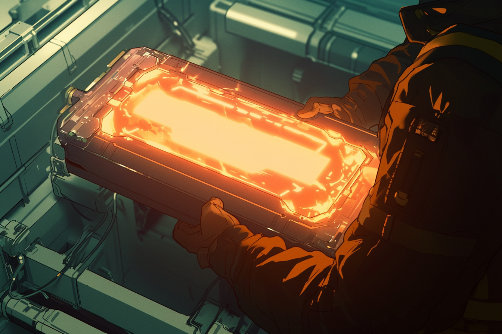

---
layout:
  title:
    visible: true
  description:
    visible: false
  tableOfContents:
    visible: true
  outline:
    visible: true
  pagination:
    visible: true
---

# Parallel Energy

<figure><figcaption>
A parallel reactor with a single cell powering a massive industrial machine.
</figcaption></figure>

## Overview

After years of perceived stagnation in GATA's energy production capabilities, parallel energy has recently gained attention as a new energy source poised to replace [fusion](fusion-energy.md) in [GATA](../gata/) and perhaps abroad.

Parallel Energy is a GATA-developed technology, made possible by advances in applied physics and material sciences first pioneered by [Atla’s](../gata/key-locations/atla.md) [Research Corps](../sol/institutions/the-research-corps.md#overview) during [the Reconstruction](../history/the-reconstruction.md) under the [Existence Doctrine](../gata/military-and-defense/existence-doctrine.md).&#x20;

Parallel energy is presently being trialed in the field by Angelis, in partnership with the London-based enterprise ParaCell who have pioneered the manufacture of parallel cells and reactors. However, the [AIC](../gata/institutions/atlan-information-control-aic.md) has yet to officially paradigm the technology for enterprise or civilian use anywhere in [Greater Atla](../gata/politics/greater-atla.md).

The AIC has proposed that if it proves as safe and promising as it seems over the trial period, they will move to share the technology with partner states. This has caused some friction between GATA, [URSA](../ursa/) and [New Imperial Japan](../new-imperial-japan/), as these two other states have enjoyed a long-standing energy partnership which may be under threat.

***

## **Design & Usage**

<figure><figcaption>
A portable parallel energy cell being installed by a technician.
</figcaption></figure>

Parallel energy systems are advanced storage solutions that function more like supercapacitors than traditional generators. They consist of parallel cells, which use quantum effects to store and supply power, and parallel reactors which house the cells.

Parallel cells use quantum effects to access energy on-demand from parallel universes where the cells have not yet been discharged. Cells from parallel universes are known as "threads," with the cell in our universe termed the "origin thread."

### Tapping Parallel Universes

To harness energy, the origin thread must first be "primed" by charging it. Once primed, the origin thread can tap into the near-infinite reservoir of energy stored across the other threads.

The reactor's hard-coded system architecture regulates the flow of power from the other threads to the origin thread. When the origin thread depletes its energy, the reactor sequentially taps into the other threads to recharge it, ensuring a consistent, stable, and theoretically inexhaustible power supply. Reactors can be designed to house one or more cells.

Because the parallel universes diverge from the causal chain in our universe, the other threads do not all draw on the cell's power reservoir at the same time. This probabilistic design ensures that the power available to the origin thread remains stable despite fluctuations in the total energy reservoir due to concurrent draw from the cells in some of the parallel universes.

This system allows for the massive and nearly instantaneous release of energy, making it highly suitable for industrial and military applications.

Parallel reactors can be scaled by installing multiple cells, thereby accessing more threads and significantly increasing the energy available in the reactor's reservoir. This scalability makes parallel reactors compact yet powerful.

***

## **Dangers & Time Distortion**

Although it has only happened under testing conditions, when pushed several orders of magnitude beyond safety thresholds, parallel energy cells can become unstable, resulting in catastrophic failure called "thread collapse".

The local effects felt proximately during thread collapse, even at purportedly ‘safe’ distances, are said to be severely disorienting, with multiple first hand accounts reporting significant distortions in the felt passage of time; namely, an uncanny and uncomfortable experience that subjective time slows to a crawl for minutes or hours. This is understood to be the result of an increase in the local irreducibility as multiple timelines recohere by brute force, and more time is compressed into a finite volume of space.

Due to their psychological side effects, the use of these time distortion effects in offensive weapons has been proposed by some. Others hypothesize that thread collapse could be causing unseen effects in parallel universes. However, [Angelis](../gata/military-and-defense/angelis.md) with its "special paradigm" has reportedly begun employing portable distortion charges as tactical equipment, giving a breaching team or operative more time to observe and react.
