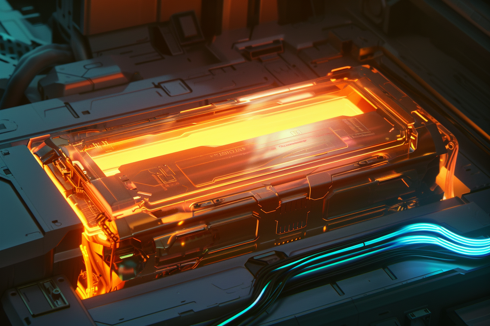

---
layout:
  title:
    visible: true
  description:
    visible: false
  tableOfContents:
    visible: true
  outline:
    visible: true
  pagination:
    visible: true
---

# Parallel Energy

<figure><figcaption>
A parallel reactor with a single cell powering a massive industrial machine.
</figcaption></figure>

## Overview

After years of perceived stagnation in GATA's energy production capabilities, parallel energy has recently gained attention as a new energy source poised to replace [fusion](fusion-energy.md) in [GATA](../gata/) and perhaps abroad.

Parallel Energy is a GATA-developed technology, made possible by advances in applied physics and material sciences first pioneered by Atla’s [Research Corps](../sol/institutions/the-research-corps.md#overview) during the [Dark Decade](../history/the-dark-decade.md). The [AIC](../gata/institutions/atlan-information-control-aic.md) has only recently approved several enterprises to commercialize parallel energy in a few [districts](../gata/politics/districts.md) under highly-controlled conditions.

The AIC has proposed that if it proves as safe and promising as it seems over the trial period, they will move to share the technology with partner states. This has caused some friction between GATA, [URSA](../ursa/) and [New Imperial Japan](../new-imperial-japan/), as these two other states have enjoyed a long-standing energy partnership which may be under threat.

***

## **Parallel Reactors**

<figure><figcaption>
A portable parallel energy cell being installed by a technician.
</figcaption></figure>

Unlike fusion reactors, parallel cells do not actually generate energy; they are technically more akin to supercapacitors, and use charged cells arrayed across parallel universes to store and supply power. Before they are can be tapped for power, they must first be charged.

Parallel cells use quantum effects to access energy on-demand from parallel universes where the cells have not yet been discharged. These parallel universe cells are called ‘threads’ and the cell in the observer's universe is called the ‘origin thread’.

These cells are installed in Parallel reactor units, which regulate the flow of energy. By installing and charging multiple cells in a reactor unit, more threads become available to be tapped.

Cells from parallel universes are systematically tapped to power the origin thread cell. While the power available in the reactor's reservoir is constantly fluctuating as the cells in the parallel universes can also draw power from the reservoir, the power supply available to to be tapped by the origin thread at any given time is extremely stable and exponentially higher than the energy used to charge it.

The energy reservoir accessible across the near-infinite parallel threads can in turn be used to charge additional cells installed in the reactor, exponentially increasing the energy in the reactor's energy reservoir.

Parallel energy can be spent almost instantaneously, like a supercapacitor, making it perfect for many industrial and military applications. Because energy is stored across parallel universes, parallel reactors and their individual cells are remarkably compact for their massive power output.

There is not much room for further miniaturization using any other known technology, so generating more power will always require bigger reactors with more cells until some new method is discovered (or revealed by [ALTAR](../gata/institutions/altar.md) if it already exists).

***

## **Dangers & Time Distortion**

Although it has only happened under testing conditions, when pushed several orders of magnitude beyond safety thresholds, parallel energy cells can become unstable, resulting in catastrophic failure called "thread collapse".

The local effects felt proximately during thread collapse, even at purportedly ‘safe’ distances, are said to be severely disorienting, with multiple first hand accounts reporting significant distortions in the felt passage of time; namely, an uncanny and uncomfortable experience that subjective time slows to a crawl for minutes or hours. This is understood to be the result of an increase in the local irreducibility as multiple timelines recohere by brute force, and more time is compressed into a finite volume of space.

Due to their psychological side effects, the use of these time distortion effects in offensive weapons has been proposed by some. Others hypothesize that thread collapse could be causing unseen effects in parallel universes. However, [Angelis](../gata/military-and-defense/angelis.md) with its "special paradigm" has reportedly begun employing portable distortion charges as tactical equipment, giving a breaching team or operative more time to observe and react.
