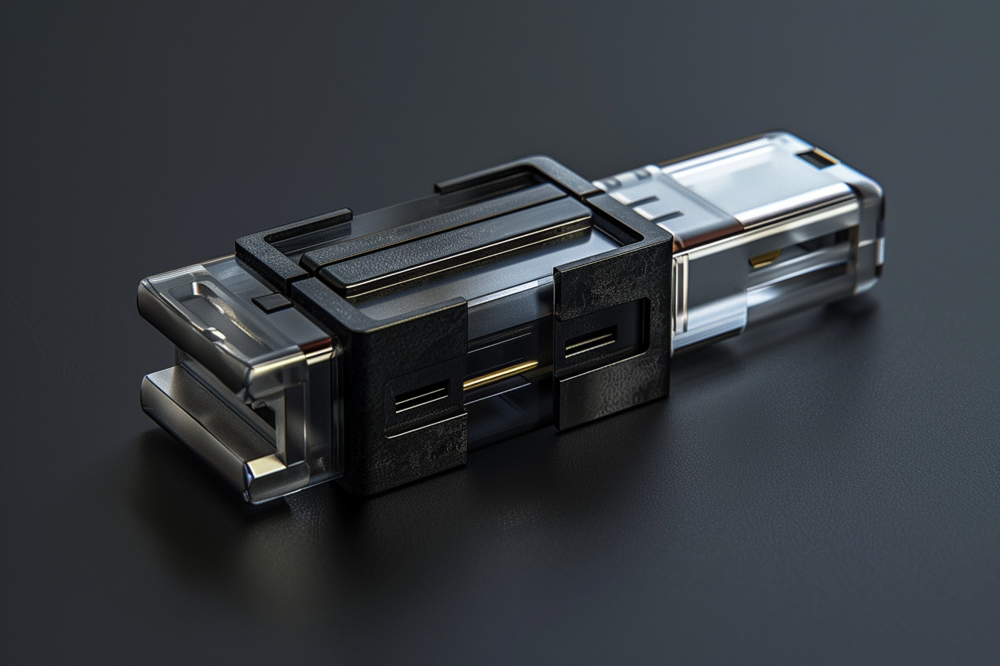

---
layout:
  title:
    visible: true
  description:
    visible: false
  tableOfContents:
    visible: true
  outline:
    visible: true
  pagination:
    visible: true
---

# Psychotech

<figure><figcaption>
A small psychotech module that can be inserted in various link interfaces or sync hubs.
</figcaption></figure>

## Overview

Compact modules containing cognitive subroutines that can be physically installed into compatible [link wearables and implants](links.md) with expansion ports, or can be installed in sync hubs, allowing link users to directly access their data.

Older link implants don’t have the necessary ports for modular psychotech, but some early implants with embedded psychotech were explored. Embedded psychotech has largely been abandoned for the more modular, extensible approach.

Psychotech, or "psychs" for short, contain associational data and carefully constructed entrainment loops through that data that can confer knowledge, basic instincts, complex mental operations, heightened motor function, and other states of mind. Designer psychs can be acquired by those who know where to look, and a market for [recreational](../gata/underground-scene/recreational-drugs.md) psychs has emerged in recent years across the [Free Territories](../free-territories/) and in [the underground scene](../gata/underground-scene/) found in [Gray Zones](../gata/politics/gray-zones.md).

Unstable or corrupted psychotech can be dangerous and potentially cause irreversible long-term damage to its user.

The architecture of psychotech is closely related to the design patterns found in cogs, essentially representing an extension of the users cognition that can be accessed consciously by leveraging quantum properties of its crystal-based storage.
