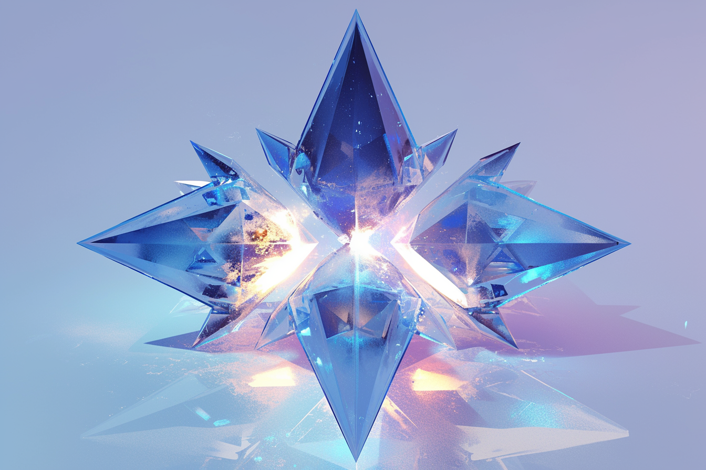

---
layout:
  title:
    visible: true
  description:
    visible: false
  tableOfContents:
    visible: true
  outline:
    visible: true
  pagination:
    visible: true
---

# Quantum Seeds

<figure><figcaption>
A set of entangled quantum seeds.
</figcaption></figure>

## Overview

Quantum seeds, or Q's, are special [hard-code modules](hard-code.md) containing quantum-entangled crystals that allow for instantaneous communication across any distance. Groups of seeds that are entangled together are called cohorts.

Quantum seeds are not widely [paradigmed](../gata/politics/paradigms.md) in [GATA](../gata/the-basics.md), and possession of illegal quantum seeds is a [Class 1 infraction](../gata/law-and-order/tech-regulation.md#class-1-red) under [AIC](../gata/institutions/atlan-information-control-aic.md) [regulations](../gata/law-and-order/tech-regulation.md). The most widespread illegal quantum seeds are the [astral seeds](the-astral.md#astral-seeds), which are used to enter to a vast network of connected minds known as [the Astral](the-astral.md), a new and unprecedented shared mental [construct](constructs.md).

Quantum seeds are based on the science of time crystals, regular crystalline structures that evolve over time. The internal structure of a quantum seed is a complex matrix of ever-evolving facets, and as long as it is cooled to absolute zero inside of a temperature-controlled module, each entangled quantum seed will remain physically identical to every other quantum seed in its cohort.

If a quantum seed's temperature is disrupted, or its structure is physically damaged, its entanglement with its cohort is broken, rendering it inert.
