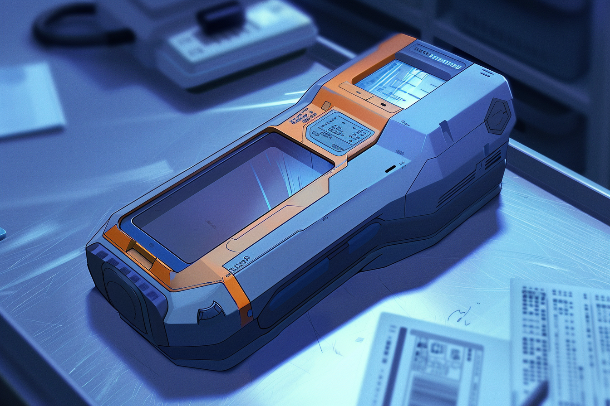

---
layout:
  title:
    visible: true
  description:
    visible: false
  tableOfContents:
    visible: true
  outline:
    visible: false
  pagination:
    visible: true
---

# Scanners

<figure><figcaption>
A handheld scanner.
</figcaption></figure>

## Overview

Scanners are handheld or stationary devices used to analyze vehicles, objects and people based on their material and energetic signatures in order to identify any patterns that have been programmed into the scanner.

<figure><figcaption>
Full-body scanners at a security checkpoint.
</figcaption></figure>

Scanners are used in a wide range of applications, from security checkpoints, medical assessments, detecting environmental pollutants, verifying the contents of shipments, or identifying illegal technologies.

The precise capabilities of a scanner are entirely depending on its library of patterns stored in a local data storage module. While some scanner patterns are widely available, many require keys to purchase or use, and some are even illegal under AIC regulation.
