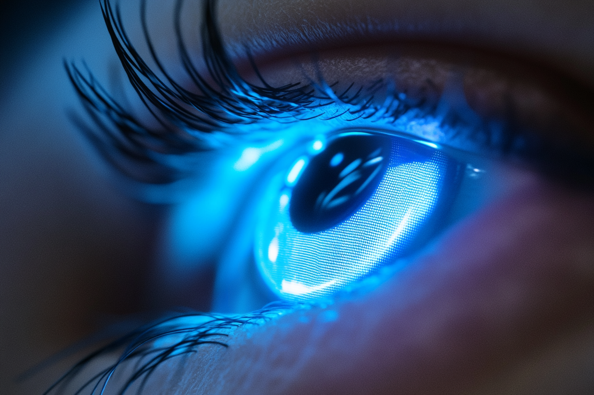

---
layout:
  title:
    visible: true
  description:
    visible: false
  tableOfContents:
    visible: true
  outline:
    visible: false
  pagination:
    visible: true
---

# Sights

<figure><figcaption>
Close up of an active sight lens on a wearer.
</figcaption></figure>

## Overview

A semi-permanent organic lens on the wearer's eye made of a microscopic lattice of photoluminescent cells. Sights have a nano-scale antennae allowing them to connect to gear, links, and other systems, enabling the wearer to see real-time information, view constructs and virtual media, and interact with connected systems.

Sights don't have computational resources of their own, and rely on connected systems, such as terminals, slates, gear, or links to provide visual input. When activated, sights can be seen to emit light, and the appearance is often personalized by their wearers. The most common sight aesthetic is to make the wearer's iris appear to glow a given color when their sights are active.
