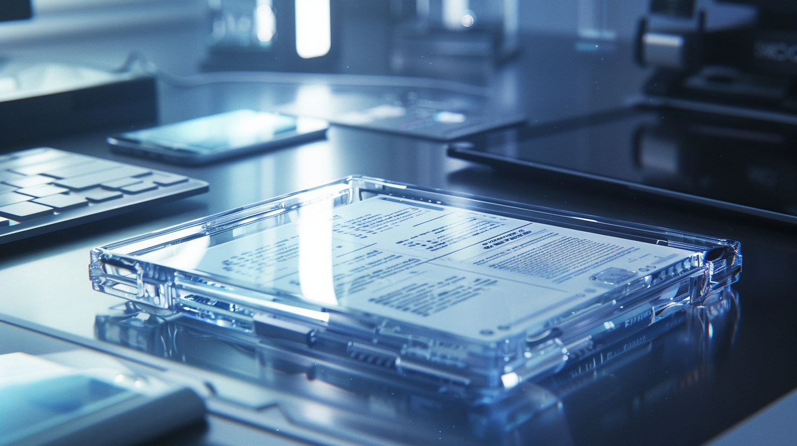

---
layout:
  title:
    visible: true
  description:
    visible: false
  tableOfContents:
    visible: true
  outline:
    visible: true
  pagination:
    visible: true
---

# Slates

<figure><figcaption>
A slate on a desk displaying an opaque document
</figcaption></figure>

## Overview

Slates are portable, personal interfaces featuring large displays. They are often used to connect to [endpoints](endpoints.md) in order to control various systems. The typical slate has an edge-to-edge touch-enabled organic display with a thin form factor. Slates can be translucent or opaque, elegant or robust. They come in a number of form factors.

***

## Types of Slates

### Glass Slates

Translucent displays that can read data sticks and interface with local terminals. They also have some limited on-board LMNL compute. Glass slates are very common in enterprise and institutional environments where information is constantly in flux, and secured through private endpoints.

### Paper Slates

These paper-thin displays (colloquially referred to simply as "paper") are one of the most common varieties of slate. The ‘paper’ material is not really paper, but a highly resilient [hard-code](hard-code.md) nanostructure with a paper-like texture. Usually, one paper slate is stacked with multiple regular sheets of storage “paper” that can be explored via the paper slate’s interface.

Paper slates are commonly used for extremely sensitive information, and is particularly useful in the criminal underworld, and more clandestine enterprises. Paper is also commonly used as a medium of exchange in financial transactions, and for storage backups for critical data.
