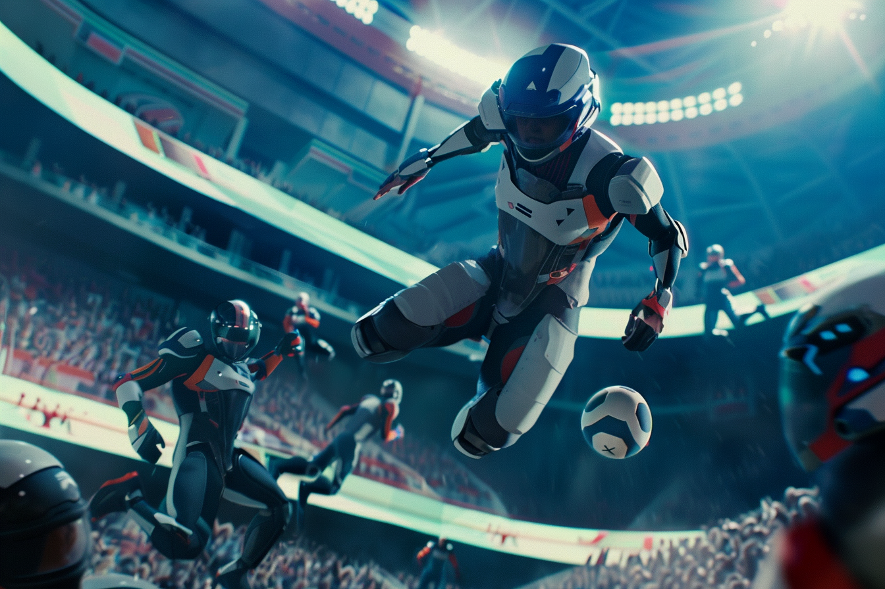

---
layout:
  title:
    visible: true
  description:
    visible: false
  tableOfContents:
    visible: true
  outline:
    visible: false
  pagination:
    visible: true
---

# Statics

<figure><figcaption>
A static ship docked on the water while static tankers maneuver in the sky above.
</figcaption></figure>

## Overview

Applied static field technology, also known as 'statics', is an advanced science and engineering field combining high-energy physics, quantum information, and gravitational manipulation (also known as "gravitics").

Specialized devices called 'static nodes' are used to accurately position, orient, and transport objects within Earth's gravitational field and beyond.

Developed from theoretical physics breakthroughs and refined engineering—including efforts by the Joint Atlantic Command during the Dark Decade—statics enable a reliable yet energy-intensive framework for controlling spatial relationships in a wide range of applications.

Statics are widespread in Greater Atla (GATA) and its partner states, rarer in URSA, and rarer still across the Free Territories.

Static field technology is used in a wide range of applications beyond positioning and translating static nodes, from [grabbers](grabbers.md), inertial dampening fields for [frame](frames.md) operators' [cradles](frames.md#design-and-functionality), or containment fields for controlled atmospheres and artificial gravity environments, like those used in the popular sport, [Gravita](../gata/people-and-culture/sports-and-games/#gravita).

***

## **Underlying principles**

Static technology rests on two core processes—**Addressing** and **Folding**—each of which is facilitated by key components like addressing pins, field generators, and field amplifiers.

These methods integrate breakthrough research in relativity, gravitics, quantum mechanics.

Broadly speaking, the technology uses quantum entanglement to control the collapse of probabilistic wavefunctions, and gravitational effects to relativistically isolate an envelope of space-time.

### Addressing

* **Pins and Entanglement:** At the heart of each static node is a set of specially prepared quantum-entangled electrons, housed within separate modules called **pins**. Arranged in spherical arrays, the pins enable higher-resolution “addresses” in space-time with greater pin counts. Each entangled electron samples potential states across many branches of the wavefunction, as predicted by the Many-Worlds interpretation.
* **Spatial Fixation:** By measuring local gravitational and relativistic conditions simultaneously, the node maintains coherence among its pins to identify a precise location (or "address") within the gravitational frame. This address acts as a signature of local equilibrium within the gravitational field, weighting future measurements toward a particular outcome among many possible realities. Early breakthroughs in theoretical physics and material sciences—especially during the Dark Decade—were crucial to making this near-infinite branching controllable.
* **Gravitational Sensing:** Minute changes in gravitational potential are constantly measured, factoring in local Lorentz invariance and Minkowski geometry. This ensures stable anchoring even when gravitational forces shift. The node’s address depends not only on Earth’s gravity but also on other dominant gravitational actors, such as the Sun.

### Folding

* **Static Field Creation:** Once a location is addressed, a **field generator** folds that region of space-time into a **static field** (or gravitational envelope), effectively isolating its interior from external relativistic interactions. From a relativistic standpoint, it skews the local reference frame so the interior’s inertial state is centered at the chosen address, and from which the static field can be used to drive various applications.
* **Field Amplification:** A **field amplifier** enables expansion of this static field to encompass larger objects, entire vessels, or sprawling platforms. It boosts the energy throughput necessary to collapse wavefunctions on a broader scale, retaining coherence under high stress or across vast distances. Larger static envelopes support advanced uses like vessel-scale gravity manipulation.
* **Exterior and Interior Frames:** Externally, a tightened node appears locked in place, while internally, quantum systems traverse continuous micro-fluctuations, 'navigating' the node between probabilistic wavefunction branches by exploiting the probabilistic gradient of relativistic interactions at the boundary of the gravitational envelope. With higher-power amplification, an entire craft (and its occupants) can experience an interior frame where external gravity becomes partially mutable, forming the basis for trans-medium travel.

***

## Static Nodes

<figure><figcaption>
A static node that can be installed inside of structures or static engines.
</figcaption></figure>

Static nodes are the fundamental hardware implementing these principles. Typically manufactured in spherical assemblies and ranging from 5 cm to 1 m in diameter, each node houses:

#### **Pins**

Quantum-entangled electrons (arranged in modules) to pinpoint addresses in space-time.

#### **Field Generator**

The core module that folds local space-time by coupling quantum fields with classical gravitational potentials.

#### **Field Amplifier (optional):**

Scales up gravitational envelopes for large-scale or power-intensive deployments.

### **Node Tightening and Loosening**

#### **Tightening:**

Applying a carefully modulated charge incrementally locks the node to its addressed point. Once sufficiently tight, it can hold this position indefinitely—even if external power is lost—until the same resonant frequency is applied to unwind it. The node’s locked state directly depends on gravitational influences; for example, tightness can be stronger in Earth’s gravity well than in weaker fields.

#### **Loosening:**

To detach the node from its address, an inverse or frequency-matched charge is applied, letting previously dismissed wavefunction branches reassert themselves. This process can take considerable energy and time, especially if the node is highly tightened. While loosely locked, a node can be manually moved through ambient magnetic fields, with the level of physical resistance determined by how tightly the node was locked beforehand.

### **Node Size and Operation**

#### **Smaller Nodes (5–20 cm):**

Faster to tighten, yielding agile responses suitable for short-range maneuvering or swift directional changes. However, pushing them to full tightness is disproportionately energy-intensive, restricting use at high altitudes or deep gravity wells.

#### **Larger Nodes (up to 1 m):**

Slower to reach maximum tightness but more efficient once locked. Their expanded array of pins can leverage subtler gravitational cues and reference more distant gravitational bodies, enabling them to navigate more easily across orbits or the solar gravity well. These advances were pioneered by Atla's Research Corps during The Reconstruction.

***

## **Static Engines & Motion**

<figure><figcaption>
A large static engine inside of an industrial static tanker.
</figcaption></figure>

A **static engine** is a coordinated assembly of three or more static nodes. Dynamically controlling each node’s folding parameters, charges, and addresses yields stable, controlled motion through the gravitational field. The number of nodes also determines how robustly an engine can orient and navigate.

#### **Multi-nodal Coordination:**

Three or more nodes allow stable locomotion in multiple axes, while two-node setups are typically limited to simpler horizontal movement. A single tightened node can serve as an immovable anchor for infrastructure.

### **Energy Sources:**

* **Small-Scale:** Compact battery systems power smaller vehicles (e.g., boards, cycles) over short distances.
* **Larger Platforms:** Fusion reactors or specialized fusion cells power heavy industrial transports and large platforms. Some states—like New Imperial Japan—use refined miniature fusion cells, giving them indefinite operational advantages in both military and civilian applications.
* **Experimental Parallel Energy:** Taps into latent wavefunction branches to harness "parallel" probabilistic energy. Still in advanced R\&D, with varied results.

**Continuous Modulation**

Engine controllers constantly recalculate addresses and folding intensities across all nodes. This ensures smooth, efficient travel even in shifting gravitational landscapes. Historical examples include GATA’s early staging platforms used during The Reconstruction, while modern miniaturized systems power extreme-sport “darts.”

### Enterprise players

Manufacturers like Pegasus (GATA), Nimbus (GATA), and Gibraltar (AU) lead the industry, offering quantum-resilient electronics, robust materials, and advanced entanglement fidelity measures.

***

## Applications of Static Field tech

### Transport & Vehicles

From massive industrial rigs to sleek personal transports, static engines have proliferated widely in GATA’s districts and beyond, though they remain costly or less available in places like URSA and the Free Territories.

### Ships

<figure><figcaption>
A static ship at rest in the serene wilderness of Greater Atla.
</figcaption></figure>

Vehicles of various size with different configurations of static engines. The most popular mode of inter-district travel, and increasingly accessible for civilian use.

***

### Cycles

<figure><figcaption>
A static cycle idling in a garage.
</figcaption></figure>

Smaller seated vehicles, typically with no enclosure surrounding the occupant(s). Designed for higher top speeds and generally only intended to carry one or two passengers. Modelled after traditional wheeled motorcycles.

***

### Rafts

<figure><figcaption>
A static raft employed by Collections to recover illegal contraband.
</figcaption></figure>

Small, simple static platforms made for ferrying heavy cargo and equipment over shorter distances. Used widely in industrial, law enforcement, and military contexts.

***

### Gondolas

<figure><figcaption>
A public gondola ready to ferry people across the city.
</figcaption></figure>

These moving extensions of urban architecture are a common form of public transportation in districts. Gondolas typically take the form of small platforms with handrails, and sometimes seating.

***

### Static Boards

<figure><figcaption>
A youth exploring the wilds on a small static board.
</figcaption></figure>

Board-like personal conveyances with miniature static engines. Increasingly popular among the youth and favored for fast, dynamic movement. They use articulating magnetic plates to secure the rider and maneuver the board.&#x20;

Larger, more intense static boards that are finely tuned for high-performance and extreme sports are called [Darts](../gata/people-and-culture/sports-and-games/#darts).

***

### Platforms

<figure><figcaption>
A static platform used for construction.
</figcaption></figure>

Large static platforms that serve as staging areas for construction, industry, and military operations. While more down-to-Earth industrial platforms are a common sight across Greater Atla, the most famous static platform is perhaps the most exceptional; the [Azure Plateau](../sol/key-locations/azure-plateau.md) located at the edge of Low-Earth Orbit.

***

### Tankers

<figure><figcaption>
A static tanker carrying System Yield above a district shipyard.
</figcaption></figure>

Remarkably large static vehicles used for enterprise-scale transport. Tankers are used widely by government and enterprise for district-to-district shipping, and are employed by The System to transport [System Yield](../gata/politics/yield.md).

***

### Skyliners

<figure><figcaption>
Static skyliners traversing the skies above Greater Atla.
</figcaption></figure>

Luxury static vessels used for travel and leisure. Popular among affluent travelers seeking scenic inter-district routes or remote hideaways.

### Industrial and passive applications

<figure><figcaption></figcaption></figure>

Beyond vehicles, statics also drive complementary technologies:

* **Grabbers:** Specialized clamp-like devices for securing and moving cargo with precise control.
* **Containment Fields for Breathable Atmospheres:** Vital for off-world habitats and deep-space platforms.
* **Inertial Dampening Fields:** Used for frame operators’ cradles and other high-impact tasks.
* **Artificial Gravity:** Showcased in sports arenas like “Gravita,” enabling participants to compete in variable gravity conditions.

***

## Cultural and Historical Significance

Originally developed through Joint Atlantic Command research in the Dark Decade, static technology advanced rapidly during The Reconstruction. It is now integral to daily infrastructure across Greater Atla and allied states. Statics fuels entire sporting subcultures like Gravita and the high-adrenaline darts scene, and has shaped new socioeconomic enterprises, from massive cargo shipping to high-end tourism.

<figure><figcaption>
A pivotal moment in a Gravita match.
</figcaption></figure>

Because static nodes rely on stable quantum entanglement in real-world conditions, there remains debate among leading researchers on the precise nature of this phenomenon. Some argue that static technology offers strong evidence for a Many-Worlds interpretation, positing that each node prunes a single branch from a near-infinite wavefunction. Others favor single-world explanations—such as repeated wavefunction collapse, pilot-wave dynamics, or decoherence-based models—to account for how the node “locks” onto one outcome among many.

Observations of energy gradients at the boundary of a static field’s gravitational envelope remain a key area of interest; many researchers pursuing experimental 'parallel energy' research find the Many-Worlds framework particularly compelling for explaining these phenomena.

Overall, static field technology merges quantum-scale physics with large-scale engineering, offering versatile gravitational manipulation that is both delicate and tremendously powerful.

Research into this technology continues to expand humanity’s horizons, enabling robust infrastructure, trans-medium travel, and deeper cosmic exploration while reshaping cultural, industrial, and scientific landscapes alike.
