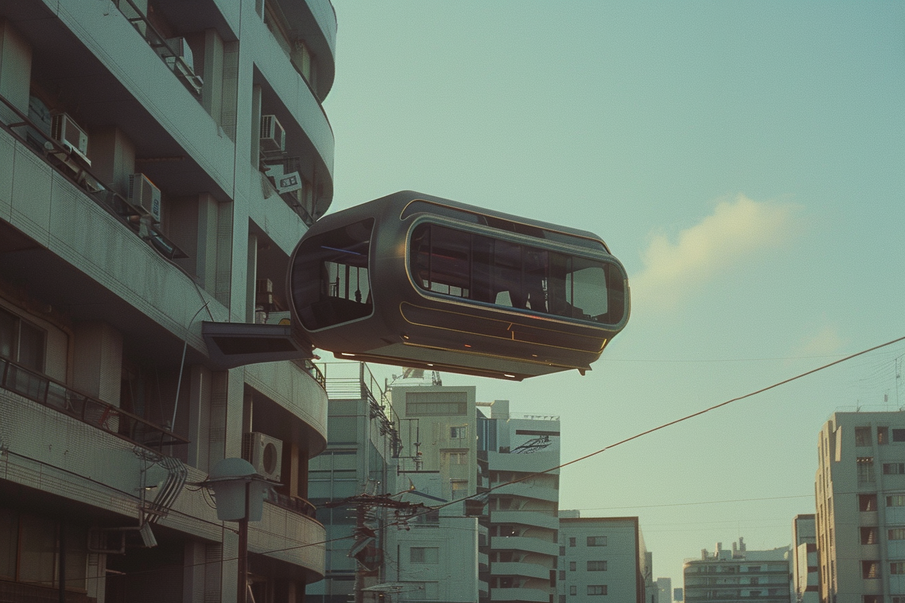

---
layout:
  title:
    visible: true
  description:
    visible: false
  tableOfContents:
    visible: true
  outline:
    visible: false
  pagination:
    visible: true
---

# Statics

<figure><figcaption>
A static ship docked on the water while static tankers maneuver in the sky above.
</figcaption></figure>

## Overview

Static Field technology, or statics for short, uses ‘[static nodes](statics.md#static-nodes)’ to position and move objects, crafts, platforms, and structures within the Earth’s gravitational field, or ‘static field’ as it relates to static technology.

Statics are much more prevalent in [GATA's](../gata/the-basics.md) districts and across [Greater Atla](../gata/politics/greater-atla.md), however they can also be found in use within all of [GATA's partner states](../gata/politics/new-dawn-accords.md#signatories). Conversely, they are a rarer sight in [URSA](../ursa/the-basics.md) and rarer still across the [Free Territories](../free-territories/the-basics.md).

Static field technology has also been essential for the development of [grabbers](grabbers.md), and it is a key element of many other innovations, such as containment fields for breathable atmospheres in space, inertial dampening fields for [frame](frames.md) operators' [cradles](frames.md#design-and-functionality), or artificial gravity environments, such as those used in the popular sport, [Gravita](../gata/people-and-culture/sports-and-games.md#gravita).

***

## **Static Nodes**

<figure><figcaption>
A static node that can be installed inside of structures or static engines.
</figcaption></figure>

Static nodes are small polyhedral components whose position in its surrounding gravitational field can be modulated by applying a charge to the node.

When a high charge is applied to an inactive node, the node slowly becomes more "static" in the gravitational field. When the current is cut, the node holds its relative position in the gravitational field indefinitely until the exact same frequency of charge is first applied and then slowly entrained down, at which time the node will loosen again. The charge necessary to loosen a regulation "firm" node is extremely high and must be applied for some time before the node will come loose.

A loose node can be moved manually through the magnetic field, although the amount of resistance is determined by the charge that was entrained. Loose nodes have opened up a wide range of applications in industry and enterprise, and in particular, static engines.

The number of nodes determines the way in which an object can orient in the gravitational field. A single, firm node is useful as an anchor for architecture and infrastructure. Two nodes can be used to create platforms that can be moved horizontally along the Earth's magnetic field. In order to achieve locomotion, three nodes are required.

Static nodes can range from 5 cm in diameter to 1 meter. The diameter of the node's core determines how quickly the node's resonant frequency can be entrained up or down. Smaller nodes can approach up to 90% firmness very quickly, permitting faster, more agile movement—but the last 10% of firmness would require an asymptotically higher current. Larger nodes take quite a while to reach 90% firmness, but reaching 99.9999% firmness is much faster and more energy efficient than with smaller nodes.

Static nodes are made possible by advances in material sciences pioneered by Atla’s [Research Corps](../sol/institutions/the-research-corps.md) during [The Reconstruction](../history/the-reconstruction.md) era.

***

## **Static Engines & Motion**

<figure><figcaption>
A large static engine inside of an industrial static tanker.
</figcaption></figure>

Static engines continuously modulate the charge applied to three or more nodes to produce smooth, stable movement within the Earth’s gravitational field. Static engines are essential for transporting extremely heavy loads, as demonstrated during the Reconstruction with GATA's long-defunct staging platforms that crawled the skies of Greater Atla.

With modern, miniaturized static engines, extremely fast and expressive movement can be achieved, as many have discovered with the recent rise in the popularity of [darts](statics.md#dart-boards)–static boards that have become central to an extreme [sport culture](../gata/people-and-culture/sports-and-games.md) that is intertwined with the [counterculture scene](../gata/underground-scene/).

Smaller static vehicles are reliant on compact batteries to power their static engines, while larger ships and platforms employ [fusion reactors](fusion-energy.md) to power their larger static engines. Meanwhile, New Imperial Japan, URSA and various Free Territories utilize much smaller fusion cells [manufactured by New Imperial Japan](fusion-energy.md#new-imperial-japans-miniaturized-fusion-cells), giving them advantages in certain military and industrial applications where their statics can operate indefinitely.

Prominent statics manufacturers include Pegasus (GATA), Nimbus (GATA), and Gibraltar (AU).

***

## Types of Static Vehicles

Static vehicles come in a wide range of shapes and sizes, tailored to their intended use. Their maneuverability and carrying capacity requirements determine the number and size of static engines employed, and static vehicles can be used in trans-medium travel, functional in air, water, and space, which further informs their forms and features.

### Ships

Vehicles of various size with different configurations of static engines. The most popular mode of inter-district travel, and increasingly affordable for civilian use.

***

### Cycles

<figure><figcaption>
A static cycle idling in a garage.
</figcaption></figure>

Smaller seated vehicles, typically with no enclosure surrounding the occupant(s). Designed for higher top speeds and generally only intended to carry one or two passengers. Modelled after traditional wheeled motorcycles.

***

### Rafts

<figure><figcaption>
A static raft employed by Collections to recover illegal contraband.
</figcaption></figure>

Small, simple static platforms made for ferrying heavy cargo and equipment across shorter distances. Used widely in industrial, law enforcement, and military contexts.

***

### Gondolas

<figure><figcaption>
A public gondola ready to ferry people across the city.
</figcaption></figure>

These moving extensions of urban architecture are a common form of public transportation in districts. Gondolas typically take the form of small platforms with handrails, and sometimes seating.

***

### Static Boards

<figure><figcaption>
A youth exploring the wilds on a small static board.
</figcaption></figure>

Highly maneuverable personal conveyance devices with static engines, particularly popular among the youth. Larger static boards that are finely tuned for high-performance and extreme sports are called [Darts](../gata/people-and-culture/sports-and-games.md#darts).

***

### Platforms

<figure><figcaption>
A static platform used for construction.
</figcaption></figure>

Large static platforms that serve as staging areas for construction, industry, and military operations. The most famous static platform is the [Azure Plateau](../sol/key-locations/azure-plateau.md).

***

### Tankers

<figure><figcaption>
A static tanker carrying System Yield above a district shipyard.
</figcaption></figure>

Large static vehicles used for large scale shipping. Tankers are used widely by enterprise for district-to-district shipping and are used by GATA to transport [System Yield](../gata/politics/yield.md).

***

### Skyliners

<figure><figcaption>
Static skyliners traversing the skies above Greater Atla.
</figcaption></figure>

Large luxury static ships used for travel and leisure. Skyliners are a popular form of travel between districts, or to remote [luxury homesteads](../gata/politics/homesteads.md#luxury-homesteads) found across Greater Atla.
