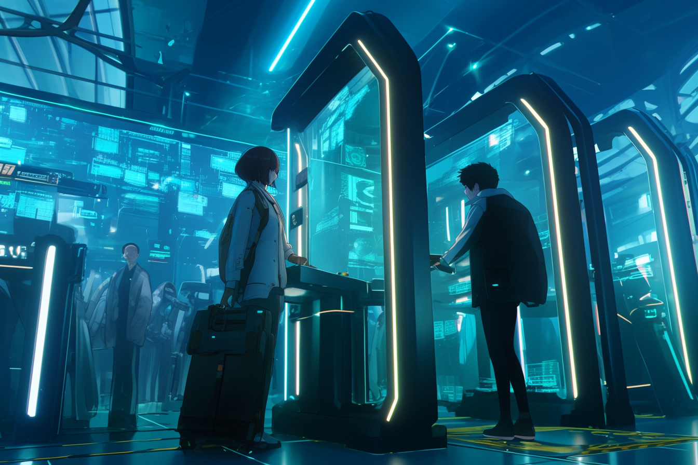
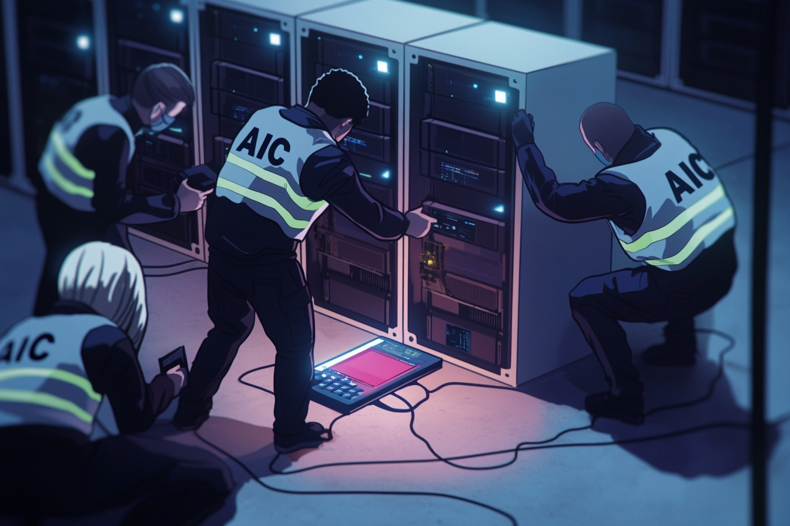

---
layout:
  title:
    visible: true
  description:
    visible: false
  tableOfContents:
    visible: true
  outline:
    visible: false
  pagination:
    visible: true
---

# Tech Regulation

<figure><figcaption>
Collections officers retrieving Class 1 technology on a static raft.
</figcaption></figure>

## Overview

Within GATA, technology is heavily regulated by two of its formative legislative documents; the NEw Dawn Accords, and the Whole Privacy Act. Authorities investigate, pursue, and prosecute the use of illegal technology, including legacy tech from the [Old World](../history/the-old-world.md), within and without the borders of Greater Atla, and technology is scrutinized particularly closely inside the walls of GATA's districts.

This heavy-handed regulation of technology is foundational to GATA's vision for a safe and prosperous human future, a bid to never again repeat the tragedies of the Dark Decade. By restraining and constraining the development of novel tech, GATA intends to mitigate sudden and catastrophic failures at both the immediate and existential scope.

GATA's tech regulation is overseen by Atlan Information Control (AIC). The AIC is a vast institution tasked with classifying safe and unsafe technologies, designing the technological paradigms that differentiate each district's technological regime, and adjudicating on matters that rise to their courts.

Unsurprisingly, this restrictive atmosphere has created a lucrative black market for illegal technology, whether it's exotic tech smuggled from inside a district, or legacy technology that is deemed illegal under the strictures of the NDA.

***

## Classifications

<figure><figcaption>
Collections field analysts inspecting an unlicensed legacy compute rack.
</figcaption></figure>

In GATA, technology is generally classified into three different categories that signify the potential danger they pose and their prescribed handling by authorities.

### Class 1 - Red

Class 1 technology, aka "red tech", is universally restricted technology, and includes general purpose processors, legacy military tech, automated weapons, nanotechnology, and hazardous materials or compounds, among others.

Not only are the functional components illegal, but also the designs and instrumental information about its fabrication or operation.

Class 1 offenses fall under into the domain of AIC's rigorous court system. Collections must be alerted whenever Class 1 technology is involved. In some cases, restricted Class 1 tech can be licensed to enterprise for study under very stringent conditions. The AIC's courts are responsible for granting or denying these licenses.

### Class 2 - Gray

Class 2 tech, aka "gray tech", is technology that is exclusively permitted within specified paradigms. This technology is not legal to possess or operate outside of those districts' walls, and attempts to smuggle Class 2 tech are severely punished.

Possession of legacy software is a class 2 offense, and is generally held to imply an intent to sell or exploit said software, necessitating the use of legacy hardware.

Possession of any un-paradigmed technology may be a Class 2 offense. These cases are left up to the local governments to adjudicate, with offending tech submitted to Collections, and detailed reports served to the AIC. Failure to enforce these laws negatively impacts a district's standing and System yield.

### Class 3 - Blue

Class 3 technology, aka "blue tech", is any technology that is universally permitted across Greater Atla and within all districts, notably including hard-coded systems and components. With regards to legacy tech, Class 3 tech typically includes simple antique electronics, basic electronic components, analog technologies, industrial tools, and other reasonably benign artifacts.

### Unclassified Tech

Technology that is unidentified or yet un-classified for whatever reason. Referred to as "invisible tech". Often scavengers and Old World salvage yards will uncover such items, which legally must be submitted to the nearest Gate for assessment by Collections inspectors.

Generally these items turn out to be 21st century equipment relating to industry. It's not unheard of for scavengers to sell these items to criminal syndicates and other private buyers.

The AIC and the NDA prescribe that unclassified tech is to be handled as if it may be Class 1 until proven otherwise, however local law enforcement are significantly less likely to recognize that they are even looking at unclassified tech than an inspector working for Collections.

***

## Privacy

Under the WPA, the right of an individual to be protected from invasive recording and processing of their personal data is guaranteed by law, and infringing use of technology is classified as a "red" offense. This right is protected due to the corrosive effect of surveillance and subliminal manipulation that had been so destructive to the social and political fabric of the Old World prior to The Crash.

While cameras, microphones, and other sensors are not expressly forbidden in the NDA, the transmission, sharing, and processing of identifying information of citizens without their consent infringes on the WPA.

"Wipers" are a common fixture in district public infrastructure and on private property, which destroy the sensors of most digital cameras and recording devices, and disrupt audio signals with destructive interference.
