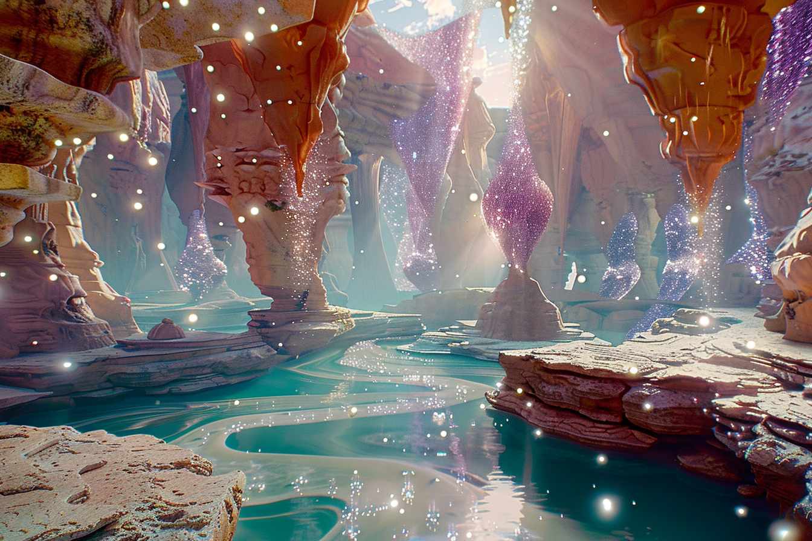
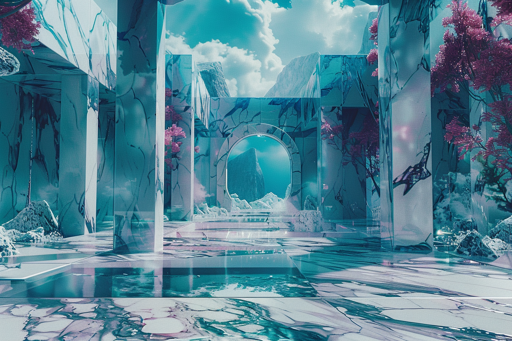
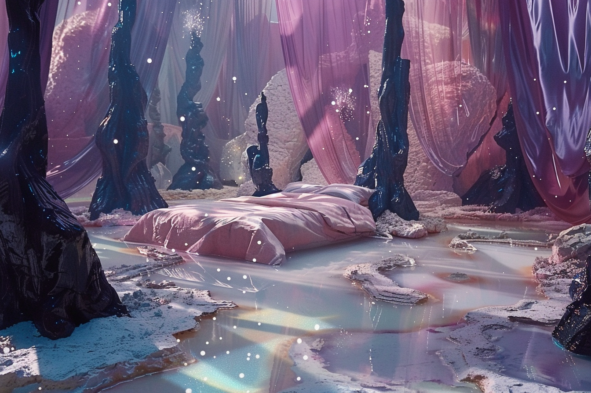
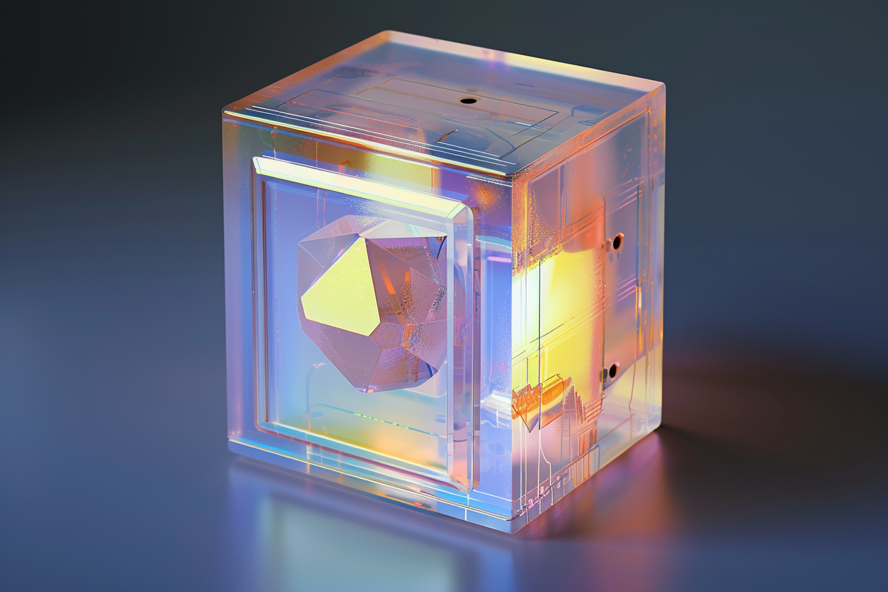

---
layout:
  title:
    visible: true
  description:
    visible: false
  tableOfContents:
    visible: true
  outline:
    visible: true
  pagination:
    visible: true
---

# The Astral

<figure><figcaption>
A stunning view within the Astral, with the famed Crystal Tower looming in the distance.
</figcaption></figure>

## **Overview**

The Astral is a novel kind of virtual construct that exists entirely in the minds of the users who are connected to it. Astral users are called "travelers", and they access the Astral using [links](links.md) and modified [sync hubs](sync-hubs.md) with an astral seed module that is entangled with its sibling astral seeds, allowing instantaneous synchronization between participants.

This modification of sync hubs is illegal and connecting to the Astral is a Class 1 crime. However, this has not prevented a growing subculture of Astral users from taking root, particularly among [sleepers](../gata/people-and-culture/sleepers.md) who already spend most of their lives within [virtual constructs](constructs.md#virtual-constructs).

Sleepers and others usually learn about the Astral and gain access to their secretive networks via illegal offline constructs that have been known to circulate around [dormitory communities](../gata/people-and-culture/sleepers.md#dormitories), leading to increasing scrutiny of dormitories by [the AIC](../gata/institutions/atlan-information-control.md).

***

<figure><figcaption></figcaption></figure>

 

<figure><figcaption></figcaption></figure>

 

<figure><figcaption></figcaption></figure>

## The Astral Experience

Within the astral, travelers are confronted with impossible environments and bizarre architecture clashing and blending, with structures and weather-like phenomena that defy natural laws. The astral has a soft, dream-like quality, and users have the sensation that details often only appear when they look to see them. With focused effort, astral users can change the environments, create objects, and affect the astral environment in many other ways.

<figure><figcaption>
A bed manifested by a traveler that even sleeps inside of the astral.
</figcaption></figure>

Materials within the astral tend to have distinct qualities, with crystal, stone, and glass being the easiest materials to manipulate and create with. The air seems to have a thick atmospheric quality, and clouds can always be seen sliding across the distant horizon. Thick clouds and fog are a common sight, but can typically be dispelled with focused attention. Some regions of the astral are easier to manifest and manipulate than others, however no one is sure why. In general, very little is known about the astral.

<figure><figcaption>
A long-time astral user manifesting constructs.
</figcaption></figure>

Travelers inside the astral appear as they imagine themselves, which generally corresponds closely to their real-life appearance, however with prolonged experience within the astral, users can learn to change their appearance at will, and often their internal image of themselves tends to drift. Long-time astral users are fairly easily identifiable by how their appearance has begun to match the natural aesthetic qualities of the astral.

<figure><figcaption>
An astral traveler flying above an endless frontier.
</figcaption></figure>

### Advanced techniques

With practice, users can learn to fly, see through solid materials, change their appearance, project themselves great distances instantaneously, and can even be present in multiple locations at once, to name only a few of the abilities observed in the astral.

Experienced users also report that there is a constraint within the astral that they refer to as "cause and effect" which can be used to engineer rational practices, objects and structures that cause the astral to behave in predictable and repeatable ways.

One famous example of astral engineering is the Crystal Tower created by an early astral user that can be manifested on the horizon by simply turning around and expecting to see it. The Crystal Tower serves as a common meeting place, and astral travelers frequently rely on the tower whenever they become lost or disoriented in the astral's unmeasurable expanse.

***

## **Astral Seeds**

<figure><figcaption>
An astral module with an embedded quantum seed.
</figcaption></figure>

Astral seeds are entangled [quantum seeds](quantum-seeds.md) used by Astral users. Astral seeds are embedded in temperature-controlled hard-coded modules that can then be connected to sync hubs, allowing Astral users to interact directly and instantly with other minds on the astral network over any distance.

Seeds are entangled together in cohorts. There were only 40 Astral seeds in the first cohort, however it is estimated that there are now over 2 million entangled astral seeds connected to the Astral.

As with all quantum seeds, astral seeds must remain cooled to absolute zero in order to allow its crystalline structure to evolve and remain synchronized with the rest of its cohort of entangled seeds.

***

## Residual

As with virtual constructs, extended periods spent in the astral run the risk of very powerful residual effects. Astral residual is notably more pronounced than virtual residual, and can present with symptoms such as phantom sensations, vivid flashbacks, auditory and visual hallucinations, derealization, and depersonalization.

Unlike virtual residual, heavy astral users experiencing powerful residual effects have extremely high conviction that there is something real about the residual, even when not exhibiting symptoms of psychosis or manias, which typically accompany such claims with virtual residual.

\
