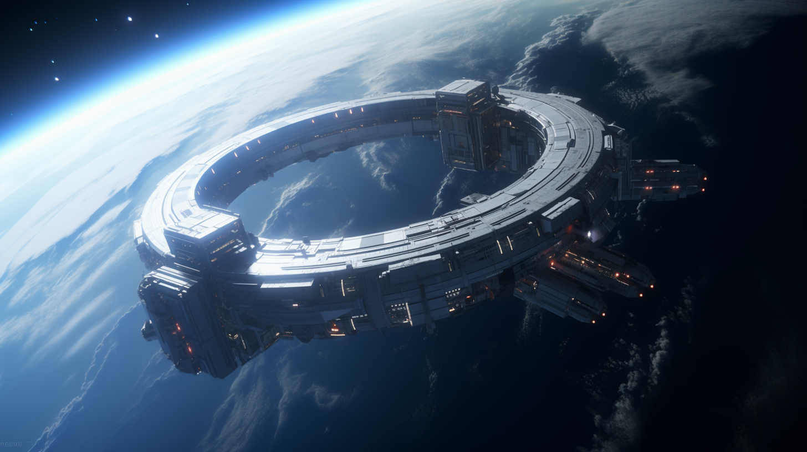
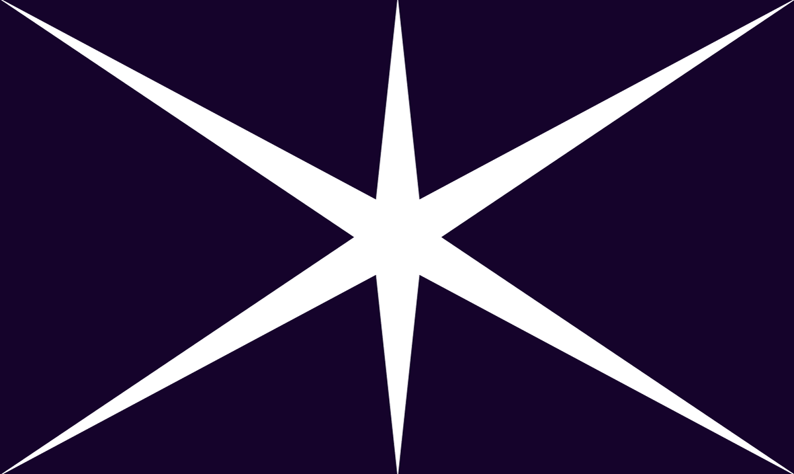

---
layout:
  title:
    visible: true
  description:
    visible: false
  tableOfContents:
    visible: true
  outline:
    visible: true
  pagination:
    visible: true
---

# 🔵 The Basics

<figure><figcaption>
A Sol habitat in orbit above the Earth.
</figcaption></figure>

### Basic Info

* Founded: 2081
* Governance: Technocratic Meritocracy
* Region(s): Dark Side of the Moon, Interplanetary Space
* Population: 4,912,000

### Overview

The smallest nation by population. Sol is a beacon of strategic importance and technological efficiency. With a history rooted in defense, Sol has evolved into a compact yet formidable entity, inhabited by a small but highly specialized population of 3,912,000.

Governed by a meritocratically selected Council of Overseers, Sol is characterized by its efficient, science-driven administration and its reliance on the military prowess of Helios, its primary enterprise. This council ensures a balanced approach to governance, intertwining scientific innovation with robust security measures, tailored to the unique demands of life in space.

<figure><figcaption>
Sol's flag. A white star on a dark purple field representing interplanetary space.
</figcaption></figure>

***

### The Spirit of Sol

The habitats of Sol, highly secured and regimented, are models of sustainable living and technological sophistication, reflecting Sol's overarching ethos of resilience, order, and forward-thinking. At the heart of its identity, Sol is a symbol of humanity's capacity to adapt and thrive in the vastness of space, prioritizing the well-being of its citizens while playing a pivotal role in the broader interstellar community.

Many would characterize life in Sol as cold and procedural, but deeply intellectually rewarding and meaningful. Citizens of Sol are unified by the belief that while GATA presides over humanity’s present, Sol will forge its future.

#### Sol and Other Off-World Populations

Its identity is similar but meaningfully distinct from Luna. While citizens of Luna and citizens of Sol both contend with the challenges of life off of the Earth, Gemini’s citizens are typically first-generation and don’t share the same cultural connection with the legacy of human survival and mutual-reliance that remains characteristic of those who live in Luna.&#x20;

***
