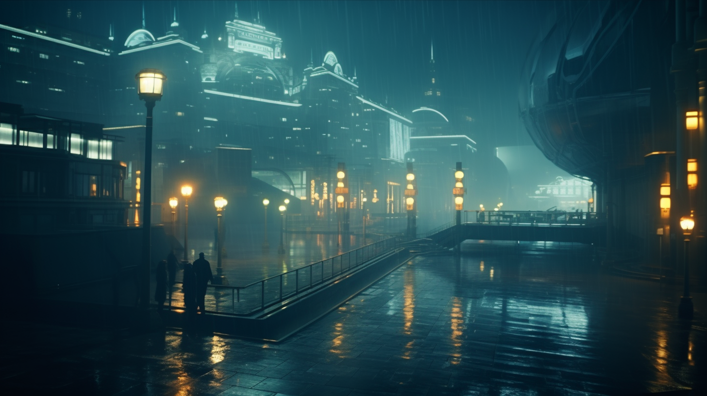

---
layout:
  title:
    visible: true
  description:
    visible: false
  tableOfContents:
    visible: true
  outline:
    visible: true
  pagination:
    visible: true
---

# 🔵 The Basics

A constitutional oligarchy born during the dark decade. Stands as a testament to human resilience and reinvention. Governed by a house representing its 215 feudal 'kingdoms'. Its capitol and center of commerce is Tashkent, which came to prominence in the region in wake of mass Russian migration. While decried as corrupt, URSA's complex web of reliance, grievance and retribution maintains its ever-re-balancing, dynamic order. Struggles with environmental obstacles caused by nuclear detonations and permafrost melt in the aftermath of the Dark Decade. URSA's leadership accuses GATA of using their climate regime to force URSA into adopting The System.

### Basic Info

* Founded: 2056
* Government: Constitutional Oligarchy
* Region(s): Russia, Eastern Europe, The Middle East
* Population: 1,490,000,000

<figure><figcaption></figcaption></figure>

***

### Comparative Stats

* **Freedom: 2** - The average citizen is beholden to their “kingdom” and must obey
* **Luxury: 5** - The oligarchs enjoy great amenities while their servants live in poor conditions
* **Military: 7** - Every kingdom maintains a small army, but joined together they are strong
* **Education: 5** - Technical education is heavily promoted, but the humanities are frowned upon
* **Technology: 8** - A vibrant illegal tech market offers exotic technology to those who can pay
* **Health: 6** - The Manna flower is essential in URSA, while GATA provides humanitarian assistance to those suffering from conditions stemming from URSA’s corrupted ecology

### Key Points

* Has a unique and challenging political landscape based on family loyalties.
* Faces significant internal and external political challenges due to corruption
* Strong cultural emphasis on loyalty, resulting in a complex socio-political order.
* Named “URSA” for the regional powers that formed it (Uzbekistan, Russia and Saudi Arabia).
* Its tumultuous domestic politics limit its ability to expand into domains like space
* Kingdoms frequently pursue their own interests by establishing alliances within and without URSA
* Some of the most exotic private labs and research programs can be found in the secret depths of the more technically inclined Kingdoms
* Rogue kingdoms have attempted and succeeded in coups in the past, and run illegal operations in defiance of the House of Kingdoms
* Members of royal families are called Crowns
* The leader of a Kingdom is called a Throne
